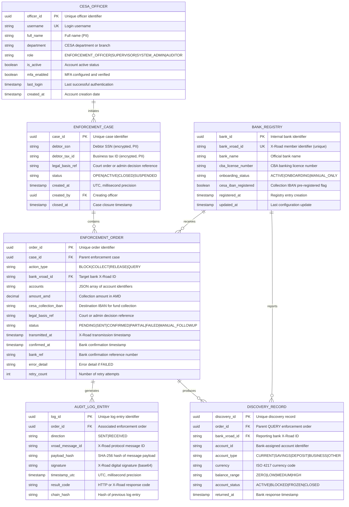

# Data Model: CESA–Commercial Banks Enforcement Integration

> **Template Origin**: Official | **ArcKit Version**: 4.9.1 | **Command**: `/arckit:data-model`

## Document Control

| Field | Value |
|-------|-------|
| **Document ID** | ARC-001-DATA-v1.0 |
| **Document Type** | Data Model |
| **Project** | CESA–Banks Enforcement Integration (Project 001) |
| **Classification** | OFFICIAL |
| **Status** | DRAFT |
| **Version** | 1.0 |
| **Created Date** | 2026-04-22 |
| **Last Modified** | 2026-04-22 |
| **Review Cycle** | Quarterly |
| **Next Review Date** | 2026-05-22 |
| **Owner** | Programme Lead, CESA IT Department |
| **Reviewed By** | PENDING |
| **Approved By** | PENDING |
| **Distribution** | Project Team, Architecture Team, CESA Programme Office, Data Protection Authority Representative |

## Revision History

| Version | Date | Author | Changes | Approved By | Approval Date |
|---------|------|--------|---------|-------------|---------------|
| 1.0 | 2026-04-22 | ArcKit AI | Initial creation from `/arckit:data-model` command — derived from ARC-001-REQ-v1.0 and CESA-BANKS-BP.pdf | PENDING | PENDING |

---

## Executive Summary

### Overview

This data model defines the canonical data structures for the CESA–Commercial Banks Enforcement Integration. It covers all entities required to support the four enforcement action types — account discovery (QUERY), account blocking (BLOCK), fund collection (COLLECT), and restriction lifting (RELEASE) — transmitted in real time via the X-Road interoperability platform. [CBBP-C2]

The model is derived directly from the six data requirements (DR-001 through DR-006) defined in ARC-001-REQ-v1.0. It supports both the operational case management function within CESA and the tamper-evident, legally non-repudiable audit trail required by RA enforcement law. [CBBP-C4]

Personal data (debtor SSN, tax ID, account identifiers, balance ranges) is treated as CONFIDENTIAL throughout. All such data is subject to the RA Law on Personal Data Protection and must be processed under the legal basis of legal obligation (enforcement proceedings). A Data Protection Impact Assessment (DPIA) is required prior to go-live given the large-scale processing of personal financial data under legal compulsion (NFR-C-003).

### Model Statistics

- **Total Entities**: 6 entities defined (E-001 through E-006)
- **Total Attributes**: 57 attributes across all entities
- **Total Relationships**: 6 relationships mapped
- **Data Classification**:
  - Public: 0 entities
  - Internal: 1 entity (E-005: BankRegistry — operational configuration)
  - Confidential: 4 entities (enforcement case records, orders, discovery records, officer identities)
  - Restricted: 1 entity (E-003: AuditLogEntry — legal evidence, immutable)

### Compliance Summary

- **Privacy Law Status**: RA Law on Personal Data Protection — processing under legal obligation (enforcement law)
- **PII Entities**: 3 entities contain personally identifiable information (E-001, E-004, E-006)
- **Data Protection Impact Assessment (DPIA)**: REQUIRED — large-scale processing of personal financial data under legal compulsion (NFR-C-003)
- **Data Retention**: 10 years from case closure (driven by RA Enforcement Law and legal evidence requirements)
- **Cross-Border Transfers**: None anticipated — all data processed within Armenia

### Key Data Governance Stakeholders

- **Data Owner (Business)**: CESA Programme Manager — accountable for enforcement data quality and lawful use
- **Data Steward**: CESA IT Department Lead — responsible for schema governance and retention enforcement
- **Data Custodian (Technical)**: CESA IT Operations — manages database infrastructure, backups, and encryption
- **Data Protection Responsible Person**: CESA representative to the RA Data Protection Authority — ensures compliance with RA personal data law

---

## Visual Entity-Relationship Diagram (ERD)

**Diagram Notes**:

- `||--o{` = one-to-many (exactly one parent, zero or more children)
- **PK** = Primary Key | **FK** = Foreign Key | **UK** = Unique Key
- Debtor SSN and Tax ID are encrypted at rest (AES-256) — represented as `string` type in the ERD
- AUDIT_LOG_ENTRY has no cascade delete — it is immutable legal evidence

---

## Entity Catalog

### Entity E-001: EnforcementCase

**Description**: The central record for a debtor enforcement case, from initiation by a CESA officer through to closure. All enforcement orders (E-002) are linked to a case. The case carries the debtor identity and legal basis that authorise all downstream enforcement actions.

**Source Requirements**:
- DR-001: Enforcement Case Record — defines all mandatory attributes
- BR-003: Legal Non-Repudiation — legal_basis_ref must be stored and validated
- FR-005: Enforcement Case Record Management — case must show full enforcement history
- FR-010: Legal Reference Validation — legal_basis_ref mandatory before any order

**Business Context**: Each CESA officer opens a case per debtor when legal enforcement is authorised. The case aggregates all enforcement orders issued against that debtor across multiple banks. [CBBP-C4]

**Data Ownership**:
- **Business Owner**: CESA Programme Manager — accountable for data accuracy and lawful basis
- **Technical Owner**: CESA IT Department — maintains database schema
- **Data Steward**: CESA IT Department Lead — enforces retention and access policies

**Data Classification**: CONFIDENTIAL (personal data + legal records)

**Volume Estimates**:
- **Initial Volume**: Estimated 5,000–10,000 open cases at go-live
- **Growth Rate**: +500–1,000 new cases per month
- **Peak Volume**: ~50,000 cases at Year 5
- **Average Record Size**: 1 KB

**Data Retention**:
- **Active Period**: Duration of open case
- **Archive Period**: 10 years from case closure
- **Total Retention**: 10 years from closure (RA Enforcement Law) or statutory period — whichever is longer
- **Deletion Policy**: Soft delete with audit marker; debtor SSN/tax ID anonymised after retention period expires

#### Attributes

| Attribute | Type | Required | PII | Description | Validation Rules | Default | Source Req |
|-----------|------|----------|-----|-------------|------------------|---------|------------|
| case_id | UUID | Yes | No | Unique case identifier | UUID v4 format | Auto-generated | DR-001 |
| debtor_ssn | VARCHAR(20) | Conditional | Yes | Debtor national SSN (Armenian format) | RA SSN format regex; mutually exclusive with debtor_tax_id; encrypted at rest | NULL | DR-001 |
| debtor_tax_id | VARCHAR(20) | Conditional | Yes | Business tax identifier | RA tax ID format regex; mutually exclusive with debtor_ssn; encrypted at rest | NULL | DR-001 |
| legal_basis_ref | VARCHAR(100) | Yes | No | Court order or administrative decision reference | Non-null, non-empty; format validated against configured pattern | None | DR-001, BR-003 |
| status | VARCHAR(20) | Yes | No | Case lifecycle status | Enum: OPEN, ACTIVE, CLOSED, SUSPENDED | OPEN | DR-001 |
| created_at | TIMESTAMP | Yes | No | Case creation time (UTC) | UTC, millisecond precision; auto-set on insert | NOW() UTC | DR-001 |
| created_by | UUID | Yes | No | FK to CESA officer who created the case | References E-006.officer_id; non-null | None | DR-001 |
| closed_at | TIMESTAMP | No | No | Case closure timestamp | UTC; set only when status transitions to CLOSED | NULL | DR-001 |

**Attribute Notes**:
- **PII Attributes**: debtor_ssn, debtor_tax_id — encrypted at rest using AES-256; decrypted only when a signed enforcement order is being prepared
- **Conditional Rule**: Exactly one of debtor_ssn or debtor_tax_id must be present (not both, not neither)
- **Audit Attributes**: created_at, created_by, closed_at support full case lifecycle audit trail

#### Relationships

**Outgoing**:
- **contains**: E-001 → E-002 (one-to-many) — A case contains zero or more enforcement orders; FK: order.case_id → case.case_id; Cascade Delete: No (orders are legal records); orders may outlive a case closure
- **created_by**: E-001 → E-006 (many-to-one) — Many cases may be created by the same officer; FK: case.created_by → officer.officer_id; ON DELETE RESTRICT

**Incoming**:
- None — EnforcementCase is the root aggregate

#### Indexes

**Primary Key**: `pk_enforcement_case` on `case_id`

**Foreign Keys**:
- `fk_case_officer` on `created_by` → E-006.officer_id; ON DELETE RESTRICT; ON UPDATE CASCADE

**Unique Constraints**: None (multiple cases may exist per debtor at different times)

**Performance Indexes**:
- `idx_case_status` on `status` (filter open/active cases)
- `idx_case_created_by` on `created_by` (officer case load queries)
- `idx_case_created_at` on `created_at` (time-range reporting)

#### Privacy & Compliance

- **Contains PII**: Yes (debtor_ssn, debtor_tax_id)
- **Legal Basis**: Legal obligation — RA Law on Enforcement Proceedings
- **Data Minimisation**: Only the minimum debtor identifier (SSN or tax ID) is stored; full personal profile is not held
- **Debtor Rights**: Right of access to own enforcement case data is subject to enforcement law constraints; erasure is not available while case is active or within retention period; anonymisation applied after retention expiry
- **Data Breach Impact**: HIGH — debtor identity linked to enforcement proceedings; breach must be reported to RA Data Protection Authority
- **Encryption**: debtor_ssn and debtor_tax_id must be encrypted at rest (AES-256); decryption requires officer authentication
- **Audit Logging**: All access to debtor PII attributes must be logged (who, when, purpose)

---

### Entity E-002: EnforcementOrder

**Description**: Represents a single enforcement action (BLOCK, COLLECT, RELEASE, or QUERY) issued by CESA against one or more debtor accounts at a specified bank. Each order is transmitted via X-Road and results in one or more audit log entries (E-003) and, for QUERY orders, one or more discovery records (E-004).

**Source Requirements**:
- DR-002: Enforcement Order Record — defines all mandatory attributes
- BR-001: Real-Time Enforcement Execution — status and timestamp attributes support SLA measurement
- FR-002 to FR-004: Block, Collect, Release via X-Road — action_type, accounts, amount_amd
- FR-008: Retry and Manual Fallback — retry_count, MANUAL_FOLLOWUP status
- NFR-P-001 to NFR-P-003: Latency SLAs — transmitted_at and confirmed_at enable latency measurement

**Business Context**: A single enforcement case may produce multiple orders — one per bank, one per action type, and additional orders on retry. Orders are immutable once in CONFIRMED or FAILED terminal states. [CBBP-C2]

**Data Ownership**:
- **Business Owner**: CESA Programme Manager
- **Technical Owner**: CESA IT Department
- **Data Steward**: CESA IT Department Lead

**Data Classification**: CONFIDENTIAL

**Volume Estimates**:
- **Initial Volume**: ~3 orders per case at go-live (discovery + block + collect)
- **Growth Rate**: +1,500–3,000 orders per month
- **Average Record Size**: 2 KB (JSON accounts array variable)

**Data Retention**: Per parent case retention (DR-006) — 10 years from case closure

#### Attributes

| Attribute | Type | Required | PII | Description | Validation Rules | Default | Source Req |
|-----------|------|----------|-----|-------------|------------------|---------|------------|
| order_id | UUID | Yes | No | Unique order identifier | UUID v4 | Auto-generated | DR-002 |
| case_id | UUID | Yes | No | FK to parent enforcement case | References E-001.case_id; non-null | None | DR-002 |
| action_type | VARCHAR(10) | Yes | No | Type of enforcement action | Enum: BLOCK, COLLECT, RELEASE, QUERY | None | DR-002 |
| bank_xroad_id | VARCHAR(100) | Yes | No | Target bank X-Road member identifier | References E-005.bank_xroad_id; bank must be ACTIVE | None | DR-002 |
| accounts | TEXT (JSON) | Yes | No | JSON array of target account identifiers | Valid JSON array; non-empty for BLOCK/COLLECT/RELEASE | None | DR-002 |
| amount_amd | DECIMAL(18,2) | Conditional | No | Fund collection amount in AMD | Positive; required only for COLLECT orders | NULL | DR-002 |
| cesa_collection_iban | VARCHAR(34) | Conditional | No | CESA destination IBAN for fund transfers | Valid IBAN format; required only for COLLECT orders | NULL | DR-002, INT-005 |
| legal_basis_ref | VARCHAR(100) | Yes | No | Court or administrative decision reference | Non-null, non-empty; copied from case or separately specified | None | DR-002, BR-003 |
| status | VARCHAR(20) | Yes | No | Order processing status | Enum: PENDING, SENT, CONFIRMED, PARTIAL, FAILED, MANUAL_FOLLOWUP | PENDING | DR-002 |
| transmitted_at | TIMESTAMP | No | No | X-Road transmission timestamp | UTC; set when order is sent to X-Road | NULL | DR-002 |
| confirmed_at | TIMESTAMP | No | No | Bank confirmation received timestamp | UTC; set on CONFIRMED or PARTIAL response | NULL | DR-002 |
| bank_ref | VARCHAR(100) | No | No | Bank's confirmation reference number | Returned by bank CBS; stored verbatim | NULL | DR-002 |
| error_detail | TEXT | No | No | Error description if status is FAILED | Free text from X-Road error response | NULL | DR-002 |
| retry_count | INTEGER | Yes | No | Number of retry attempts made | 0–3; incremented on each retry | 0 | FR-008 |

#### Relationships

**Outgoing**:
- **targets**: E-002 → E-005 (many-to-one) — Many orders target one bank; FK: order.bank_xroad_id → bank_registry.bank_xroad_id
- **belongs to**: E-002 → E-001 (many-to-one) — Many orders belong to one case; FK: order.case_id → enforcement_case.case_id; ON DELETE RESTRICT

**Incoming**:
- **generates**: E-003 → E-002 (many-to-one) — One order generates one or more audit log entries
- **produces**: E-004 → E-002 (many-to-one) — QUERY orders produce one or more discovery records

#### Indexes

**Primary Key**: `pk_enforcement_order` on `order_id`

**Foreign Keys**:
- `fk_order_case` on `case_id` → E-001.case_id; ON DELETE RESTRICT; ON UPDATE CASCADE
- `fk_order_bank` on `bank_xroad_id` → E-005.bank_xroad_id; ON DELETE RESTRICT

**Performance Indexes**:
- `idx_order_case_id` on `case_id` (join to case)
- `idx_order_status` on `status` (filter pending/failed orders for retry queue)
- `idx_order_action_type` on `action_type` (reporting by action type)
- `idx_order_transmitted_at` on `transmitted_at` (latency SLA measurement)

#### Privacy & Compliance

- **Contains PII**: Indirectly — accounts array may contain account identifiers that are personal data in context; cesa_collection_iban identifies CESA's own account (not PII)
- **Legal Basis**: Legal obligation — enforcement proceedings
- **Audit Logging**: All status changes must be logged; transmitted_at and confirmed_at enable legal evidence of timing
- **Immutability**: Once in CONFIRMED, FAILED, or MANUAL_FOLLOWUP status, records must not be modified (insert-only audit pattern)

---

### Entity E-003: AuditLogEntry

**Description**: An immutable, tamper-evident record of every X-Road message exchange — both messages sent by CESA and responses received from banks. The chain_hash attribute links each entry to the previous, forming a cryptographic hash chain that detects any tampering or deletion. This entity constitutes the legal audit trail required by NFR-C-002 and RA enforcement law. [CBBP-C4]

**Source Requirements**:
- DR-003: X-Road Audit Log Entry — defines all attributes including chain_hash
- NFR-C-002: Comprehensive Audit Logging — 10-year retention, tamper-evident
- BR-003: Legal Non-Repudiation — signature attribute enables independent verification

**Business Context**: The audit log is maintained independently on both the CESA side and each bank's side. The CESA-side log captures all messages CESA sends and all responses received. This entity should be stored in append-only, immutable storage with no update or delete operations permitted. [CBBP-C4]

**Data Ownership**:
- **Business Owner**: CESA Programme Manager (legal evidence responsibility)
- **Technical Owner**: CESA IT Operations (immutable storage management)
- **Data Steward**: CESA IT Department Lead

**Data Classification**: RESTRICTED (legal evidence — highest sensitivity)

**Volume Estimates**:
- **Growth Rate**: ~2 log entries per enforcement order (one SENT, one RECEIVED) plus retries
- **Estimated Volume**: ~3,000–6,000 entries per month at full operation
- **Average Record Size**: 4 KB (payload hash + signature are large fields)

**Data Retention**:
- **Retention Period**: 10 years from transaction date — immutable, no archival tier (must remain in place)
- **Deletion Policy**: No deletion permitted during retention period; legal hold may extend beyond 10 years
- **Storage Requirement**: Append-only immutable storage (WORM — Write Once Read Many)

#### Attributes

| Attribute | Type | Required | PII | Description | Validation Rules | Default | Source Req |
|-----------|------|----------|-----|-------------|------------------|---------|------------|
| log_id | UUID | Yes | No | Unique log entry identifier | UUID v4 | Auto-generated | DR-003 |
| order_id | UUID | Yes | No | FK to associated enforcement order | References E-002.order_id; non-null | None | DR-003 |
| direction | VARCHAR(10) | Yes | No | Message direction | Enum: SENT, RECEIVED | None | DR-003 |
| xroad_message_id | VARCHAR(100) | Yes | No | X-Road protocol-assigned message ID | Non-null; unique per X-Road session | None | DR-003 |
| payload_hash | CHAR(64) | Yes | No | SHA-256 hash of the full message payload | 64 hex characters; computed before transmission | None | DR-003 |
| signature | TEXT | Yes | No | X-Road digital signature (base64-encoded) | Valid base64; RSA-2048 or ECDSA-256 minimum | None | DR-003, NFR-SEC-002 |
| timestamp_utc | TIMESTAMP | Yes | No | Event timestamp (UTC) | UTC, millisecond precision; set at time of event | None | DR-003 |
| result_code | VARCHAR(10) | Yes | No | HTTP or X-Road response code | Non-null; e.g., "200", "500", "XROAD-E001" | None | DR-003 |
| chain_hash | CHAR(64) | Yes | No | SHA-256 hash of the previous log entry | 64 hex characters; first entry uses genesis hash constant | None | DR-003, NFR-C-002 |

**Attribute Notes**:
- **chain_hash**: Computed as `SHA-256(previous_entry_log_id + previous_entry_timestamp_utc + previous_entry_chain_hash)`. The first entry in the chain uses a pre-agreed genesis constant. Any gap or recomputed hash indicates tampering.
- **Immutability**: No UPDATE or DELETE operations are permitted on this table. Any correction must be made via a new compensating log entry marked as CORRECTION.

#### Relationships

**Outgoing**:
- **belongs to**: E-003 → E-002 (many-to-one) — FK: audit_log.order_id → enforcement_order.order_id; ON DELETE RESTRICT

**Incoming**: None

#### Indexes

**Primary Key**: `pk_audit_log_entry` on `log_id`

**Foreign Keys**:
- `fk_log_order` on `order_id` → E-002.order_id; ON DELETE RESTRICT

**Performance Indexes**:
- `idx_log_order_id` on `order_id` (retrieve all log entries for an order)
- `idx_log_timestamp_utc` on `timestamp_utc` (time-range queries for audit review)

#### Privacy & Compliance

- **Contains PII**: Indirectly — payload_hash is a hash of the X-Road message; the message itself contains debtor identifiers, but the hash is a one-way function and is not itself PII
- **Legal Classification**: Legal evidence — may be subpoenaed; must be producible within 30 seconds per BR-003
- **Storage**: WORM (Write Once Read Many) or equivalent immutable storage; hash chain integrity must be verified periodically (monthly recommended)
- **Access Control**: Read access restricted to AUDITOR role and above; no write access for any system user (append-only via system service account only)

---

### Entity E-004: DiscoveryRecord

**Description**: Represents account information returned by a bank in response to an account discovery query (QUERY-type enforcement order). One discovery record is created per account returned per bank. Balance ranges — not exact balances — are stored, implementing data minimisation per NFR-C-003 and the resolution of conflict C-002 in ARC-001-REQ-v1.0. [CBBP-C3]

**Source Requirements**:
- DR-004: Debtor Account Discovery Record — defines all attributes
- BR-002: Automated Account Discovery — discovery returns account type, currency, status, balance range
- NFR-C-003: Data Minimisation — balance_range (not precise balance)
- FR-001: Account Discovery Broadcast — discovery query response structure

**Business Context**: Discovery records are created when a CESA officer initiates an account enquiry. They are used by officers to select which accounts to target for blocking or collection orders. Records are retained for the duration of the enforcement case. [CBBP-C3]

**Data Ownership**:
- **Business Owner**: CESA Programme Manager
- **Technical Owner**: CESA IT Department

**Data Classification**: CONFIDENTIAL (financial data about identifiable debtors)

**Volume Estimates**:
- **Growth Rate**: ~5–15 discovery records per QUERY order (accounts per debtor per bank)
- **Estimated Volume**: ~10,000–30,000 records per month at full operation

**Data Retention**: Duration of enforcement case + 10 years (per DR-006)

#### Attributes

| Attribute | Type | Required | PII | Description | Validation Rules | Default | Source Req |
|-----------|------|----------|-----|-------------|------------------|---------|------------|
| discovery_id | UUID | Yes | No | Unique discovery record identifier | UUID v4 | Auto-generated | DR-004 |
| order_id | UUID | Yes | No | FK to parent QUERY enforcement order | References E-002.order_id; action_type must be QUERY | None | DR-004 |
| bank_xroad_id | VARCHAR(100) | Yes | No | Reporting bank X-Road identifier | References E-005.bank_xroad_id | None | DR-004 |
| account_id | VARCHAR(50) | Yes | No | Bank-internal account identifier | Non-null; bank-assigned; not exposed outside CESA IS | None | DR-004 |
| account_type | VARCHAR(10) | Yes | No | Account category | Enum: CURRENT, SAVINGS, DEPOSIT, BUSINESS, OTHER | None | DR-004 |
| currency | CHAR(3) | Yes | No | Account currency | ISO 4217 code; non-null | None | DR-004 |
| balance_range | VARCHAR(10) | Yes | No | Balance range (data minimisation) | Enum: ZERO, LOW, MEDIUM, HIGH — not precise balance | None | DR-004, NFR-C-003 |
| account_status | VARCHAR(10) | Yes | No | Current account status at reporting bank | Enum: ACTIVE, BLOCKED, FROZEN, CLOSED | None | DR-004 |
| returned_at | TIMESTAMP | Yes | No | Timestamp of bank response | UTC, millisecond precision | None | DR-004 |

**Attribute Notes**:
- **balance_range mapping**: ZERO = 0 AMD; LOW = 1–100,000 AMD; MEDIUM = 100,001–1,000,000 AMD; HIGH = > 1,000,000 AMD. Exact thresholds are configurable and should be agreed with CESA and the RA Data Protection Authority.
- **account_id**: Not exposed in discovery API responses to officers — used internally for enforcement targeting only

#### Relationships

**Outgoing**:
- **belongs to order**: E-004 → E-002 (many-to-one) — FK: discovery.order_id → enforcement_order.order_id; ON DELETE RESTRICT
- **reported by**: E-004 → E-005 (many-to-one) — FK: discovery.bank_xroad_id → bank_registry.bank_xroad_id

#### Indexes

**Primary Key**: `pk_discovery_record` on `discovery_id`

**Foreign Keys**:
- `fk_discovery_order` on `order_id` → E-002.order_id; ON DELETE RESTRICT
- `fk_discovery_bank` on `bank_xroad_id` → E-005.bank_xroad_id

**Performance Indexes**:
- `idx_discovery_order_id` on `order_id` (retrieve all accounts for a discovery query)
- `idx_discovery_bank_xroad_id` on `bank_xroad_id` (per-bank result analysis)

#### Privacy & Compliance

- **Contains PII**: Yes — account_id, in combination with debtor identity from the parent case, is personal data (financial data)
- **Legal Basis**: Legal obligation — enforcement proceedings
- **Data Minimisation**: balance_range is the key data minimisation control; exact balances are not transmitted or stored
- **Access Control**: Accessible only to the officer who initiated the discovery (or their supervisor); auditor role read access for compliance review

---

### Entity E-005: BankRegistry

**Description**: A configuration registry of all commercial banks in Armenia, their X-Road member identifiers, and their onboarding status in the enforcement integration. This is the operational configuration entity that controls which banks receive real-time enforcement orders versus requiring manual follow-up. Adding a new bank requires only configuration changes to this registry — no code changes (FR-006, BR-005).

**Source Requirements**:
- FR-006: Bank Registry Management — onboarding_status, ACTIVE/ONBOARDING/MANUAL_ONLY states
- BR-005: Phased Bank Onboarding — registry drives which banks receive X-Road orders
- INT-003: Bank Core Banking System Enforcement API — bank_xroad_id is the routing key
- INT-005: CESA Collection Account — cesa_iban_registered tracks pre-registration status

**Business Context**: Maintained by CESA System Administrators. All 15 CBA-licensed commercial banks should eventually appear as ACTIVE. Initially, some will be ONBOARDING or MANUAL_ONLY. The registry controls message routing in the enforcement orchestration layer. [CBBP-C5]

**Data Ownership**:
- **Business Owner**: CESA IT Department (configuration asset)
- **Technical Owner**: CESA IT Operations
- **Data Steward**: CESA System Administrator role

**Data Classification**: INTERNAL (operational configuration — not personal data)

**Volume Estimates**:
- **Initial Volume**: 15 banks (all CBA-licensed banks)
- **Growth Rate**: Minimal — new banks require CBA licensing; very occasional additions

**Data Retention**: Active for duration of programme; archived when a bank exits the X-Road enforcement channel

#### Attributes

| Attribute | Type | Required | PII | Description | Validation Rules | Default | Source Req |
|-----------|------|----------|-----|-------------|------------------|---------|------------|
| bank_id | UUID | Yes | No | Internal bank identifier | UUID v4 | Auto-generated | FR-006 |
| bank_xroad_id | VARCHAR(100) | Yes | No | X-Road member identifier (format: COUNTRY/MEMBER_CLASS/MEMBER_CODE) | UK; X-Road ID format; non-null | None | FR-006, INT-001 |
| bank_name | VARCHAR(200) | Yes | No | Official bank name (Armenian and transliterated) | Non-empty | None | FR-006 |
| cba_license_number | VARCHAR(50) | Yes | No | CBA banking licence reference number | Non-null | None | FR-006 |
| onboarding_status | VARCHAR(20) | Yes | No | X-Road enforcement integration status | Enum: ACTIVE, ONBOARDING, MANUAL_ONLY | MANUAL_ONLY | FR-006, BR-005 |
| cesa_iban_registered | BOOLEAN | Yes | No | Whether CESA collection IBAN is pre-registered with this bank | true/false | false | INT-005 |
| registered_at | TIMESTAMP | Yes | No | When this bank was added to the registry | UTC; auto-set on insert | NOW() UTC | FR-006 |
| updated_at | TIMESTAMP | Yes | No | Last configuration change | UTC; auto-update on any field change | NOW() UTC | FR-006 |

#### Relationships

**Incoming**:
- E-002 → E-005 (many-to-one) — Many enforcement orders target this bank
- E-004 → E-005 (many-to-one) — Many discovery records report from this bank

#### Indexes

**Primary Key**: `pk_bank_registry` on `bank_id`

**Unique Constraints**: `uk_bank_xroad_id` on `bank_xroad_id` (X-Road IDs must be unique)

**Performance Indexes**:
- `idx_bank_onboarding_status` on `onboarding_status` (filter ACTIVE banks for routing)

#### Privacy & Compliance

- **Contains PII**: No — bank institutional data only
- **Access Control**: SYSTEM_ADMIN role required for insert/update; all roles read access
- **Audit Logging**: All changes to onboarding_status logged (configuration audit trail)

---

### Entity E-006: CESAOfficer

**Description**: Identity and access record for all CESA staff with access to the enforcement system. Supports RBAC with four roles (NFR-SEC-004) and MFA enforcement (NFR-SEC-005). Officer records are linked to enforcement cases and provide the "who" dimension of the audit trail. [CBBP-C5]

**Source Requirements**:
- NFR-SEC-004: Role-Based Access Control — role attribute with four defined values
- NFR-SEC-005: Multi-Factor Authentication — mfa_enabled attribute
- DR-001: Enforcement Case Record — created_by FK links cases to officers

**Business Context**: Enforcement officers, supervisors, system administrators, and auditors are all represented. Multiple CESA departments and branches may have officers, reflecting the departmental routing shown in the business process document. [CBBP-C5]

**Data Ownership**:
- **Business Owner**: CESA Programme Manager (workforce data)
- **Technical Owner**: CESA IT Department

**Data Classification**: CONFIDENTIAL (officer full_name is PII)

**Volume Estimates**:
- **Initial Volume**: Estimated 50–200 active officers at go-live
- **Growth Rate**: Minimal; driven by CESA staffing changes

**Data Retention**:
- **Active Period**: Duration of employment
- **Archive Period**: 5 years post-departure (authentication log compliance, NFR-C-002)

#### Attributes

| Attribute | Type | Required | PII | Description | Validation Rules | Default | Source Req |
|-----------|------|----------|-----|-------------|------------------|---------|------------|
| officer_id | UUID | Yes | No | Unique officer identifier | UUID v4 | Auto-generated | DR-001 |
| username | VARCHAR(50) | Yes | No | Login username | UK; lowercase alphanumeric and underscores; non-empty | None | NFR-SEC-004 |
| full_name | VARCHAR(200) | Yes | Yes | Officer's full name (Armenian script) | Non-empty; displayed in case records | None | NFR-SEC-004 |
| department | VARCHAR(100) | Yes | No | CESA department or branch | Non-empty; free text | None | NFR-SEC-004 |
| role | VARCHAR(30) | Yes | No | System access role | Enum: ENFORCEMENT_OFFICER, SUPERVISOR, SYSTEM_ADMIN, AUDITOR | ENFORCEMENT_OFFICER | NFR-SEC-004 |
| is_active | BOOLEAN | Yes | No | Account active/disabled | true/false; false on departure | true | NFR-SEC-004 |
| mfa_enabled | BOOLEAN | Yes | No | MFA configured and verified | Must be true before any enforcement action is permitted | false | NFR-SEC-005 |
| last_login | TIMESTAMP | No | No | Last successful authentication timestamp | UTC; updated on each successful login | NULL | NFR-SEC-004 |
| created_at | TIMESTAMP | Yes | No | Account creation date | UTC; auto-set on insert | NOW() UTC | NFR-SEC-004 |

#### Relationships

**Incoming**:
- E-001 → E-006 (many-to-one) — Many cases are initiated by one officer

#### Indexes

**Primary Key**: `pk_cesa_officer` on `officer_id`

**Unique Constraints**: `uk_officer_username` on `username`

**Performance Indexes**:
- `idx_officer_role` on `role` (role-based access queries)
- `idx_officer_is_active` on `is_active` (filter active accounts)

#### Privacy & Compliance

- **Contains PII**: Yes — full_name is personal data
- **Legal Basis**: Employment contract / legal obligation (workforce management)
- **Authentication Logs**: Login attempts (success and failure) must be logged separately; retained 5 years (NFR-C-002)
- **MFA Enforcement**: System must verify mfa_enabled = true before allowing any enforcement action initiation; accounts with mfa_enabled = false are read-only

---

## Data Governance Matrix

| Entity | Business Owner | Data Steward | Technical Custodian | Sensitivity | Compliance | Quality SLA | Access Control |
|--------|----------------|--------------|---------------------|-------------|------------|-------------|----------------|
| E-001: EnforcementCase | CESA Programme Manager | CESA IT Department Lead | CESA IT Operations | CONFIDENTIAL | RA Personal Data Law, RA Enforcement Law | 100% accuracy; 100% legal_basis_ref completeness | ENFORCEMENT_OFFICER, SUPERVISOR, AUDITOR (read); SYSTEM_ADMIN (config) |
| E-002: EnforcementOrder | CESA Programme Manager | CESA IT Department Lead | CESA IT Operations | CONFIDENTIAL | RA Enforcement Law, X-Road governance | 99.5% transmission success rate; < 5s latency p95 | ENFORCEMENT_OFFICER (CR--); SUPERVISOR (CRUD); AUDITOR (-R--) |
| E-003: AuditLogEntry | CESA Programme Manager (legal) | CESA IT Department Lead | CESA IT Operations | RESTRICTED | RA Enforcement Law (legal evidence) | 100% completeness; 100% chain integrity | AUDITOR (-R--); System service account (C---) only |
| E-004: DiscoveryRecord | CESA Programme Manager | CESA IT Department Lead | CESA IT Operations | CONFIDENTIAL | RA Personal Data Law, RA Enforcement Law | 100% completeness per QUERY order | ENFORCEMENT_OFFICER (-R--); SUPERVISOR (-R--); AUDITOR (-R--) |
| E-005: BankRegistry | CESA IT Department | CESA System Administrator | CESA IT Operations | INTERNAL | X-Road governance | 100% accuracy; updated within 24h of change | SYSTEM_ADMIN (CRUD); all authenticated (-R--) |
| E-006: CESAOfficer | CESA Programme Manager | CESA IT Department Lead | CESA IT Operations | CONFIDENTIAL | RA Personal Data Law | 100% mfa_enabled for active officers | SYSTEM_ADMIN (CRUD); self (-R--) |

---

## CRUD Matrix

| Entity | CESA IS Enforcement Module | CESA Admin Portal | Supervisor Dashboard | Audit Service | X-Road Integration Layer |
|--------|---------------------------|-------------------|---------------------|---------------|--------------------------|
| E-001: EnforcementCase | CR-- | CRUD | -R-- | -R-- | ---- |
| E-002: EnforcementOrder | CR-D | -R-- | -R-- | -R-- | -RU- |
| E-003: AuditLogEntry | C--- | ---- | ---- | -R-- | C--- |
| E-004: DiscoveryRecord | CR-- | ---- | -R-- | -R-- | C--- |
| E-005: BankRegistry | -R-- | CRUD | -R-- | -R-- | -R-- |
| E-006: CESAOfficer | -R-- | CRUD | -R-- | -R-- | ---- |

**Legend**: C = Create, R = Read, U = Update, D = Delete, - = No access

**Key Access Control Notes**:
- E-003 (AuditLogEntry): Only `C---` — no system component may read or update audit logs except the dedicated Audit Service (which has `-R--` only). No deletes ever.
- E-002 Update (`-RU-` for X-Road Integration Layer): Only status field transitions are permitted via the integration layer; order creation is exclusively through the CESA IS Enforcement Module.
- E-001 Delete (`CR-D` for Enforcement Module): Soft-delete only — records are marked CLOSED, not physically deleted.

---

## Data Integration Mapping

### Upstream Systems (Data Flowing In)

#### Integration INT-001 / INT-002: CESA IS to X-Road Security Server

**Data Flow**: CESA IS Enforcement Module → X-Road Integration Layer → Bank CBS (via X-Road)

**Entities Produced on Response**:
- **E-003 (AuditLogEntry)**: Created for every X-Road message (both SENT and RECEIVED direction)
- **E-004 (DiscoveryRecord)**: Created from bank responses to QUERY orders
- **E-002 (EnforcementOrder)**: Status updated on receipt of bank confirmation (CONFIRMED, PARTIAL, FAILED)

**Data Mapping — Discovery Response**:

| Bank Response Field | Type | Target Entity | Target Attribute | Transformation |
|---------------------|------|---------------|------------------|----------------|
| accountId | string | E-004 | account_id | Direct mapping |
| accountType | string | E-004 | account_type | Enum normalisation |
| currency | string | E-004 | currency | ISO 4217 validation |
| balanceRange | string | E-004 | balance_range | Enum: ZERO/LOW/MEDIUM/HIGH |
| accountStatus | string | E-004 | account_status | Enum normalisation |
| xroadMessageId | string | E-003 | xroad_message_id | Direct mapping |
| signature | string | E-003 | signature | Base64 stored verbatim |

**Data Quality Rules**:
- Reject discovery responses with missing accountId, currency, or accountStatus
- Reject enforcement confirmations missing bank_ref
- Flag partial responses (bank returns fewer accounts than expected) for supervisor review

---

#### Integration INT-003: Bank CBS Enforcement API

**Flow**: Bank CBS → Bank X-Road Security Server → CESA X-Road Security Server → CESA IS

**Entities Updated on Response**:
- E-002: status, confirmed_at, bank_ref, error_detail updated on enforcement confirmation
- E-003: RECEIVED audit log entry created for every response

---

### Downstream Systems (Data Flowing Out)

#### Integration INT-004: CBA Aggregate Reporting

**Target**: Central Bank of Armenia — aggregate enforcement statistics (not individual records)

**Entities Included**: E-002 (aggregate counts by action_type, status, bank_xroad_id)

**Data Mapping**:
- Enforcement actions per bank per period (count, success rate, failure rate)
- Bank onboarding status from E-005

**PII Scope**: No individual debtor data transmitted to CBA — aggregate statistics only

**Frequency**: Monthly batch (per INT-004 in ARC-001-REQ-v1.0)

---

### Master Data Management

| Entity | System of Record | Rationale | Conflict Resolution |
|--------|------------------|-----------|---------------------|
| E-001: EnforcementCase | CESA IS | Enforcement cases originate in CESA | CESA IS is authoritative |
| E-002: EnforcementOrder | CESA IS | Orders are created by CESA | CESA IS is authoritative; bank_ref from bank is appended |
| E-003: AuditLogEntry | Both CESA and Bank (independent) | X-Road mandates independent logs on each side | No conflict resolution — independent legal records |
| E-004: DiscoveryRecord | Bank CBS (source); CESA IS (store) | Banks report their own account data | Bank data is authoritative; CESA stores for case purposes |
| E-005: BankRegistry | CESA IS | CESA manages onboarding configuration | CESA IT Admin is authoritative |
| E-006: CESAOfficer | CESA IS | Workforce data managed by CESA IT | CESA IT Admin is authoritative |

---

## Privacy & Compliance

### RA Law on Personal Data Protection — Compliance Assessment

This project processes personal data (debtor SSN, tax ID, account information) of individuals subject to enforcement proceedings. The applicable framework is the RA Law on Personal Data Protection (HH 49-N, as amended). The following table identifies PII across all entities.

#### PII Inventory

| Entity | PII Attributes | Sensitivity | Encryption Required |
|--------|---------------|-------------|---------------------|
| E-001: EnforcementCase | debtor_ssn, debtor_tax_id | HIGH — identity document numbers | Yes — AES-256 at rest; mTLS in transit |
| E-004: DiscoveryRecord | account_id (in context of debtor identity) | HIGH — financial account data | Yes — AES-256 at rest |
| E-006: CESAOfficer | full_name | LOW — workforce data | Standard access control |

**Total PII Attributes**: 4 attributes across 3 entities

**Special Category Data**: None — debtor SSN/tax ID are identity numbers, not health, biometric, or other special categories

#### Legal Basis for Processing

| Entity | Data Element | Legal Basis | Notes |
|--------|-------------|-------------|-------|
| E-001 | debtor_ssn / debtor_tax_id | Legal obligation — RA Enforcement Proceedings Law | Processing authorised by court or administrative enforcement order |
| E-002 | accounts, amount_amd | Legal obligation — enforcement order | Minimum data necessary for the specific enforcement action |
| E-003 | xroad_message_id, signature | Legal obligation — RA Enforcement Law (audit requirement) | Non-repudiable record mandated by law |
| E-004 | account_id, balance_range | Legal obligation — enforcement proceedings | Balance range (not precise) as data minimisation compromise |
| E-005 | None | N/A — institutional data | |
| E-006 | full_name | Legitimate interest / employment contract | Workforce management; named in enforcement audit trail |

#### Data Minimisation Controls

- **Discovery returns balance range only** — not precise balances (Conflict C-002 resolution in ARC-001-REQ-v1.0)
- **Debtor SSN transmitted only to ACTIVE banks** — not ONBOARDING or MANUAL_ONLY banks
- **Account identifiers not exposed in officer-facing UI** — used internally for enforcement targeting only
- **No personal profile data held** — CESA IS stores only the minimum attributes required for legal enforcement

#### Debtor Rights Under RA Personal Data Law

| Right | Implementation | Notes |
|-------|---------------|-------|
| Right of access | Debtor may request case data via formal channel | Subject to enforcement law constraints on disclosure during active proceedings |
| Right to rectification | Errors in identity data correctable by CESA officer | Legal_basis_ref is immutable after enforcement is issued |
| Right to erasure | Not available during active case or 10-year retention period | Anonymisation applied after retention expiry |
| Right to restriction | Enforcement proceedings take precedence | Cannot pause enforcement via data protection channel |

#### Data Protection Impact Assessment (DPIA)

**DPIA Required**: Yes

**Triggers**:
- Large-scale processing of personal data (all bank accounts of enforcement debtors across all Armenian commercial banks)
- Processing under legal compulsion (enforcement proceedings — individuals have no practical ability to object)
- Automated decision-making affecting individual financial rights (account blocking without individual review at point of execution)

**DPIA Status**: NOT_STARTED — must be initiated and reviewed with the RA Data Protection Authority before go-live (NFR-C-003)

**Key Privacy Risks**:
1. **Wrongful blocking** — incorrect account identified and blocked due to data error (Risk R-005 in ARC-001-REQ-v1.0)
2. **Unauthorised access** — CESA officer accessing debtor data outside their case authority
3. **Data breach** — debtor SSN/tax ID exposed if database encryption is bypassed
4. **Excessive retention** — data retained beyond statutory period due to retention policy failure

**Mitigation Measures**:
- AES-256 encryption at rest for all PII attributes (NFR-SEC-003)
- RBAC ensuring officers access only cases assigned to them (NFR-SEC-004)
- Mandatory bank certification testing before go-live (Risk R-005 mitigation)
- Automated retention enforcement with deletion audit log

#### Notification to RA Data Protection Authority

Engagement with the RA Data Protection Authority is required as a Gate 1 prerequisite, alongside the DPIA. See ARC-001-ROAD-v1.0, Theme 3 (Security and Compliance).

---

### RA Enforcement Law Compliance

| Requirement | Entity | Control | Status |
|-------------|--------|---------|--------|
| Legal basis reference in all enforcement messages | E-002 | legal_basis_ref (required, validated) | Modelled |
| Tamper-evident audit trail | E-003 | chain_hash (SHA-256 hash chain) | Modelled |
| 10-year audit log retention | E-003 | Retention policy + WORM storage | Modelled |
| Non-repudiation of enforcement messages | E-003 | signature (X-Road digital signature) | Modelled |
| Officer identity in case record | E-001, E-006 | created_by FK; full officer record | Modelled |

---

## Data Quality Framework

### Quality Dimensions and Targets

#### Accuracy

| Entity | Attribute | Target | Measurement Method |
|--------|-----------|--------|--------------------|
| E-001: EnforcementCase | legal_basis_ref | 100% valid references | Format validation at submission; legal reference registry check |
| E-002: EnforcementOrder | accounts | 100% valid account IDs as confirmed by bank | Bank CONFIRMED response validation |
| E-004: DiscoveryRecord | balance_range | 100% valid enum values | Schema validation on insert |
| E-005: BankRegistry | bank_xroad_id | 100% accurate X-Road IDs | Validated against X-Road Central Server on registration |

#### Completeness

| Entity | Required Fields | Target | Handling |
|--------|----------------|--------|---------|
| E-001: EnforcementCase | case_id, legal_basis_ref, status, created_at, created_by | 100% | Reject on insert if missing |
| E-002: EnforcementOrder | order_id, case_id, action_type, bank_xroad_id, accounts, legal_basis_ref | 100% | Reject on insert if missing |
| E-003: AuditLogEntry | All attributes | 100% | System-generated; no partial inserts permitted |
| E-004: DiscoveryRecord | All attributes except those nullable | 100% | Reject bank responses with missing required fields |

#### Consistency

- **Cross-entity**: Every E-002.case_id must reference a valid E-001.case_id (referential integrity)
- **Cross-entity**: Every E-003.order_id must reference a valid E-002.order_id
- **Chain integrity**: E-003.chain_hash must be verifiable against the previous log entry (hash chain verification — monthly batch check)
- **Status consistency**: E-002.status progression must follow defined state machine (PENDING → SENT → CONFIRMED/PARTIAL/FAILED)

#### Timeliness

| Entity | Update SLA | Source Req |
|--------|-----------|------------|
| E-002: EnforcementOrder (status update) | < 1 second after bank confirmation received | FR-002 |
| E-003: AuditLogEntry (creation) | < 100ms after X-Road message sent/received | NFR-C-002 |
| E-004: DiscoveryRecord (creation) | < 1 second after bank discovery response received | FR-001 |
| E-005: BankRegistry | < 24 hours after any configuration change | FR-006 |

#### Uniqueness

| Entity | Deduplication Rule |
|--------|-------------------|
| E-001: EnforcementCase | case_id is UUID — guaranteed unique; debtor+legal_basis_ref combination checked for duplicate case prevention |
| E-002: EnforcementOrder | order_id is UUID — guaranteed unique |
| E-003: AuditLogEntry | log_id UUID + xroad_message_id must be unique; duplicate xroad_message_id indicates replay attack |
| E-005: BankRegistry | bank_xroad_id unique constraint enforced |

#### Validity

| Attribute | Validation Rule |
|-----------|----------------|
| debtor_ssn | RA SSN format (10-digit numeric) |
| debtor_tax_id | RA tax ID format (8-digit numeric) |
| currency | ISO 4217 3-letter code |
| cesa_collection_iban | Valid IBAN checksum (ISO 13616) |
| amount_amd | Positive decimal, max 2 decimal places |
| balance_range | Enum: ZERO, LOW, MEDIUM, HIGH |
| chain_hash | 64-character hex string |

### Data Quality Monitoring

- **Overall Quality Target**: 99% score across all entities
- **Alerting**: Automatic alert to CESA IT Department Lead if any entity falls below 95%
- **Chain Integrity Check**: Monthly automated hash chain verification of E-003; alert on any broken link
- **SLA Breach Monitoring**: APM telemetry on E-002 status update latency vs NFR-P-001 targets

---

## Requirements Traceability

| Requirement ID | Requirement Description | Entity | Key Attributes | Status | Notes |
|----------------|------------------------|--------|----------------|--------|-------|
| DR-001 | Enforcement Case Record | E-001: EnforcementCase | case_id, debtor_ssn, debtor_tax_id, legal_basis_ref, status, created_at, created_by | Implemented | Debtor identifiers encrypted at rest |
| DR-002 | Enforcement Order Record | E-002: EnforcementOrder | order_id, case_id, action_type, bank_xroad_id, accounts, amount_amd, status, bank_ref | Implemented | retry_count added for FR-008 support |
| DR-003 | X-Road Audit Log Entry | E-003: AuditLogEntry | log_id, order_id, payload_hash, signature, chain_hash, timestamp_utc | Implemented | WORM storage requirement noted |
| DR-004 | Debtor Account Discovery Record | E-004: DiscoveryRecord | discovery_id, order_id, bank_xroad_id, account_id, balance_range, account_status | Implemented | balance_range implements data minimisation (C-002) |
| DR-005 | Personal Data Processing Register | All entities | See Privacy section | Implemented | Documented in Privacy & Compliance section |
| DR-006 | Data Retention Schedule | All entities | Retention policy per entity | Implemented | 10-year retention for enforcement records; 5-year for officer auth logs |

**Supporting Requirements Modelled**:

| Requirement | Entity | Notes |
|-------------|--------|-------|
| FR-006: Bank Registry | E-005: BankRegistry | onboarding_status controls real-time vs manual routing |
| NFR-SEC-004: RBAC | E-006: CESAOfficer | role attribute with four defined values |
| NFR-SEC-005: MFA | E-006: CESAOfficer | mfa_enabled attribute enforced at application layer |
| NFR-C-003: Data Minimisation | E-004: DiscoveryRecord | balance_range not exact balance |
| BR-003: Non-Repudiation | E-003: AuditLogEntry | signature + chain_hash |

**Coverage Summary**:
- **Data Requirements Mapped**: 6 of 6 DR-xxx requirements (100%)
- **Unmapped Requirements**: 0
- **Supporting FR/NFR modelled**: 5 additional requirements

---

## Implementation Guidance

### Database Technology Recommendation

**Recommended Database**: PostgreSQL 15+

**Rationale**:
- Strong ACID guarantees required for enforcement order state management and audit log integrity
- JSON support (PostgreSQL JSONB) for the accounts array in E-002
- Row-level security (RLS) can enforce officer-level case access restrictions without application-layer filtering
- Transparent Data Encryption (TDE) available via pgcrypto or cloud-provider managed encryption for PII attributes
- Mature ecosystem; excellent operational tooling; well-supported in cloud-managed services

**High Availability**: Multi-AZ deployment with synchronous standby replica; automated failover (RPO 1hr, RTO 4hrs per NFR-A-002)

**Audit Log Storage**: E-003 (AuditLogEntry) should be stored in a separate append-only tablespace with no DELETE permission granted to any application role. Consider an immutable object store (S3-compatible) as an archival mirror with WORM enforcement.

### Schema Migration Strategy

**Migration Tool**: Flyway or Liquibase

**Naming Convention**: `V{major}.{minor}.{patch}__{description}.sql` (e.g., `V1.0.0__create_enforcement_case.sql`)

**Process**: Development → Peer review → Test DB migration → Staging → Production (planned maintenance window)

**Zero-Downtime Approach**: Additive migrations only in Phase 1; column renames via new-column-plus-view pattern

### Backup and Recovery

| Tier | Method | Frequency | Retention |
|------|--------|-----------|-----------|
| E-001 to E-006 (hot) | Continuous WAL archiving + daily full backup | Continuous | 90 days online |
| E-001 to E-002 (archive) | Monthly snapshot | Monthly | 10 years |
| E-003 (audit log — WORM) | Continuous replication to immutable store | Continuous | 10 years (immutable) |
| E-006 (officer auth logs) | Daily backup | Daily | 5 years |

**Encryption**: All backups encrypted at rest using AES-256; backup storage access restricted to CESA IT Operations

### Testing Data Strategy

**PII Masking**:
- debtor_ssn / debtor_tax_id → replaced with deterministic synthetic identifiers (e.g., `SHA-256(real_value + salt)` truncated to 10 digits — preserves format, destroys meaning)
- full_name (E-006) → replaced with randomly generated Armenian names (faker library with Armenian locale)

**Prohibition**: Real debtor PII must never be present in development or test environments; non-production environments must be network-isolated from live bank X-Road connections

---

## Appendix

### Data Retention Summary

| Data Type | Retention Period | Storage Tier | Deletion Method |
|-----------|-----------------|--------------|-----------------|
| Enforcement case records (E-001) | 10 years from case closure | Active → Archive | Anonymise debtor PII; retain case structure |
| Enforcement orders (E-002) | 10 years from case closure | Active → Archive | Hard delete after retention |
| X-Road audit logs — CESA side (E-003) | 10 years from transaction date | Immutable WORM | No deletion during retention; legal hold may extend |
| Discovery records (E-004) | Duration of case + 10 years | Case archive | Hard delete with case |
| Bank registry (E-005) | Duration of programme | Active | Deactivate; archive on bank exit |
| Officer records (E-006) | 5 years from departure | Secure archive | Anonymise after 5 years |

### Glossary

| Term | Definition |
|------|-----------|
| WORM | Write Once Read Many — storage that cannot be modified or deleted after writing |
| AES-256 | Advanced Encryption Standard with 256-bit key — encryption standard for data at rest |
| SHA-256 | Secure Hash Algorithm producing a 64-character hex digest — used for payload hashing and hash chaining |
| chain_hash | Cryptographic link between sequential audit log entries; any tampering or deletion breaks the chain |
| balance_range | Enumerated balance category (ZERO/LOW/MEDIUM/HIGH) returned by banks in lieu of exact balances — data minimisation control |
| RBAC | Role-Based Access Control — access permissions granted by role rather than individual identity |
| mTLS | Mutual TLS — both parties authenticate each other via X.509 certificates |
| IBAN | International Bank Account Number — standardised bank account identifier |
| RPO | Recovery Point Objective — maximum acceptable data loss (set at 1 hour, NFR-A-002) |
| RTO | Recovery Time Objective — maximum acceptable downtime (set at 4 hours, NFR-A-002) |

### References

- RA Law on Personal Data Protection (HH 49-N and amendments) — applicable privacy framework
- RA Law on Enforcement Proceedings — legal basis and retention obligations
- X-Road Protocol 6 specification (x-road.global) — audit log and message ID standards
- ISO 4217 — Currency codes (currency attribute)
- ISO 13616 — IBAN standard (cesa_collection_iban validation)
- RFC 4122 — UUID format (all PK attributes)
- PostgreSQL 15 Documentation — implementation platform reference
- ARC-001-REQ-v1.0 — Source requirements document (DR-001 through DR-006, NFR-SEC, NFR-C)
- ARC-001-DIAG-001-v1.0 — Sequence diagram (entity interactions shown in enforcement flows)

---

## External References

### Document Register

| Doc ID | Filename | Type | Source Location | Description |
|--------|----------|------|-----------------|-------------|
| CBBP | CESA-BANKS-BP.pdf | Business Process | `001-cesa-banks/external/` | Existing (AS-IS) and to-be business process swimlane diagrams for enforcement actions across RA commercial banks. Pages covering X-Road-based automated flows for account blocking, fund collection, restriction lifting, and account discovery. |

### Citations

| Citation ID | Doc ID | Page/Section | Category | Quoted Passage |
|-------------|--------|--------------|----------|----------------|
| CBBP-C2 | CBBP | Page 1 — TO-BE swimlane (globe icon) | Architecture Constraint | TO-BE state shows all enforcement actions (block, collect, release) transmitted via X-Road with real-time confirmation flows — drives E-002 (EnforcementOrder) and E-003 (AuditLogEntry) entity designs |
| CBBP-C3 | CBBP | Page 2 — account discovery flow | Functional Requirement | Account discovery/enquiry process shows CESA querying banks simultaneously via X-Road — drives E-004 (DiscoveryRecord) design and balance_range data minimisation |
| CBBP-C4 | CBBP | Pages 1–3 — all flows | Compliance Constraint | All process flows include legal decision/order reference validation — drives legal_basis_ref mandatory attribute and E-003 tamper-evident audit log design |
| CBBP-C5 | CBBP | Page 3 — departmental variant | Business Requirement | Enforcement actions originate from multiple CESA departments — drives E-006 (CESAOfficer) department attribute and E-005 (BankRegistry) multi-bank routing design |

---

**Generated by**: ArcKit `/arckit:data-model` command
**Generated on**: 2026-04-22 GMT
**ArcKit Version**: 4.9.1
**Project**: CESA–Banks Enforcement Integration (Project 001)
**AI Model**: claude-sonnet-4-6
**Generation Context**: Data model derived from ARC-001-REQ-v1.0 (DR-001 through DR-006, NFR-SEC, NFR-C requirements) and CESA-BANKS-BP.pdf. No stakeholder analysis (STKE) or architecture principles (PRIN) were available — DPIA and privacy governance structure are recommended next steps.
