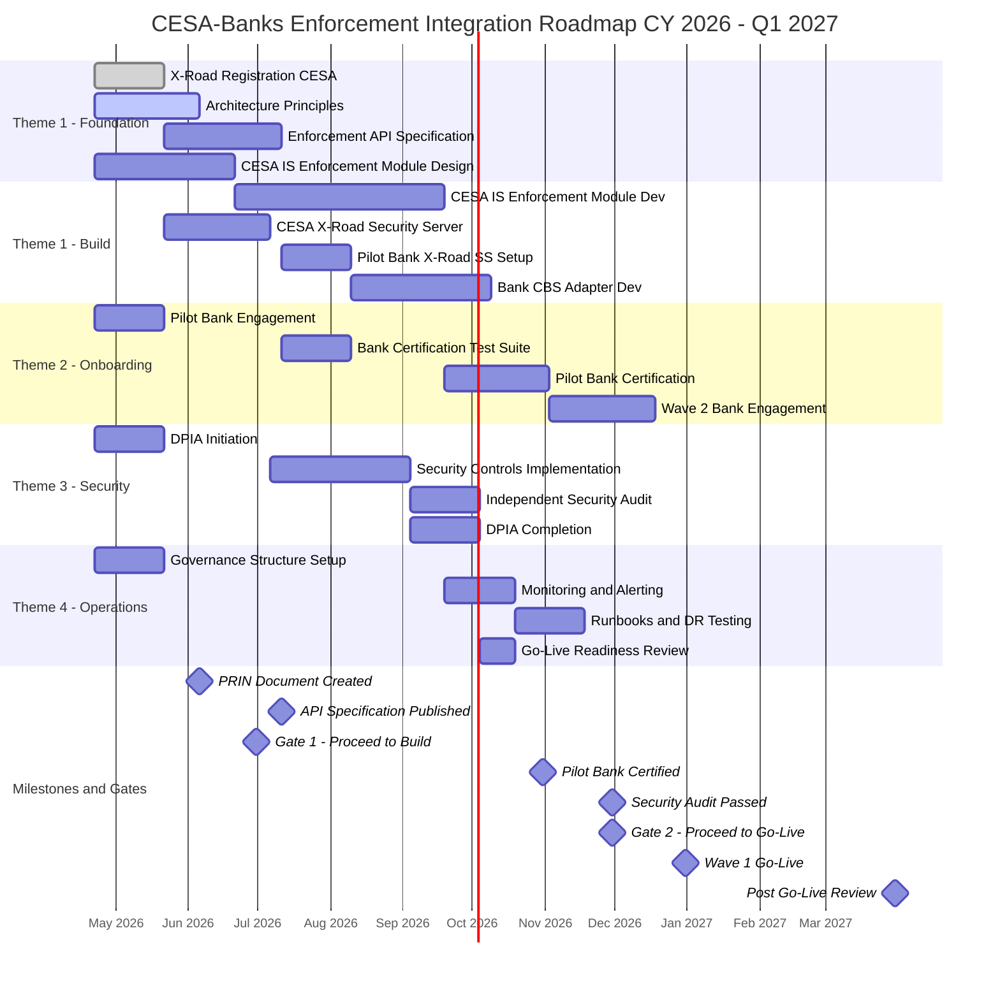
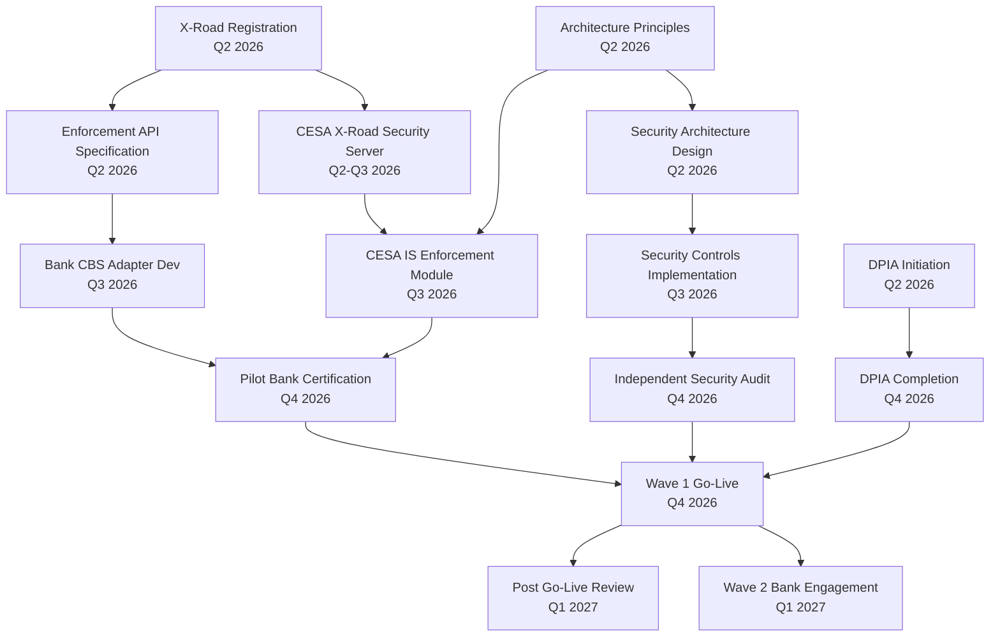

# Architecture Roadmap: CESA–Commercial Banks Enforcement Integration

> **Template Origin**: Official | **ArcKit Version**: 4.9.1 | **Command**: `/arckit:roadmap`

> **Prerequisite Warning**: Architecture Principles document (ARC-000-PRIN) has not yet been created. This roadmap includes principle creation as a Q2 2026 action. Run `/arckit:principles` before the ARB review of this roadmap to ensure full alignment.

## Document Control

| Field | Value |
|-------|-------|
| **Document ID** | ARC-001-ROAD-v1.0 |
| **Document Type** | Strategic Architecture Roadmap |
| **Project** | CESA–Banks Enforcement Integration (Project 001) |
| **Classification** | OFFICIAL |
| **Status** | DRAFT |
| **Version** | 1.0 |
| **Created Date** | 2026-04-22 |
| **Last Modified** | 2026-04-22 |
| **Review Cycle** | Quarterly |
| **Next Review Date** | 2026-05-22 |
| **Owner** | Programme Lead, CESA IT Department |
| **Reviewed By** | PENDING |
| **Approved By** | PENDING |
| **Distribution** | Project Team, Architecture Team, CESA Programme Office, Commercial Bank Representatives |
| **Period Covered** | Q2 CY 2026 – Q1 CY 2027 (12 months) |

## Revision History

| Version | Date | Author | Changes | Approved By | Approval Date |
|---------|------|--------|---------|-------------|---------------|
| 1.0 | 2026-04-22 | ArcKit AI | Initial creation from `/arckit:roadmap` command | PENDING | PENDING |

---

## Executive Summary

### Strategic Vision

The Armenian State Enforcement Service (CESA) is transitioning from a manual, document-based enforcement process to a fully automated, real-time API integration with all licensed commercial banks in Armenia. Today, enforcement orders — account blocking, fund collection, and restriction lifting — are dispatched manually, introducing delays of hours to days between legal order issuance and bank execution. This window exposes enforcement to asset dissipation risk and undermines the practical authority of court orders [CBBP-C1].

This roadmap defines the 12-month programme to build, test, and deploy the X-Road-backed enforcement integration platform. By end of Q1 2027, CESA officers will initiate enforcement actions in the CESA Case Management System and receive bank confirmation within 5 seconds — with a cryptographically signed audit trail on both sides. The X-Road interoperability platform provides the secure, standards-based backbone, and all participating banks adopt a CESA-published API specification for enforcement endpoints [CBBP-C2].

### Investment Summary

| Category | Indicative Estimate | Notes |
|----------|-------------------|-------|
| **Total Programme Investment** | TBD | To be confirmed via business case (SOBC) |
| **CESA IS Development** | Indicative: $200K–$280K USD | 3–4 developers, 6–9 months |
| **X-Road Infrastructure** | Indicative: $40K–$60K USD | Security Server hardware/VM, certificates |
| **Security Audit & DPIA** | Indicative: $25K–$40K USD | Independent security assessment |
| **Bank Onboarding Support** | Indicative: $30K–$50K USD | Technical support per bank |
| **Project Management & Governance** | Indicative: $50K–$70K USD | PM, architecture oversight |
| **Training** | Indicative: $15K–$25K USD | Officer and bank technical training |

> All figures are indicative estimates requiring formal business case validation. Run `/arckit:sobc` to develop a full 5-case business case.

### Expected Outcomes

1. **Real-time enforcement**: Account blocking confirmed within 5 seconds per bank — eliminating the current hours-to-days delay
2. **Complete enforcement coverage**: All licensed commercial banks reachable via X-Road, eliminating selective enforcement risk
3. **Audit-ready by default**: 100% cryptographically signed audit trail for every enforcement action — legally defensible without additional effort
4. **Officer efficiency**: CESA officer time spent on enforcement dispatch reduced by more than 80% for X-Road-connected banks
5. **Scalable platform**: Infrastructure that can onboard additional banks with configuration-only changes, no code modifications

### Timeline at a Glance

- **Duration**: April 2026 – March 2027 (12 months)
- **Major Phases**: 4 phases (Foundation → Build → Test & Harden → Go-Live)
- **Key Milestones**: 6 governance milestones
- **Decision Gates**: 3 Go/No-Go gates

---

## Strategic Context

### Vision & Strategic Drivers

#### Business Vision

Armenia's enforcement service must be able to act on court orders with the same immediacy that financial systems operate. The integration platform eliminates the systemic delay in the enforcement chain — from legal order to bank action — and makes that chain transparent, auditable, and legally robust. X-Road, as the established national interoperability backbone, provides the trust framework without requiring bespoke security engineering [CBBP-C2].

#### Link to Business Requirements

| Business Driver | Requirement | Roadmap Theme | Delivery Quarter |
|----------------|-------------|---------------|-----------------|
| Real-time enforcement execution | BR-001 | Theme 1: X-Road Integration | Q3–Q4 2026 |
| Automated account discovery | BR-002 | Theme 1: X-Road Integration | Q3 2026 |
| Legal non-repudiation and audit trail | BR-003 | Theme 3: Security & Compliance | Q3–Q4 2026 |
| Unified enforcement platform | BR-004 | Theme 1: X-Road Integration | Q3 2026 |
| Phased bank onboarding | BR-005 | Theme 2: Bank Onboarding | Q4 2026 – Q1 2027 |
| Officer efficiency improvement | BR-006 | Theme 4: Operational Readiness | Q1 2027 |

#### Architecture Principles Alignment

> ARC-000-PRIN has not yet been created. The following principles are recommended for adoption and will be formalised by running `/arckit:principles` in Q2 2026.

| Recommended Principle | Roadmap Compliance | Target Date |
|----------------------|--------------------|-------------|
| Interoperability First (use X-Road for all inter-agency exchange) | Theme 1 delivers this | Q3 2026 |
| Security by Design (non-repudiation, mTLS, encryption at rest) | Theme 3 delivers this | Q3–Q4 2026 |
| Data Minimisation (transmit only what is legally necessary) | Enforced in API specification | Q2 2026 |
| Open Standards (X-Road, OpenAPI 3.0, REST/JSON) | API specification follows this | Q2 2026 |
| Audit by Default (tamper-evident log on both sides) | Theme 3 delivers this | Q3 2026 |

### Current State Assessment

#### Technology Landscape

**CESA Internal Systems**:
- **CESA Case Management System**: Existing system managing enforcement cases; does not currently have API integration capability for bank communications. Enforcement actions are initiated in the system but dispatched manually.
- **Bank Communication Channel**: No automated channel. Officers prepare documents and transmit via email, fax, or physical delivery depending on bank relationship.

**Bank Systems**:
- **Bank Core Banking Systems (CBS)**: Vary per bank (typically proprietary or major vendor). No standardised enforcement API exists. Manual bank staff action required to apply holds or process collections.

**X-Road Infrastructure**:
- **CESA**: Not yet registered as an X-Road member. No Security Server deployed.
- **Banks**: Likely partial X-Road adoption for other government integrations (tax, social security). Enforcement-specific endpoints do not exist.

#### Capability Maturity Baseline

| Capability Domain | Current Maturity | Assessment |
|-------------------|-----------------|------------|
| Enforcement API Integration | L1 (Initial) | No automated integration exists; entirely manual |
| X-Road Connectivity (CESA) | L0 (None) | Not yet an X-Road member |
| Bank CBS API (enforcement endpoints) | L0 (None) | No enforcement API endpoints defined or deployed |
| Audit & Non-Repudiation | L1 (Initial) | Manual records only; no cryptographic signing |
| Security Controls (enforcement channel) | L1 (Initial) | Relying on email/document security; no mTLS |
| Operational Monitoring | L1 (Initial) | No monitoring of enforcement action delivery |

#### Risk Exposure (from ARC-001-REQ-v1.0)

| Risk | Impact on Roadmap |
|------|-----------------|
| R-001: Banks reluctant without CBA mandate | May delay bank onboarding; pilot bank strategy mitigates |
| R-002: X-Road latency exceeds 5-second target | Performance testing in Q3 2026 validates this early |
| R-003: Legal reference format not standardised | Must be resolved in Q2 2026 or blocks FR-010 |
| R-004: Personal data breach via insecure channel | Security architecture in Theme 3 mitigates |
| R-005: Bank CBS returns incorrect data | Bank certification testing in Q4 2026 mitigates |

### Future State Vision

#### Target Architecture (End of Q1 2027)

By the end of the programme, the CESA Case Management System will have a fully operational enforcement module that routes all enforcement actions through the CESA X-Road Security Server. At least one commercial bank will be live in production (Wave 1), with additional banks completing onboarding in the months following. The architecture will be:

- **API-first**: All enforcement actions via OpenAPI 3.0 compliant endpoints
- **X-Road native**: Mutual TLS, signed messages, independent audit logs on both sides
- **Configuration-driven**: New bank onboarding requires no code change
- **Audit-complete**: Every enforcement action has a cryptographically verifiable record

#### Capability Maturity Targets (Q1 2027)

| Capability Domain | Q1 2027 Target | Gap to Close |
|------------------|----------------|-------------|
| Enforcement API Integration | L3 (Defined) | +3 levels |
| X-Road Connectivity (CESA) | L3 (Defined) | +3 levels |
| Bank CBS API (enforcement endpoints) | L2 (Repeatable) for pilot banks | +2 levels |
| Audit & Non-Repudiation | L4 (Managed) | +3 levels |
| Security Controls (enforcement channel) | L4 (Managed) | +3 levels |
| Operational Monitoring | L2 (Repeatable) | +1 level |

---

## Roadmap Timeline

### Visual Timeline

### Roadmap Phases

#### Phase 1: Foundation (Q2 2026 — April to June 2026)

**Objectives**:
- Register CESA as an X-Road member and provision the X-Road Security Server
- Publish the enforcement API specification for banks
- Create architecture principles and governance structure
- Engage pilot bank(s) and initiate DPIA

**Key Deliverables**:
- CESA X-Road membership confirmed (EKENG registration complete)
- Enforcement API specification (OpenAPI 3.0) published for bank consumption
- ARC-000-PRIN (Architecture Principles) created and approved
- Pilot bank(s) identified and formally engaged
- DPIA scoping initiated with Data Protection Authority

**Gate 1 Go/No-Go Criteria** (end of June 2026):
- X-Road registration confirmed
- API specification approved by ARB
- At least 1 pilot bank committed to onboarding

---

#### Phase 2: Build & Integration (Q3 2026 — July to September 2026)

**Objectives**:
- Develop the CESA IS enforcement module
- Deploy CESA X-Road Security Server in development/staging environment
- Support pilot bank's X-Road Security Server setup and CBS adapter development
- Implement security controls (mTLS, encryption at rest, RBAC, audit logging)

**Key Deliverables**:
- CESA IS enforcement module (account query, block, collect, release API client) — feature complete
- CESA X-Road Security Server deployed and operational in staging
- Pilot bank X-Road Security Server connected to CESA staging
- Security controls implemented: mTLS, message signing, AES-256 at rest, RBAC

---

#### Phase 3: Testing & Security Hardening (Q4 2026 — October to November 2026)

**Objectives**:
- Execute end-to-end integration testing with pilot bank
- Complete independent security audit and penetration test
- Complete DPIA and obtain Data Protection Authority sign-off
- Achieve Go/No-Go decision for production deployment

**Key Deliverables**:
- Pilot bank certified against CESA enforcement API specification
- Independent security audit report with all critical/high findings resolved
- DPIA completed and approved
- Monitoring, alerting, and operational runbooks in place

**Gate 2 Go/No-Go Criteria** (end of November 2026):
- All integration tests passing (NFR-P-001: block confirmed within 5 seconds)
- Security audit: zero unresolved critical or high findings
- DPIA approved
- Operational runbooks reviewed and approved

---

#### Phase 4: Go-Live & Handover (Q4 2026 – Q1 2027 — December 2026 to March 2027)

**Objectives**:
- Deploy CESA IS enforcement module to production
- Execute Wave 1 go-live with pilot bank(s)
- Conduct post-go-live review and stability monitoring
- Plan Wave 2 bank onboarding

**Key Deliverables**:
- Wave 1 go-live: CESA and pilot bank(s) live on X-Road enforcement channel
- Post-go-live monitoring dashboard operational
- Wave 2 bank onboarding plan confirmed (additional banks, timeline)
- Lessons learned report and roadmap refresh recommendation

---

## Roadmap Themes & Initiatives

### Theme 1: X-Road Integration & API Platform

#### Strategic Objective

Build the technical backbone for real-time enforcement data exchange: CESA's X-Road Security Server, the enforcement API specification, and the CESA IS enforcement module. This theme delivers the core platform on which all bank integrations depend. [CBBP-C2]

#### Timeline by Quarter

**Q2 2026 (Foundation)**:
- Initiative 1.1: CESA X-Road membership registration with EKENG
- Initiative 1.2: Enforcement API specification design (account query, block, collect, release)
- Initiative 1.3: CESA IS enforcement module technical design and sprint planning
- **Milestone**: API specification published for banks (July 2026)
- **Indicative Investment**: See investment table below

**Q3 2026 (Build)**:
- Initiative 1.4: CESA IS enforcement module development (10 sprints of 2 weeks)
- Initiative 1.5: CESA X-Road Security Server deployment (staging environment)
- Initiative 1.6: End-to-end connectivity test (CESA → X-Road → pilot bank staging)
- **Milestone**: CESA IS enforcement module feature-complete (September 2026)

**Q4 2026 (Integration & Go-Live Prep)**:
- Initiative 1.7: Production X-Road Security Server deployment
- Initiative 1.8: Production CESA IS enforcement module deployment
- **Milestone**: Production environment ready (November 2026)

**Q1 2027 (Stabilisation)**:
- Initiative 1.9: Performance tuning based on production telemetry
- Initiative 1.10: Configuration-driven onboarding tooling for Wave 2 banks
- **Milestone**: Wave 2 onboarding tooling ready (March 2027)

#### Success Criteria

- [ ] CESA IS enforcement module passes all acceptance tests for BR-001, FR-001 through FR-010
- [ ] Account blocking confirmed within 5 seconds at the 95th percentile (NFR-P-001)
- [ ] Account discovery returns results from all registered banks within 30 seconds (NFR-P-002)
- [ ] Zero manual steps in enforcement transmission path from CESA IS to bank CBS

---

### Theme 2: Bank Onboarding & Certification

#### Strategic Objective

Engage, certify, and onboard Armenian commercial banks to the X-Road enforcement channel. This theme ensures the platform has real-world bank participation and that each onboarded bank has passed a defined certification test suite before going live. [CBBP-C5]

#### Timeline by Quarter

**Q2 2026 (Engagement)**:
- Initiative 2.1: Identify and formally engage pilot bank(s) — target 1–2 early adopters
- Initiative 2.2: Brief Central Bank of Armenia (CBA) on programme; seek regulatory coordination
- Initiative 2.3: Draft bank participation agreement (technical obligations, SLA terms)
- **Milestone**: Pilot bank(s) committed (June 2026)

**Q3 2026 (Technical Onboarding)**:
- Initiative 2.4: Support pilot bank X-Road Security Server procurement and deployment
- Initiative 2.5: Provide bank with enforcement API specification and test suite
- Initiative 2.6: Bank CBS adapter development support (advisory role — bank's responsibility)
- **Milestone**: Pilot bank X-Road Security Server connected to CESA staging (August 2026)

**Q4 2026 (Certification)**:
- Initiative 2.7: Run full certification test suite against pilot bank
- Initiative 2.8: Resolve certification test failures with bank technical team
- Initiative 2.9: Issue bank certification sign-off
- **Milestone**: Pilot bank certified (October 2026)

**Q1 2027 (Wave 2 Planning)**:
- Initiative 2.10: Engage 3–5 additional banks for Wave 2 onboarding
- Initiative 2.11: Publish learnings from pilot as a bank onboarding guide
- **Milestone**: Wave 2 onboarding plan confirmed (March 2027)

#### Success Criteria

- [ ] At least 1 bank fully certified and live on X-Road enforcement channel by end of Q4 2026
- [ ] Bank certification process documented and repeatable for Wave 2
- [ ] Certification test suite covers all 4 API endpoints (query, block, collect, release)
- [ ] Bank SLA agreement signed (3-second CBS processing target per NFR-P-001)

---

### Theme 3: Security, Compliance & Audit

#### Strategic Objective

Ensure the enforcement integration platform meets the highest security and legal standards — non-repudiation, data protection, and compliance with Armenian enforcement law. Security must be built in from day one, not bolted on after. (NFR-SEC-001 through NFR-SEC-006, NFR-C-001 through NFR-C-004) [CBBP-C4]

#### Timeline by Quarter

**Q2 2026 (Design & Initiation)**:
- Initiative 3.1: Security architecture design — mTLS, message signing, encryption at rest, RBAC
- Initiative 3.2: DPIA scoping — identify data flows, legal basis, DPA consultation plan
- Initiative 3.3: Audit logging design — tamper-evident log structure, retention schedule (DR-003, DR-006)
- **Milestone**: Security architecture approved by ARB (June 2026)

**Q3 2026 (Implementation)**:
- Initiative 3.4: mTLS and X-Road digital signature implementation (NFR-SEC-001, NFR-SEC-002)
- Initiative 3.5: AES-256 encryption at rest for CESA IS database (NFR-SEC-003)
- Initiative 3.6: RBAC implementation — Officer, Supervisor, Admin, Auditor roles (NFR-SEC-004)
- Initiative 3.7: MFA for CESA officer authentication (NFR-SEC-005)
- Initiative 3.8: Tamper-evident audit log implementation with hash chaining (NFR-C-002)
- **Milestone**: Security controls implementation complete (September 2026)

**Q4 2026 (Validation)**:
- Initiative 3.9: Independent security audit by external specialist (NFR-SEC-001 through NFR-SEC-006)
- Initiative 3.10: Penetration test of X-Road integration channel
- Initiative 3.11: DPIA completion and submission to Data Protection Authority (NFR-C-003)
- **Milestone**: Security audit passed — zero unresolved critical/high findings (November 2026)
- **Milestone**: DPIA approved (November 2026)

**Q1 2027 (Sustain)**:
- Initiative 3.12: Ongoing vulnerability monitoring (quarterly scan cadence)
- Initiative 3.13: Security incident response process operational
- **Milestone**: Continuous compliance monitoring operational (March 2027)

#### Success Criteria

- [ ] All critical and high findings from security audit resolved before go-live
- [ ] DPIA approved by Data Protection Authority
- [ ] Audit log hash chain integrity verified — zero tampered records in test
- [ ] MFA enforced for 100% of CESA officer accounts before go-live

---

### Theme 4: Governance, Operational Readiness & Architecture Foundations

#### Strategic Objective

Establish the governance structures, architecture documentation, and operational capabilities required to run and sustain the enforcement integration platform — and to plan effectively for future phases of the programme. [CBBP-C5]

#### Timeline by Quarter

**Q2 2026 (Foundation)**:
- Initiative 4.1: Create ARC-000-PRIN (Architecture Principles) — run `/arckit:principles`
- Initiative 4.2: Establish Architecture Review Board (ARB) — monthly cadence
- Initiative 4.3: Formalise risk register — run `/arckit:risk`
- Initiative 4.4: Create stakeholder map — run `/arckit:stakeholders`
- **Milestone**: PRIN created and ARB operational (June 2026)

**Q3 2026 (Monitoring Setup)**:
- Initiative 4.5: Monitoring and alerting design (X-Road transmission success/failure rates, latency)
- Initiative 4.6: Enforcement status dashboard development (FR-007)
- Initiative 4.7: Retry and fallback handling implementation (FR-008)
- **Milestone**: Monitoring dashboard operational in staging (September 2026)

**Q4 2026 (Operational Readiness)**:
- Initiative 4.8: Runbook authoring — enforcement channel failure, bank unavailability, DR scenarios
- Initiative 4.9: DR test — simulate X-Road channel failure and verify fallback
- Initiative 4.10: CESA officer training on new enforcement workflows
- Initiative 4.11: Bank compliance officer training on new API-driven process
- **Milestone**: Operational readiness confirmed (November 2026)

**Q1 2027 (Review & Refresh)**:
- Initiative 4.12: Post-go-live review — performance against NFRs, officer feedback, incident log
- Initiative 4.13: Lessons learned report published
- Initiative 4.14: Roadmap refresh for CY 2027 (Wave 2 banks, additional capabilities)
- **Milestone**: Post-go-live review complete and CY 2027 roadmap drafted (March 2027)

#### Success Criteria

- [ ] ARC-000-PRIN created and approved before ARB Gate 1 review
- [ ] Risk register formally maintained with quarterly reviews
- [ ] Monitoring dashboard showing real-time enforcement action success/failure rates
- [ ] All CESA enforcement officers trained before Wave 1 go-live
- [ ] DR test passed — fallback to manual process verified within defined RTO

---

## Capability Delivery Matrix

| Capability Domain | Baseline (Apr 2026) | Q2 2026 | Q3 2026 | Q4 2026 | Q1 2027 (Target) |
|-------------------|---------------------|---------|---------|---------|-----------------|
| Enforcement API Integration | L0 (None) | L1 | L2 | L3 | L3 (Defined) |
| X-Road Connectivity (CESA) | L0 (None) | L1 | L2 | L3 | L3 (Defined) |
| Bank CBS API (enforcement endpoints) | L0 (None) | L0 | L1 | L2 | L2 (Repeatable) |
| Audit & Non-Repudiation | L1 (Initial) | L1 | L3 | L4 | L4 (Managed) |
| Security Controls (enforcement) | L1 (Initial) | L2 | L3 | L4 | L4 (Managed) |
| Operational Monitoring | L1 (Initial) | L1 | L2 | L2 | L2 (Repeatable) |
| Architecture Governance | L1 (Initial) | L2 | L2 | L3 | L3 (Defined) |

**Capability Maturity Model**:

| Level | Label | Description |
|-------|-------|-------------|
| L0 | None | Capability does not exist |
| L1 | Initial / Ad-hoc | Unpredictable, reactive, individual effort |
| L2 | Repeatable | Documented, can be repeated, some discipline |
| L3 | Defined | Standardised, organisation-wide, consistent |
| L4 | Managed | Metrics-driven, quantitatively controlled |
| L5 | Optimised | Continuous improvement, industry-leading |

---

## Dependencies & Sequencing

### Initiative Dependencies

### Critical Path

1. **X-Road Registration** → 2. **API Specification Published** → 3. **Pilot Bank Engaged** → 4. **CESA IS Module Developed** → 5. **Security Controls Implemented** → 6. **Integration Testing** → 7. **Security Audit Passed** → 8. **Wave 1 Go-Live**

### External Dependencies

| Dependency | Owner | Required By | Risk Level | Mitigation |
|------------|-------|-------------|------------|------------|
| CESA X-Road membership registration | EKENG | May 2026 | HIGH | Initiate immediately; EKENG lead time is 4–6 weeks |
| Pilot bank commitment | Commercial bank (TBD) | June 2026 | HIGH | CBA coordination; executive-level engagement |
| CBA regulatory coordination | Central Bank of Armenia | June 2026 | MEDIUM | Briefing in Q2; formal request for bank participation directive |
| Legal reference format agreement | Ministry of Justice / CESA | June 2026 | MEDIUM | Bilateral agreement; sample court orders for validation |
| DPIA DPA consultation | Data Protection Authority | October 2026 | MEDIUM | Early engagement in Q2 to set expectations |
| Independent security auditor | External specialist | October 2026 | LOW | Procure in Q2 to secure availability for Q4 |

---

## Investment & Resource Planning

### Investment Summary by Quarter

| Period | CAPEX (indicative) | OPEX (indicative) | Total |
|--------|-------------------|-------------------|-------|
| Q2 2026 (Foundation) | $60K–$80K | $20K–$30K | $80K–$110K |
| Q3 2026 (Build) | $80K–$120K | $25K–$35K | $105K–$155K |
| Q4 2026 (Test & Go-Live) | $20K–$30K | $30K–$40K | $50K–$70K |
| Q1 2027 (Stabilise) | $10K–$20K | $25K–$35K | $35K–$55K |
| **Total** | **$170K–$250K** | **$100K–$140K** | **$270K–$390K** |

> All amounts are indicative USD estimates. Actual budgets require formal business case (SOBC) approval and should be denominated in AMD following CESA financial governance.

### Resource Requirements

| Period | FTE (CESA IT) | Key External Roles | Notes |
|--------|--------------|--------------------|-------|
| Q2 2026 | 2 FTE | Architect (part-time), X-Road specialist | Design and registration phase |
| Q3 2026 | 3–4 FTE | 2–3 developers, X-Road specialist | Core development sprint |
| Q4 2026 | 2–3 FTE | Security auditor (external), test engineers | Testing and hardening |
| Q1 2027 | 1–2 FTE | Support engineer | Stabilisation and Wave 2 planning |

### Investment by Theme

| Theme | Q2 2026 | Q3 2026 | Q4 2026 | Q1 2027 | Total (indicative) |
|-------|---------|---------|---------|---------|-------------------|
| Theme 1: X-Road Integration | 40% | 50% | 25% | 40% | ~$130K–$180K |
| Theme 2: Bank Onboarding | 25% | 20% | 25% | 30% | ~$70K–$100K |
| Theme 3: Security & Compliance | 20% | 20% | 40% | 15% | ~$70K–$100K |
| Theme 4: Governance & Operations | 15% | 10% | 10% | 15% | ~$30K–$50K |

### Benefits Realisation

| Benefit | Q4 2026 | Q1 2027 | Full Year Post-Launch |
|---------|---------|---------|----------------------|
| Enforcement dispatch time (reduction) | > 80% (X-Road banks) | > 80% (all onboarded banks) | > 80% sustained |
| Officer time per enforcement order | Reduced for pilot bank(s) | Reduced for all onboarded banks | TBD from post-launch study |
| Failed enforcement rate (technical) | < 1% (initial target) | < 0.5% | < 0.5% sustained |
| Audit trail completeness | 100% for X-Road transactions | 100% | 100% |

---

## Risks, Assumptions & Constraints

### Key Risks

| Risk ID | Risk | Impact | Probability | Mitigation | Owner | Target |
|---------|------|--------|-------------|------------|-------|--------|
| R-001 | Banks unwilling without CBA mandate | HIGH | HIGH | CBA briefing Q2; pilot with willing bank; evidence value before mandate | CESA / CBA | Q2 2026 |
| R-002 | X-Road latency exceeds 5-second target | HIGH | MEDIUM | Early performance testing in staging with realistic payloads; enforce bank SLA | CESA IT | Q3 2026 |
| R-003 | Legal reference format not standardised | HIGH | MEDIUM | Bilateral agreement with Ministry of Justice in Q2; validate against real court orders | CESA Legal | Q2 2026 |
| R-004 | Personal data breach — enforcement channel | CRITICAL | LOW | mTLS, message signing, audit; independent security audit before go-live | CESA IT / Security | Q4 2026 |
| R-005 | Bank CBS incorrect data — wrong accounts blocked | CRITICAL | LOW | Mandatory bank certification testing; dispute resolution process; liability agreement | CESA Legal | Q4 2026 |
| R-006 | EKENG X-Road registration delayed | HIGH | MEDIUM | Initiate registration immediately; escalate via Ministry of Justice if stalled | CESA IT / Programme | Q2 2026 |

> See ARC-001-REQ-v1.0 Section "Dependencies and Risks" for full risk detail. Run `/arckit:risk` to create a formal risk register.

### Critical Assumptions

| ID | Assumption | Validation Approach | Contingency |
|----|------------|---------------------|-------------|
| A-001 | EKENG will register CESA as X-Road member within 4 weeks of application | Initiate application in week 1; weekly follow-up | Escalate through Ministry of Justice |
| A-002 | At least 1 commercial bank will commit to pilot by end of Q2 2026 | CBA engagement and executive outreach in Q2 | Extend pilot phase by 1 quarter; delay go-live to Q1 2027 |
| A-003 | Network round-trip time CESA to any bank X-Road SS is under 500ms | Measure during staging integration in Q3 | If latency too high, investigate dedicated connection options |
| A-004 | Ministry of Justice will agree standardised court order reference format | Bilateral meeting in Q2 2026 | If delayed, implement flexible format validation pending agreement |
| A-005 | DPA will complete DPIA review within 4 weeks of submission | Early engagement in Q2; pre-consultation if available | Parallel track: submit DPIA early; go-live not blocked if DPA confirms no objection within review window |

### Constraints

| Constraint | Description | Impact on Roadmap |
|------------|-------------|-------------------|
| **Bank autonomy** | Banks implement their own CBS adapters; CESA provides spec and test suite only | Bank-side delivery speed is outside CESA's direct control |
| **Legal basis requirement** | All enforcement orders must carry a valid legal reference (BC-002) | FR-010 (legal validation) must be complete before any production traffic |
| **X-Road governance** | CESA and banks must comply with EKENG's X-Road membership agreement | Certificate lifecycle and SS version requirements must be maintained throughout |
| **Budget TBD** | Formal budget approval requires SOBC completion | Investment figures remain indicative until SOBC approved |

---

## Governance & Decision Gates

### Governance Structure

#### Architecture Review Board (ARB)

- **Frequency**: Monthly
- **Purpose**: Review architecture decisions, approve API specifications, resolve technical blockers
- **Participants**: CESA Chief Architect (or delegate), CESA IT Lead, Bank Technical Representatives (quarterly)
- **Deliverables**: Architecture Decision Records (ADRs), specification approvals

#### Programme Board

- **Frequency**: Monthly
- **Purpose**: Programme-level oversight, budget tracking, risk management, bank onboarding coordination
- **Participants**: CESA Programme Manager, Finance representative, CBA representative (quarterly), ARB representative
- **Deliverables**: Progress reports, budget variance, risk updates

#### Steering Committee

- **Frequency**: Quarterly
- **Purpose**: Strategic direction, investment decisions, escalation resolution, CBA and Ministry of Justice alignment
- **Participants**: CESA Senior Leadership, Programme Manager, Chief Architect, Ministry of Justice representative
- **Deliverables**: Strategic decisions, funding confirmations, roadmap adjustments

### Review Cycles

| Review Type | Frequency | Purpose |
|-------------|-----------|---------|
| Sprint Review | Bi-weekly | Development progress, demo of completed features |
| ARB Review | Monthly | Architecture governance, ADR approvals |
| Programme Board | Monthly | Budget, schedule, risk tracking |
| Steering Committee | Quarterly | Strategic alignment, investment decisions |
| Roadmap Review | Quarterly | Roadmap adjustment based on delivery actuals |

### Decision Gates

| Gate | Date | Decision Required | Go/No-Go Criteria |
|------|------|-------------------|-------------------|
| Gate 1: Proceed to Build | June 2026 | Approve development phase investment | X-Road registered; API spec ARB-approved; pilot bank committed; PRIN created |
| Gate 2: Proceed to Production | November 2026 | Approve Wave 1 go-live | Integration tests passing; security audit clear; DPIA approved; runbooks ready; officer training complete |
| Gate 3: Proceed to Wave 2 | March 2027 | Approve Wave 2 bank onboarding plan | Wave 1 stable in production; monitoring showing < 0.5% failure rate; bank onboarding guide published |

---

## Success Metrics & KPIs

### Strategic KPIs

| KPI | Baseline | Q2 2026 Target | Q3 2026 Target | Q4 2026 Target | Q1 2027 Target |
|-----|----------|----------------|----------------|----------------|----------------|
| Enforcement execution time (block) | Hours–days | N/A (building) | Staging: < 10s | Staging: < 5s | Production: < 5s |
| Banks live on X-Road enforcement | 0 | 0 | 0 | 1 (pilot) | 1–3 |
| Audit trail completeness | 0% automated | N/A | 100% in staging | 100% in staging | 100% production |
| Failed enforcement rate (technical) | N/A | N/A | < 2% (staging) | < 1% (staging) | < 0.5% production |
| Officer training completion | 0% | 0% | 50% | 100% | 100% |

### Technical Metrics

| Metric | Baseline | Q3 2026 | Q4 2026 | Q1 2027 |
|--------|----------|---------|---------|---------|
| Blocking order latency p95 | N/A (manual) | Staging measured | < 5s staging | < 5s production |
| X-Road message success rate | N/A | > 95% staging | > 99% staging | > 99.5% production |
| System availability (CESA IS) | N/A | N/A | 99% staging | 99.9% production |
| Security audit findings (critical/high) | N/A | N/A | 0 unresolved | 0 production |
| Audit log integrity check | N/A | 100% staging | 100% staging | 100% production |

### Business Outcome Metrics

| Business Outcome | Baseline | Q4 2026 | Q1 2027 |
|-----------------|----------|---------|---------|
| Time to execute enforcement order | Hours–days | < 5s (pilot bank) | < 5s (all onboarded) |
| Manual steps in enforcement dispatch | Multiple | 0 (X-Road banks) | 0 (X-Road banks) |
| CESA officer time per case (dispatch) | TBD | TBD | > 80% reduction (target) |
| Asset dissipation incidents (enforcement delay) | TBD baseline | Reduced | Significantly reduced |

---

## Traceability

### Requirements → Capability Delivery

| Requirement ID | Capability Delivered | Roadmap Theme | Delivery Quarter |
|----------------|---------------------|---------------|----------------|
| BR-001 (Real-time enforcement) | X-Road enforcement API live | Theme 1 | Q4 2026 |
| BR-002 (Account discovery) | Discovery endpoint operational | Theme 1 | Q3 2026 |
| BR-003 (Non-repudiation) | Signed audit log on both sides | Theme 3 | Q3 2026 |
| BR-004 (Unified platform) | CESA IS single enforcement UI | Theme 1 | Q3 2026 |
| BR-005 (Phased onboarding) | Bank registry + Wave 1 pilot | Theme 2 | Q4 2026 |
| BR-006 (Officer efficiency) | New enforcement workflow | Theme 4 | Q1 2027 |
| NFR-P-001 (5-second blocking) | Performance validated in staging | Theme 1 + Theme 2 | Q4 2026 |
| NFR-SEC-001 (mTLS) | X-Road mutual TLS enforced | Theme 3 | Q3 2026 |
| NFR-SEC-002 (Message signing) | X-Road digital signature | Theme 3 | Q3 2026 |
| NFR-C-002 (Audit logging) | Tamper-evident log, 10-year retention | Theme 3 | Q3 2026 |
| NFR-C-003 (Personal data protection) | DPIA approved, data minimisation enforced | Theme 3 | Q4 2026 |
| INT-001 (X-Road integration) | CESA Security Server operational | Theme 1 | Q3 2026 |
| INT-003 (Bank API) | API spec published, banks certified | Theme 2 | Q4 2026 |

### Risks → Mitigation Timeline

| Risk ID | Mitigation Activity | Roadmap Theme | Mitigation Completion |
|---------|-------------------|---------------|-----------------------|
| R-001 (Bank reluctance) | CBA engagement; pilot bank commitment | Theme 2 | Q2 2026 |
| R-002 (X-Road latency) | Performance testing in staging | Theme 1 | Q3 2026 |
| R-003 (Legal format) | Bilateral agreement with MoJ | Theme 4 | Q2 2026 |
| R-004 (Data breach) | Security audit; mTLS; encryption | Theme 3 | Q4 2026 |
| R-005 (Wrong account blocked) | Bank certification test suite | Theme 2 | Q4 2026 |
| R-006 (EKENG delay) | Immediate application; weekly follow-up | Theme 1 | Q2 2026 |

---

## Appendices

### Appendix A: Capability Maturity Model (CMM)

| Level | Label | Characteristics |
|-------|-------|----------------|
| L0 | None | Capability does not exist; entirely absent |
| L1 | Initial / Ad-hoc | Unpredictable, reactive; dependent on individual effort; not documented |
| L2 | Repeatable | Documented processes at project level; can repeat previous successes |
| L3 | Defined | Standardised organisation-wide; consistent across teams; proactively managed |
| L4 | Managed | Quantitatively managed; metrics-driven; statistical process control |
| L5 | Optimised | Continuous improvement; innovative; industry-leading performance |

---

### Appendix B: Technology Radar

#### Adopt (proven, use now)

- X-Road 6 — interoperability platform
- OpenAPI 3.0 — API specification standard
- Mutual TLS (X.509) — transport security
- AES-256 — data encryption at rest
- REST/JSON — API message format

#### Trial (test in low-risk contexts)

- OpenTelemetry — distributed tracing for enforcement channel monitoring
- Structured logging (JSON) — for X-Road audit log aggregation

#### Assess (explore, not production-ready)

- X-Road REST adapter pattern — for banks with legacy SOAP CBS systems
- AsyncAPI — for future event-driven enforcement notification patterns

#### Hold (do not use for new work)

- Email / document-based enforcement dispatch — current manual process, to be deprecated
- Bespoke bank-specific integration adapters in CESA IS — API specification enforces standardisation

---

### Appendix C: Vendor / Platform Roadmap Alignment

| Platform | Our Dependency | Version Alignment | Risk |
|----------|---------------|------------------|------|
| X-Road 6 (open source) | Core interoperability backbone | Active development, maintained by Nordic Institute for Interoperability Solutions (NIIS) | LOW — open source, no vendor lock-in |
| EKENG X-Road Central Server | CA, OCSP, member registry | Managed by EKENG; CESA dependent on EKENG SLA | MEDIUM — single-provider dependency |
| Bank CBS (various vendors) | Enforcement API endpoint hosting | Varies per bank; CESA provides API spec, not CBS | MEDIUM — bank implementation quality varies |
| PostgreSQL (proposed) | CESA IS enforcement database | Active LTS releases | LOW — commodity, well-supported |

---

### Appendix D: Compliance & Standards Timeline

| Standard / Compliance | Baseline | Q2 2026 | Q3 2026 | Q4 2026 | Q1 2027 |
|-----------------------|----------|---------|---------|---------|---------|
| RA Law on Enforcement Proceedings | Manual compliance only | Legal review complete | Enforcement types implemented | All types validated | Maintained |
| RA Personal Data Protection Law | Partially met (manual) | DPIA initiated | Controls implemented | DPIA approved | Maintained |
| X-Road Governance / EKENG membership | Not a member | Registered | Security Server compliant | Certified | Maintained |
| Audit log retention (10 years) | No automated logs | Design approved | Automated logging live | Tamper-evident storage | Maintained |
| mTLS / X.509 certificate management | None | Certificates obtained | mTLS operational | Rotation plan in place | Maintained |

---

## External References

### Document Register

| Doc ID | Filename | Type | Source Location | Description |
|--------|----------|------|-----------------|-------------|
| CBBP | CESA-BANKS-BP.pdf | Business Process | `001-cesa-banks/external/` | Existing (AS-IS) and to-be business process swimlane diagrams for enforcement actions across RA commercial banks |

### Citations

| Citation ID | Doc ID | Page/Section | Category | Quoted Passage |
|-------------|--------|--------------|----------|----------------|
| CBBP-C1 | CBBP | Page 1 — AS-IS swimlane | Business Requirement | AS-IS process shows manual document preparation and sequential bank dispatch — source of hours-to-days enforcement delay driving the real-time roadmap objective |
| CBBP-C2 | CBBP | Page 1 — TO-BE swimlane | Design Decision | TO-BE state shows X-Road (globe icon) as central interoperability platform for all enforcement transmissions — confirms X-Road as the mandated integration backbone |
| CBBP-C4 | CBBP | Pages 1–3 — all flows | Compliance Constraint | All process flows include legal decision/order reference validation before transmission — mandatory legal reference requirement carried through all roadmap themes |
| CBBP-C5 | CBBP | Page 3 — departmental variant | Business Requirement | Departmental routing variant confirms multiple CESA units use the enforcement channel — justifies the unified platform objective and phased onboarding approach |

---

**Generated by**: ArcKit `/arckit:roadmap` command
**Generated on**: 2026-04-22 GMT
**ArcKit Version**: 4.9.1
**Project**: CESA–Banks Enforcement Integration (Project 001)
**AI Model**: claude-sonnet-4-6
**Generation Context**: Derived from ARC-001-REQ-v1.0.md (46 requirements), ARC-001-DIAG-001-v1.0.md (sequence diagram), and CESA-BANKS-BP.pdf (3-page business process document). No PRIN, STKE, WARD, or RISK artifacts available at time of generation. 1-year horizon (April 2026 – March 2027), Calendar Year notation, 4 themes.
