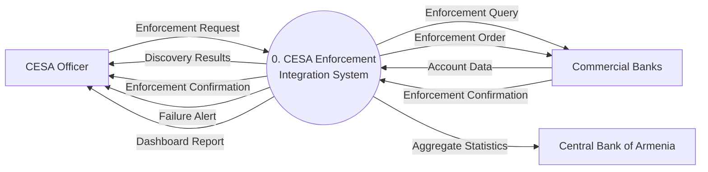
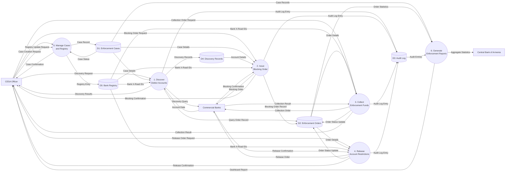

# Data Flow Diagram: CESA Enforcement Integration System

> **Template Origin**: Official | **ArcKit Version**: 4.9.1 | **Command**: `/arckit.dfd`

## Document Control

| Field | Value |
|-------|-------|
| **Document ID** | ARC-001-DFD-001-v1.0 |
| **Document Type** | Data Flow Diagram |
| **Project** | CESA-Banks Enforcement Integration (Project 001) |
| **Classification** | OFFICIAL |
| **Status** | DRAFT |
| **Version** | 1.0 |
| **Created Date** | 2026-04-22 |
| **Last Modified** | 2026-04-22 |
| **Review Cycle** | Quarterly |
| **Next Review Date** | 2026-05-22 |
| **Owner** | Programme Lead, CESA IT Department |
| **Reviewed By** | PENDING |
| **Approved By** | PENDING |
| **Distribution** | Project Team, Architecture Team, CESA Programme Office, Commercial Bank Representatives |
| **DFD Level** | All Levels (Context + Level 1) |
| **Notation** | Yourdon-DeMarco |

## Revision History

| Version | Date | Author | Changes | Approved By | Approval Date |
|---------|------|--------|---------|-------------|---------------|
| 1.0 | 2026-04-22 | ArcKit AI | Initial creation from `/arckit:dfd` command — derived from ARC-001-REQ-v1.0, ARC-001-DATA-v1.0, and CESA-BANKS-BP.pdf | PENDING | PENDING |

---

## Yourdon-DeMarco Notation Key

| Symbol | Shape | Description |
|--------|-------|-------------|
| **External Entity** | Rectangle | Source or sink of data outside the system boundary |
| **Process** | Circle | Transforms incoming data flows into outgoing data flows |
| **Data Store** | Open-ended rectangle (parallel lines) | Repository of data at rest |
| **Data Flow** | Named arrow | Data in motion between components |

**In Mermaid approximation**: Processes use `(("double-circle"))`, Data Stores use `[("cylinder")]`, External Entities use `["rectangle"]`.

---

## Context Diagram (Level 0)

The CESA Enforcement Integration System is treated as a single process (P0). All data crossing the system boundary is shown. Internal data stores are not visible at this level.

**External entities:**

| ID | Name | Role |
|----|------|------|
| OFFICER | CESA Officer | Initiates all enforcement actions; receives results, alerts, and reports |
| BANKS | Commercial Banks | X-Road member banks implementing the enforcement API (all 15+ CBA-licensed institutions) |
| CBA | Central Bank of Armenia | Receives aggregate enforcement statistics for regulatory oversight |

### `data-flow-diagram` Format

Render with: `pip install data-flow-diagram` then `dfd < file.dfd` (produces SVG/PNG with true Yourdon-DeMarco notation)

```dfd
title Context Diagram - CESA Enforcement Integration System

entity  OFFICER  "CESA Officer"
entity  BANKS    "Commercial Banks"
entity  CBA      "Central Bank\nof Armenia"
process P0       "0\nCESA Enforcement\nIntegration System"

OFFICER --> P0    "Enforcement Request"
P0      --> OFFICER "Discovery Results"
P0      --> OFFICER "Enforcement Confirmation"
P0      --> OFFICER "Failure Alert"
P0      --> OFFICER "Dashboard Report"
BANKS   --> P0    "Account Data"
BANKS   --> P0    "Enforcement Confirmation"
P0      --> BANKS  "Enforcement Query"
P0      --> BANKS  "Enforcement Order"
P0      --> CBA    "Aggregate Statistics"
```

### Mermaid Format

View at [mermaid.live](https://mermaid.live) or in GitHub/VS Code markdown preview.



---

## Level 1 DFD

The system is decomposed into six sub-processes. Internal data stores become visible. All data flows entering and leaving the Level 0 boundary are preserved and balanced.

**Processes:**

| ID | Name | Responsibility |
|----|------|---------------|
| P1 | Discover Debtor Accounts | Broadcast account discovery query to all ACTIVE banks via X-Road; aggregate responses |
| P2 | Issue Blocking Order | Validate and transmit signed account blocking orders; handle retry and failure alerting |
| P3 | Collect Enforcement Funds | Transmit signed collection orders; process full, partial, and zero-balance outcomes |
| P4 | Release Account Restrictions | Validate and transmit signed restriction release orders; confirm HOLD removal |
| P5 | Manage Cases and Registry | Create and update enforcement cases; manage bank X-Road registry; enforce RBAC |
| P6 | Generate Enforcement Reports | Produce real-time officer dashboard and monthly CBA aggregate statistics |

**Data stores:**

| ID | Name | Entity |
|----|------|--------|
| D1 | Enforcement Cases | E-001 (EnforcementCase) |
| D2 | Enforcement Orders | E-002 (EnforcementOrder) |
| D3 | Audit Log | E-003 (AuditLogEntry) |
| D4 | Discovery Records | E-004 (DiscoveryRecord) |
| D5 | Bank Registry | E-005 (BankRegistry) |

### `data-flow-diagram` Format

```dfd
title Level 1 DFD - CESA Enforcement Integration System

entity  OFFICER  "CESA Officer"
entity  BANKS    "Commercial Banks"
entity  CBA      "Central Bank\nof Armenia"

process P1  "1\nDiscover\nDebtor Accounts"
process P2  "2\nIssue\nBlocking Order"
process P3  "3\nCollect\nEnforcement Funds"
process P4  "4\nRelease\nAccount Restrictions"
process P5  "5\nManage Cases\nand Registry"
process P6  "6\nGenerate\nEnforcement Reports"

store   D1  "D1 Enforcement Cases"
store   D2  "D2 Enforcement Orders"
store   D3  "D3 Audit Log"
store   D4  "D4 Discovery Records"
store   D5  "D5 Bank Registry"

OFFICER --> P5    "Case Creation Request"
OFFICER --> P5    "Registry Update Request"
P5      --> D1    "Case Record"
D1      --> P5    "Case Status"
P5      --> D5    "Registry Entry"
P5      --> OFFICER "Case Confirmation"

OFFICER --> P1    "Discovery Request"
D1      --> P1    "Case Details"
D5      --> P1    "Bank X-Road IDs"
P1      --> BANKS "Discovery Query"
BANKS   --> P1    "Account Data"
P1      --> D4    "Discovery Records"
P1      --> D2    "Query Order Record"
P1      --> D3    "Audit Log Entry"
P1      --> OFFICER "Discovery Results"

OFFICER --> P2    "Blocking Order Request"
D1      --> P2    "Case Details"
D4      --> P2    "Account Details"
D5      --> P2    "Bank X-Road IDs"
P2      --> BANKS "Blocking Order"
BANKS   --> P2    "Blocking Confirmation"
P2      --> D2    "Blocking Order Record"
P2      --> D3    "Audit Log Entry"
P2      --> OFFICER "Blocking Confirmation"

OFFICER --> P3    "Collection Order Request"
D2      --> P3    "Order Details"
D5      --> P3    "Bank X-Road IDs"
P3      --> BANKS "Collection Order"
BANKS   --> P3    "Collection Result"
P3      --> D2    "Order Status Update"
P3      --> D3    "Audit Log Entry"
P3      --> OFFICER "Collection Result"

OFFICER --> P4    "Release Order Request"
D2      --> P4    "Order Details"
D5      --> P4    "Bank X-Road IDs"
P4      --> BANKS "Release Order"
BANKS   --> P4    "Release Confirmation"
P4      --> D2    "Order Status Update"
P4      --> D3    "Audit Log Entry"
P4      --> OFFICER "Release Confirmation"

D1      --> P6    "Case Records"
D2      --> P6    "Order Statistics"
D3      --> P6    "Audit Entries"
P6      --> OFFICER "Dashboard Report"
P6      --> CBA    "Aggregate Statistics"
```

### Mermaid Format



---

## Process Specifications

| Process ID | Name | Inputs | Outputs | Logic Summary | Req. Trace |
|------------|------|--------|---------|---------------|------------|
| P1 | Discover Debtor Accounts | Discovery Request (Officer), Case Details (D1), Bank X-Road IDs (D5) | Discovery Query (Banks), Account Data (from Banks), Discovery Records (D4), Query Order Record (D2), Audit Log Entry (D3), Discovery Results (Officer) | Validate case and debtor identifier format; broadcast discovery query to all ACTIVE-status banks via X-Road simultaneously; aggregate account responses; reject banks with ONBOARDING or MANUAL_ONLY status from broadcast; store discovery records and query order; log all X-Road messages | FR-001, BR-002, NFR-P-002, DR-004, INT-001, INT-003 |
| P2 | Issue Blocking Order | Blocking Order Request (Officer), Case Details (D1), Account Details (D4), Bank X-Road IDs (D5) | Blocking Order (Banks), Blocking Confirmation (from Banks), Blocking Order Record (D2), Audit Log Entry (D3), Blocking Confirmation or Failure Alert (Officer) | Validate legal reference present and format-valid (FR-010); verify officer MFA and RBAC; transmit digitally signed blocking order to target bank via X-Road; apply exponential backoff retry on failure (1s, 3s, 9s, max 3 attempts); update order status to CONFIRMED or FAILED; alert officer on retry exhaustion; support MANUAL_FOLLOWUP flagging | FR-002, FR-008, FR-010, BR-001, BR-003, NFR-P-001, NFR-SEC-002, INT-001 |
| P3 | Collect Enforcement Funds | Collection Order Request (Officer), Order Details (D2), Bank X-Road IDs (D5) | Collection Order (Banks), Collection Result (from Banks), Order Status Update (D2), Audit Log Entry (D3), Collection Result (Officer) | Validate CESA collection IBAN present and bank-registered; transmit signed collection order with amount in AMD and destination IBAN; handle full collection (CONFIRMED), partial (PARTIAL with shortfall reported), and zero-balance (INSUFFICIENT_FUNDS) outcomes; apply retry on transmission failure; log all outcomes | FR-003, FR-008, BR-001, NFR-P-003, INT-001, INT-005 |
| P4 | Release Account Restrictions | Release Order Request (Officer), Order Details (D2), Bank X-Road IDs (D5) | Release Order (Banks), Release Confirmation (from Banks), Order Status Update (D2), Audit Log Entry (D3), Release Confirmation (Officer) | Validate legal basis for restriction release; transmit signed release order via X-Road; confirm HOLD status removal from bank CBS; update case record to RESTRICTIONS_LIFTED on confirmation; log exchange | FR-004, BR-001, BR-004, INT-001, INT-003 |
| P5 | Manage Cases and Registry | Case Creation Request (Officer), Registry Update Request (Officer), Case Status (D1) | Case Record (D1), Registry Entry (D5), Case Confirmation (Officer) | Authenticate officer and verify MFA enabled; validate legal basis reference format before case creation; create case record with debtor identifier (encrypted) and legal reference; manage bank X-Road member registry entries (ACTIVE/ONBOARDING/MANUAL_ONLY); enforce RBAC — only SYSTEM_ADMIN role may update bank registry | FR-005, FR-006, FR-010, BR-003, BR-005, NFR-SEC-004, NFR-SEC-005, DR-001 |
| P6 | Generate Enforcement Reports | Case Records (D1), Order Statistics (D2), Audit Entries (D3) | Dashboard Report (Officer), Aggregate Statistics (CBA) | Aggregate enforcement action counts by type, bank, and outcome; compute p95 latency against NFR-P-001 targets; identify failed actions outstanding for CESA supervisor review; generate real-time dashboard refreshed within 60 seconds; compile monthly batch statistics for CBA regulatory reporting | FR-007, BR-006, INT-004, NFR-P-001 |

---

## Data Store Descriptions

| Store ID | Name | Contents | Access Pattern | Retention | Contains PII |
|----------|------|----------|----------------|-----------|-------------|
| D1 | Enforcement Cases | case_id, debtor_ssn/tax_id (AES-256 encrypted), legal_basis_ref, status (OPEN/ACTIVE/CLOSED/SUSPENDED), created_at, created_by, closed_at | Written by P5 (create/update); Read by P1 (case validation), P2 (case details for order), P6 (reporting) | 10 years from case closure | Yes — debtor_ssn, debtor_tax_id (encrypted at rest) |
| D2 | Enforcement Orders | order_id, case_id, action_type (BLOCK/COLLECT/RELEASE/QUERY), bank_xroad_id, accounts, amount_amd, cesa_collection_iban, legal_basis_ref, status, transmitted_at, confirmed_at, bank_ref, error_detail, retry_count | Written by P1, P2, P3, P4 (create/update); Read by P3 (order context for collection), P4 (order context for release), P6 (statistics) | Per case retention (10 years from case closure) | No (indirect — account IDs are pseudonymous in context) |
| D3 | Audit Log | log_id, order_id, direction (SENT/RECEIVED), xroad_message_id, payload_hash (SHA-256), signature (X-Road digital sig), timestamp_utc, result_code, chain_hash (SHA-256 tamper chain) | Written (append-only) by P1, P2, P3, P4 for every X-Road message; Read by P6 (compliance reporting and SLA analysis). No delete or update permitted | 10 years from transaction date; immutable WORM storage | No — payload_hash is a one-way hash; signature is cryptographic data |
| D4 | Discovery Records | discovery_id, order_id, bank_xroad_id, account_id, account_type, currency, balance_range (ZERO/LOW/MEDIUM/HIGH), account_status, returned_at | Written by P1 (one record per account per bank response); Read by P2 (account selection for blocking orders) | Duration of case + 10 years | Yes — account_id combined with debtor identity from parent case constitutes financial personal data |
| D5 | Bank Registry | bank_id, bank_xroad_id (X-Road member identifier), bank_name, cba_license_number, onboarding_status (ACTIVE/ONBOARDING/MANUAL_ONLY), cesa_iban_registered, registered_at, updated_at | Written by P5 (SYSTEM_ADMIN role only); Read by P1, P2, P3, P4 (routing — only ACTIVE banks receive X-Road orders) | Duration of programme; archived on bank exit from channel | No — institutional data only |

---

## Data Dictionary

| Data Flow | Composition | Source | Destination | Format |
|-----------|-------------|--------|-------------|--------|
| Enforcement Request | action_type, case_id, debtor_ssn or debtor_tax_id, legal_basis_ref, target_accounts, officer_id | CESA Officer | P1 / P2 / P3 / P4 / P5 | Internal UI form |
| Discovery Request | case_id, debtor_ssn or debtor_tax_id, legal_basis_ref | CESA Officer | P1 | Internal |
| Discovery Query | case_id, debtor_ssn or debtor_tax_id (encrypted in transit) | P1 | Commercial Banks | REST/JSON via X-Road mTLS |
| Account Data | account_id, account_type, currency, balance_range, account_status, bank_xroad_id, xroad_message_id | Commercial Banks | P1 | REST/JSON via X-Road mTLS |
| Discovery Results | Per-bank account list: account_type, currency, balance_range, account_status | P1 | CESA Officer | Internal UI response |
| Blocking Order | order_id, case_id, accounts (array), legal_basis_ref, bank_xroad_id, signed_by (CESA SS cert) | P2 | Commercial Banks | REST/JSON POST /enforcement/block via X-Road |
| Blocking Confirmation | bank_ref, blocked_accounts (array), timestamp, status (CONFIRMED) | Commercial Banks | P2 | REST/JSON via X-Road |
| Collection Order | order_id, accounts (array), amount_amd, cesa_collection_iban, legal_basis_ref | P3 | Commercial Banks | REST/JSON POST /enforcement/collect via X-Road |
| Collection Result | bank_ref, amount_collected, shortfall_amd, timestamp, status (CONFIRMED/PARTIAL/INSUFFICIENT_FUNDS) | Commercial Banks | P3 | REST/JSON via X-Road |
| Release Order | order_id, accounts (array), legal_basis_ref | P4 | Commercial Banks | REST/JSON POST /enforcement/release via X-Road |
| Release Confirmation | bank_ref, released_accounts (array), timestamp, status (RESTRICTIONS_LIFTED) | Commercial Banks | P4 | REST/JSON via X-Road |
| Audit Log Entry | order_id, direction, xroad_message_id, payload_hash, signature, timestamp_utc, result_code, chain_hash | P1 / P2 / P3 / P4 | D3 | Internal (append-only) |
| Case Record | case_id, debtor_ssn or debtor_tax_id (encrypted), legal_basis_ref, status, created_at, created_by | P5 | D1 | Internal |
| Bank X-Road IDs | bank_xroad_id, bank_name, onboarding_status | D5 | P1 / P2 / P3 / P4 | Internal |
| Order Details | order_id, action_type, bank_xroad_id, accounts, amount_amd, cesa_collection_iban, status, retry_count | D2 | P3 / P4 | Internal |
| Account Details | account_id, account_type, currency, balance_range, bank_xroad_id | D4 | P2 | Internal |
| Order Statistics | count by action_type, status, bank_xroad_id, p95 latency, failure_rate | D2 | P6 | Internal (aggregated) |
| Dashboard Report | enforcement_actions_24h, failed_count, outstanding_manual, p95_latency | P6 | CESA Officer | Internal UI (refreshed within 60 seconds) |
| Aggregate Statistics | action_counts by type and bank, success_rate, failure_rate, reporting_period | P6 | Central Bank of Armenia | Batch/JSON monthly |

---

## Requirements Traceability

| DFD Element | Element Type | Requirement ID | Requirement Description | Coverage |
|-------------|-------------|----------------|-------------------------|----------|
| P1 Discover Debtor Accounts | Process | FR-001 | Account Discovery Broadcast — query all ACTIVE banks simultaneously | Full |
| P1 Discover Debtor Accounts | Process | BR-002 | Automated Account Discovery across all X-Road member banks | Full |
| P1 Discover Debtor Accounts | Process | NFR-P-002 | Discovery returns results within 30 seconds at p95 | Full |
| P2 Issue Blocking Order | Process | FR-002 | Account Blocking via X-Road — signed order, confirmation with bank_ref | Full |
| P2 Issue Blocking Order | Process | FR-008 | Retry and Manual Fallback — 3 retries with 1s/3s/9s backoff; MANUAL_FOLLOWUP | Full |
| P2 Issue Blocking Order | Process | NFR-P-001 | Blocking order confirmed within 5 seconds at p95 | Full |
| P2 Issue Blocking Order | Process | NFR-SEC-002 | Message Signing — all orders digitally signed by CESA Security Server | Full |
| P3 Collect Enforcement Funds | Process | FR-003 | Fund Collection via X-Road — full/partial/zero-balance outcomes | Full |
| P3 Collect Enforcement Funds | Process | FR-008 | Retry logic applies to collection order transmission failures | Full |
| P3 Collect Enforcement Funds | Process | NFR-P-003 | Collection confirmed within 15 seconds at p95 | Full |
| P3 Collect Enforcement Funds | Process | INT-005 | CESA Collection Account IBAN included in all collection orders | Full |
| P4 Release Account Restrictions | Process | FR-004 | Restriction Lifting via X-Road — signed release, HOLD confirmed removed | Full |
| P4 Release Account Restrictions | Process | BR-004 | Unified Enforcement Platform for all action types | Partial |
| P5 Manage Cases and Registry | Process | FR-005 | Enforcement Case Record Management — full status history | Full |
| P5 Manage Cases and Registry | Process | FR-006 | Bank Registry Management — ACTIVE/ONBOARDING/MANUAL_ONLY states | Full |
| P5 Manage Cases and Registry | Process | FR-010 | Legal Reference Validation — mandatory before any order | Full |
| P5 Manage Cases and Registry | Process | NFR-SEC-004 | Role-Based Access Control — four roles enforced | Full |
| P5 Manage Cases and Registry | Process | NFR-SEC-005 | Multi-Factor Authentication for Officers | Full |
| P6 Generate Enforcement Reports | Process | FR-007 | Enforcement Status Dashboard — real-time throughput and failure rates | Full |
| P6 Generate Enforcement Reports | Process | INT-004 | CBA Aggregate Reporting — monthly batch statistics | Full |
| D1 Enforcement Cases | Data Store | DR-001 | Enforcement Case Record — all mandatory attributes | Full |
| D2 Enforcement Orders | Data Store | DR-002 | Enforcement Order Record — retry_count, status machine, bank_ref | Full |
| D3 Audit Log | Data Store | DR-003 | X-Road Audit Log Entry — immutable, chain_hash tamper detection | Full |
| D3 Audit Log | Data Store | NFR-C-002 | Comprehensive Audit Logging — who, what, when, where, result | Full |
| D3 Audit Log | Data Store | BR-003 | Legal Non-Repudiation — signature stored, independently verifiable | Full |
| D4 Discovery Records | Data Store | DR-004 | Debtor Account Discovery Record — balance_range not exact balance | Full |
| D4 Discovery Records | Data Store | NFR-C-003 | Personal Data Protection — data minimisation via balance_range enum | Full |
| D5 Bank Registry | Data Store | FR-006 | Bank Registry — configuration-only onboarding, no code change | Full |
| D5 Bank Registry | Data Store | BR-005 | Phased Bank Onboarding — ACTIVE banks get X-Road; others manual | Full |
| Discovery Query flow | Data Flow | INT-001 | X-Road Interoperability — GET /enforcement/accounts | Full |
| Discovery Query flow | Data Flow | INT-003 | Bank Enforcement API Specification — /enforcement/accounts endpoint | Full |
| Blocking Order flow | Data Flow | INT-001 | X-Road Interoperability — POST /enforcement/block | Full |
| Collection Order flow | Data Flow | INT-001 | X-Road Interoperability — POST /enforcement/collect | Full |
| Release Order flow | Data Flow | INT-001 | X-Road Interoperability — POST /enforcement/release | Full |
| Aggregate Statistics flow | Data Flow | INT-004 | CBA Coordination — aggregate enforcement statistics | Partial |

**Coverage Summary**:

- Total Requirements Mapped: 18 functional/non-functional + 6 data requirements + 5 integration requirements
- Fully Covered: 28
- Partially Covered: 2 (BR-004 — unified platform evidenced by all 4 action processes; INT-004 — CBA integration is SHOULD_HAVE, batch design is indicated)
- Not Covered by DFD: NFR-A, NFR-SEC-001/003/006 (infrastructure/transport-level — covered in architecture diagrams), NFR-S, NFR-C-001/004

---

## DFD Balancing Check

All data flows crossing the Level 0 boundary must appear in the Level 1 DFD. The following table verifies balance.

| Level 0 Boundary Flow | Direction | Present at Level 1? | Process(es) |
|------------------------|-----------|---------------------|-------------|
| Enforcement Request | Officer → System | Yes | OFFICER → P1, P2, P3, P4, P5 |
| Discovery Results | System → Officer | Yes | P1 → OFFICER |
| Enforcement Confirmation | System → Officer | Yes | P2, P3, P4 → OFFICER |
| Failure Alert | System → Officer | Yes | P2 → OFFICER (failure path via Blocking Confirmation with FAILED status) |
| Dashboard Report | System → Officer | Yes | P6 → OFFICER |
| Enforcement Query | System → Banks | Yes | P1 → BANKS (Discovery Query) |
| Enforcement Order | System → Banks | Yes | P2, P3, P4 → BANKS |
| Account Data | Banks → System | Yes | BANKS → P1 |
| Enforcement Confirmation | Banks → System | Yes | BANKS → P2, P3, P4 |
| Aggregate Statistics | System → CBA | Yes | P6 → CBA |

**Balancing Status**: All Level 0 boundary flows are present and accounted for at Level 1. No new external entities are introduced at Level 1.

---

## DFD Validation

### Yourdon-DeMarco Rules

- [x] Every process has at least one input AND one output data flow
- [x] No process has only inputs (black hole) or only outputs (miracle)
- [x] Data stores have at least one read and one write flow
  - D1: Written by P5; Read by P1, P2, P6
  - D2: Written by P1, P2, P3, P4; Read by P3, P4, P6
  - D3: Written by P1, P2, P3, P4; Read by P6
  - D4: Written by P1; Read by P2
  - D5: Written by P5; Read by P1, P2, P3, P4
- [x] All data flows are named
- [x] External entities connect only to processes (no entity-to-store direct flows)
- [x] Process numbering is consistent (P0 at Level 0; P1-P6 at Level 1)
- [x] Level 1 processes collectively decompose from the single Level 0 process

### Balancing Rules

- [x] All data flows entering/leaving the Level 0 context diagram appear at Level 1
- [x] No new external entities introduced at Level 1
- [x] Data stores (D1-D5) appear at Level 1 — correctly absent from Level 0 (this is expected)

---

## Rendering Tools

| Tool | Type | Yourdon-DeMarco | How to Use |
|------|------|-----------------|------------|
| **data-flow-diagram** | CLI (Python) | True notation | `pip install data-flow-diagram` then `dfd < file.dfd` |
| **Mermaid** | Text-to-diagram | Approximate | Paste into [mermaid.live](https://mermaid.live) or view in GitHub |
| **draw.io** | Online editor | True notation | Open [app.diagrams.net](https://app.diagrams.net), enable "Data Flow Diagrams" shapes |
| **Visual Paradigm** | Online editor | True notation | [online.visual-paradigm.com](https://online.visual-paradigm.com) |

---

## Linked Artifacts

**Requirements**: `projects/001-cesa-banks/ARC-001-REQ-v1.0.md`
**Data Model**: `projects/001-cesa-banks/ARC-001-DATA-v1.0.md`
**Architecture Diagrams**: `projects/001-cesa-banks/diagrams/ARC-001-DIAG-001-v1.0.md`, `ARC-001-DIAG-002-v1.0.md`
**Architecture Principles**: `projects/000-global/` (if available)

---

## External References

### Document Register

| Doc ID | Filename | Type | Source Location | Description |
|--------|----------|------|-----------------|-------------|
| CBBP | CESA-BANKS-BP.pdf | Business Process | `projects/001-cesa-banks/external/` | Existing AS-IS and to-be business process swimlane diagrams for enforcement actions across RA commercial banks. Three pages covering manual current state and X-Road-based automated to-be flows for account blocking, fund collection, restriction lifting, and account discovery. |

### Citations

| Citation ID | Doc ID | Page/Section | Category | Quoted Passage |
|-------------|--------|--------------|----------|----------------|
| CBBP-C2 | CBBP | Page 1 — TO-BE swimlane | Architecture | TO-BE state shows enforcement actions transmitted via X-Road — informs P2/P3/P4 process and X-Road data flows |
| CBBP-C3 | CBBP | Page 2 — account discovery flow | Functional | Discovery/enquiry process showing CESA querying banks via X-Road — informs P1 and D4 design |
| CBBP-C4 | CBBP | Pages 1-3 — all flows | Compliance | Legal decision/order reference validation steps in all flows — informs legal_basis_ref in all data flows and D3 Audit Log |
| CBBP-C5 | CBBP | Page 3 — departmental variant | Functional | Enforcement actions from multiple CESA departments — informs P5 RBAC and D5 Bank Registry multi-bank routing |

### Unreferenced Documents

| Filename | Source Location | Reason |
|----------|-----------------|--------|
| — | — | — |

---

**Generated by**: ArcKit `/arckit:dfd` command
**Generated on**: 2026-04-22 GMT
**ArcKit Version**: 4.9.1
**Project**: CESA-Banks Enforcement Integration (Project 001)
**AI Model**: claude-sonnet-4-6
**DFD Level**: All Levels (Context Diagram Level 0 + Level 1)
