# Architecture Diagram: CESA–Commercial Banks Enforcement Data Flow (To-Be State)

> **Template Origin**: Official | **ArcKit Version**: 4.9.1 | **Command**: `/arckit:diagram`

## Document Control

| Field | Value |
|-------|-------|
| **Document ID** | ARC-001-DIAG-001-v1.0 |
| **Document Type** | Architecture Diagram |
| **Project** | CESA–Banks Enforcement Integration (Project 001) |
| **Classification** | OFFICIAL |
| **Status** | DRAFT |
| **Version** | 1.0 |
| **Created Date** | 2026-04-22 |
| **Last Modified** | 2026-04-22 |
| **Review Cycle** | Quarterly |
| **Next Review Date** | 2026-05-22 |
| **Owner** | Project Team, Architecture Lead |
| **Reviewed By** | PENDING |
| **Approved By** | PENDING |
| **Distribution** | Project Team, Architecture Team, CESA Programme Office |

## Revision History

| Version | Date | Author | Changes | Approved By | Approval Date |
|---------|------|--------|---------|-------------|---------------|
| 1.0 | 2026-04-22 | ArcKit AI | Initial creation from `/arckit:diagram` command — derived from CESA-BANKS-BP.pdf | PENDING | PENDING |

---

## Diagram

### PlantUML Sequence Diagram — To-Be State

```plantuml
@startuml
title CESA to Commercial Banks — Enforcement Data Flow\n(To-Be State via X-Road Interoperability Platform)

skinparam sequenceArrowThickness 2
skinparam roundcorner 5
skinparam maxmessagesize 90
skinparam responseMessageBelowArrow true

skinparam participant {
    BackgroundColor #FFFFFF
    BorderColor #444444
    FontColor #222222
}

skinparam actor {
    BackgroundColor #EDE7F6
    BorderColor #6A1B9A
    FontColor #222222
}

skinparam boundary {
    BackgroundColor #E3F2FD
    BorderColor #1565C0
    FontColor #222222
}

skinparam database {
    BackgroundColor #F3E5F5
    BorderColor #7B1FA2
    FontColor #222222
}

skinparam sequence {
    ArrowColor #333333
    LifeLineBorderColor #AAAAAA
    GroupBackgroundColor #FAFAFA
    GroupBorderColor #CCCCCC
}

actor "CESA Officer\n(Bailiff)" as officer
participant "CESA Case\nManagement\nSystem" as cesais
boundary "CESA\nX-Road\nSecurity Server" as cessxroad
boundary "Bank\nX-Road\nSecurity Server" as bankxroad
participant "Bank Core\nBanking System" as cbs
database "CESA\nDatabase" as cesadb

note over cessxroad, bankxroad
  X-Road 6 — mutual TLS (cert-based auth),
  signed SOAP/REST messages, audit log both sides
end note

== Phase 1: Account Enquiry — Discover Debtor Accounts Across Banks ==

officer -> cesais: Open enforcement case\n[debtor SSN / tax ID, court order ref]
activate cesais

cesais -> cesadb: Create case record
activate cesadb
cesadb --> cesais: case_id assigned
deactivate cesadb

cesais -> cessxroad: QueryAccounts(debtor_id, case_id)
activate cessxroad
cessxroad -> bankxroad: X-Road: GET /enforcement/accounts\n{debtor_id, case_id, legal_ref}
activate bankxroad
bankxroad -> cbs: queryCustomerAccounts(debtor_id)
activate cbs
cbs --> bankxroad: {accounts: [{id, type, balance, currency, status}]}
deactivate cbs
bankxroad --> cessxroad: X-Road response: account_list [signed]
deactivate bankxroad
cessxroad --> cesais: account_list
deactivate cessxroad

note right of cessxroad
  This call repeats for each bank
  registered in the X-Road ecosystem.
  Responses aggregated in CESA IS.
end note

cesais -> cesadb: Persist account_list against case_id
cesais --> officer: Debtor account overview displayed\n[all banks, balances, account types]

deactivate cesais

== Phase 2: Enforcement Order — Account Blocking (Արգelank) ==

officer -> cesais: Issue blocking order\n[selected accounts[], legal basis, court ref]
activate cesais

cesais -> cesadb: Record blocking order, status = PENDING
activate cesadb
cesadb --> cesais: order_id
deactivate cesadb

cesais -> cessxroad: BlockAccounts(order_id, accounts[], legal_ref)
activate cessxroad
cessxroad -> bankxroad: X-Road: POST /enforcement/block\n{order_id, accounts[], legal_ref, timestamp}
activate bankxroad
bankxroad -> cbs: blockAccounts(account_ids[], order_id)
activate cbs
cbs -> cbs: Apply HOLD status to each account\nRecord enforcement reference
cbs --> bankxroad: {blocked: true, blocked_accounts[], timestamp}
deactivate cbs
bankxroad --> cessxroad: X-Road: 200 OK {confirmation, bank_ref}
deactivate bankxroad
cessxroad --> cesais: blocking_confirmation {order_id, bank_ref, timestamp}
deactivate cessxroad

cesais -> cesadb: Update case: ACCOUNTS_BLOCKED\nRecord bank_ref, timestamp
cesais --> officer: Blocking confirmed in real time\n[bank reference, affected accounts, timestamp]

deactivate cesais

== Phase 3: Fund Collection / Seizure (Brnagandz) ==

officer -> cesais: Issue collection order\n[amount, CESA collection account, order_id]
activate cesais

cesais -> cessxroad: CollectFunds(order_id, amount_amd, cesa_account)
activate cessxroad
cessxroad -> bankxroad: X-Road: POST /enforcement/collect\n{order_id, amount_amd, cesa_account, timestamp}
activate bankxroad
bankxroad -> cbs: collectFunds(account_id, amount_amd, dest_account)
activate cbs

alt Sufficient funds available
    cbs -> cbs: Transfer full amount\nto CESA collection account
    cbs --> bankxroad: {status: COLLECTED, amount: full, balance_remaining}
else Partial funds available
    cbs -> cbs: Transfer available balance\nPartial collection — flag shortfall
    cbs --> bankxroad: {status: PARTIAL, collected: available, shortfall: remaining}
else No funds available
    cbs --> bankxroad: {status: FAILED, reason: INSUFFICIENT_FUNDS, balance: 0}
end

deactivate cbs
bankxroad --> cessxroad: X-Road: collection_result [signed]
deactivate bankxroad
cessxroad --> cesais: collection_result
deactivate cessxroad

cesais -> cesadb: Record collection outcome\n[amount collected, shortfall if any, timestamp]
cesais --> officer: Collection result displayed\n[collected amount, shortfall, bank confirmation]

deactivate cesais

== Phase 4: Lifting Restrictions (Argelanqits Azatman) ==

officer -> cesais: Issue release order\n[case_id, release basis: court order / full collection / error]
activate cesais

cesais -> cesadb: Record release order, status = PENDING
activate cesadb
cesadb --> cesais: release_order_id
deactivate cesadb

cesais -> cessxroad: ReleaseAccounts(release_order_id, accounts[])
activate cessxroad
cessxroad -> bankxroad: X-Road: POST /enforcement/release\n{release_order_id, accounts[], legal_basis}
activate bankxroad
bankxroad -> cbs: releaseAccounts(account_ids[], release_order_id)
activate cbs
cbs -> cbs: Remove HOLD status\nRestore normal account operation\nClear enforcement reference
cbs --> bankxroad: {released: true, accounts[], timestamp}
deactivate cbs
bankxroad --> cessxroad: X-Road: 200 OK {release_confirmation}
deactivate bankxroad
cessxroad --> cesais: release_confirmation {timestamp, bank_ref}
deactivate cessxroad

cesais -> cesadb: Update case: CLOSED\nRestrictions lifted, final timestamp recorded
cesais --> officer: Release confirmed in real time\n[case closed, all restrictions lifted]

deactivate cesais

@enduml
```

**View this diagram** (PlantUML does NOT render in GitHub markdown):

- **Online**: https://www.plantuml.com/plantuml/uml/ (paste code above)
- **VS Code**: Install PlantUML extension (`jebbs.plantuml`)
- **CLI**: `java -jar plantuml.jar ARC-001-DIAG-001-v1.0.puml`

---

## Component Inventory

| Component | Type | Technology | Responsibility | Evolution Stage | Build/Buy |
|-----------|------|------------|----------------|-----------------|-----------|
| CESA Case Management System | Application | Web application, REST APIs | Case lifecycle management, enforcement order orchestration | Custom (0.35) | BUILD |
| CESA X-Road Security Server | Boundary / Gateway | X-Road 6, mutual TLS | Secure message routing, signing, audit logging (CESA side) | Product (0.65) | BUY |
| Bank X-Road Security Server | Boundary / Gateway | X-Road 6, mutual TLS | Secure message routing, signing, audit logging (bank side) | Product (0.65) | BUY |
| Bank Core Banking System | Application | Varies per bank (proprietary) | Account management, hold/release, fund transfer | Product (0.60) | BUY (bank-owned) |
| CESA Database | Data store | Relational DB (PostgreSQL or equivalent) | Case records, enforcement orders, audit trail | Commodity (0.85) | USE |
| X-Road Network / Central Hub | Infrastructure | X-Road ecosystem (managed by e-Gov authority) | Central message exchange, member registry, OCSP | Product (0.65) | USE |

**Evolution Stage Legend**: Genesis (0.0–0.25) | Custom (0.25–0.50) | Product (0.50–0.75) | Commodity (0.75–1.0)

---

## Architecture Decisions

### Key Design Decisions

**Decision 1**: X-Road as the interoperability backbone

- **Context**: CESA needs to send legally enforceable instructions to multiple commercial banks in real time, with guaranteed audit trails and non-repudiation.
- **Decision**: Adopt X-Road 6 as the data exchange layer between CESA and commercial banks.
- **Rationale**: X-Road provides built-in mutual TLS, message signing, centralised audit logging, and a standardised member registry — meeting legal non-repudiation and traceability requirements without bespoke integration development.
- **Consequences**: Each bank must deploy an X-Road Security Server. CESA must register as an X-Road member. Governance of the ecosystem (member registry, OCSP) requires a coordinating body (likely the Armenian e-Government Infrastructure operator).

**Decision 2**: Real-time API model replacing manual/batch dispatch

- **Context**: Existing process relies on manual document preparation and physical or email dispatch to banks, introducing delays of hours or days.
- **Decision**: All enforcement actions (block, collect, release) are executed via synchronous REST/SOAP API calls over X-Road with immediate confirmation responses.
- **Rationale**: Real-time enforcement is legally required for certain asset-protection scenarios and reduces risk of asset dissipation between order issuance and bank action.
- **Consequences**: Bank CBS systems must expose enforcement API endpoints. Availability SLAs must be agreed between CESA and banks. Retry and fallback logic must be implemented for network failures.

**Decision 3**: Enquiry phase before enforcement action

- **Context**: CESA needs to know which banks hold accounts for a debtor before issuing blocking orders.
- **Decision**: A query phase (Phase 1) precedes all enforcement actions, broadcasting to all X-Road member banks.
- **Rationale**: Avoids sending enforcement orders to banks that hold no accounts for the debtor, reducing unnecessary processing and legal exposure.
- **Consequences**: Banks must expose a queryable account-existence API (returning balance ranges, not full balances, for privacy compliance). Data minimisation must be enforced at the API level.

### Technology Choices

| Technology | Purpose | Rationale | Evolution Stage |
|------------|---------|-----------|-----------------|
| X-Road 6 | Interoperability platform | Open-source (MIT), proven in Baltic/Nordic e-government, non-repudiation built-in | Product (0.65) |
| REST/SOAP over HTTPS | API protocol | X-Road 6 supports both; REST preferred for new implementations | Commodity (0.90) |
| Mutual TLS (mTLS) | Transport security | X-Road Security Servers enforce mTLS; prevents MITM attacks | Commodity (0.90) |
| PostgreSQL | CESA case database | Open-source, mature, ACID-compliant; suitable for legal audit records | Commodity (0.88) |

---

## Requirements Traceability

*Note: Formal requirements document (ARC-001-REQ) not yet created. Traceability below is derived from the source business process document (CESA-BANKS-BP.pdf) and the to-be process design.*

| Implied Requirement | Description | Diagram Component(s) | Coverage |
|--------------------|-----------|-----------------------|----------|
| BR-001 | Real-time account blocking upon enforcement order | CESA IS → X-Road → Bank CBS (Phase 2) | ✅ |
| BR-002 | Real-time fund collection/seizure | CESA IS → X-Road → Bank CBS (Phase 3) | ✅ |
| BR-003 | Real-time lifting of restrictions upon legal basis | CESA IS → X-Road → Bank CBS (Phase 4) | ✅ |
| BR-004 | Account discovery across all banks before enforcement | Phase 1 enquiry flow | ✅ |
| INT-001 | Secure, authenticated channel between CESA and banks | X-Road SS (both sides) — mTLS, signed messages | ✅ |
| INT-002 | Non-repudiation of enforcement instructions | X-Road audit log (both Security Servers) | ✅ |
| INT-003 | Each bank receives enforcement orders independently | Per-bank X-Road SS; note on loop per bank | ✅ |
| NFR-001 | Near-real-time response (blocking confirmed < 5s) | Synchronous API call flow | ⚠️ (SLA to be defined) |
| NFR-002 | Audit trail of all enforcement actions | CESA DB + X-Road audit log | ✅ |
| NFR-003 | High availability of enforcement channel | X-Road infrastructure HA — to be specified | ⚠️ (HA design pending) |

**Coverage Summary**: 9 implied requirements | 7 Covered ✅ | 2 Partially covered ⚠️ | 0 Not covered ❌

---

## Integration Points

### External Systems

| External System | Interface | Protocol | Responsibility | Notes |
|----------------|-----------|----------|----------------|-------|
| Commercial Banks (CBS) | X-Road REST/SOAP API | HTTPS, mTLS, X-Road signed | Execute blocking, collection, release; return confirmation | Each bank deploys own X-Road SS |
| X-Road Central Server | Member registry, OCSP | HTTPS | Manage X-Road members, certificate validation | Operated by e-Gov authority |
| Court / Legal Authority | (out of scope — manual input) | N/A | Provides legal basis / order reference for CESA officer | Court order reference captured manually in CESA IS |

### API Endpoints (To-Be Design)

| API | Endpoint | Method | Purpose | Authentication |
|-----|----------|--------|---------|----------------|
| Account Query | `/enforcement/accounts` | GET | Query debtor accounts at a bank | X-Road mTLS + signed message |
| Account Block | `/enforcement/block` | POST | Apply HOLD to specified accounts | X-Road mTLS + signed message |
| Fund Collection | `/enforcement/collect` | POST | Transfer funds to CESA collection account | X-Road mTLS + signed message |
| Restriction Release | `/enforcement/release` | POST | Remove HOLD from specified accounts | X-Road mTLS + signed message |

---

## Data Flow

### Key Data Elements

| Data Element | Flow Direction | Sensitivity | Notes |
|-------------|---------------|-------------|-------|
| Debtor SSN / Tax ID | CESA IS → Bank | Personal / Legal | Used to identify customer accounts |
| Account IDs | Bank → CESA IS | Confidential | Returned in enquiry phase; retained in CESA DB |
| Account Balances | Bank → CESA IS | Confidential | Returned in enquiry; used for collection planning |
| Enforcement Order | CESA IS → Bank | Official | Includes legal reference, order ID, timestamp |
| Collection Amount (AMD) | CESA IS → Bank | Official | Specified in AMD; bank executes transfer |
| Confirmation / Bank Reference | Bank → CESA IS | Official | Audit record of bank's action |

### Personal Data Handling

| Component | PII Type | Legal Basis | Retention | Notes |
|-----------|----------|-------------|-----------|-------|
| CESA Database | Debtor SSN, account IDs, balances | Legal obligation (enforcement law) | Duration of case + statutory period | Encryption at rest required |
| X-Road audit log (CESA SS) | Message metadata, debtor ID | Legal obligation | Statutory retention (TBD per RA law) | Tamper-evident log |
| X-Road audit log (Bank SS) | Message metadata | Legal obligation | Statutory retention (TBD per RA law) | Bank-controlled |

**DPIA Recommended**: Yes — processing involves large-scale personal financial data under legal compulsion.

---

## Security Architecture

### Security Zones

| Zone | Components | Security Level | Controls |
|------|------------|----------------|----------|
| CESA Internal | CESA IS, CESA DB | HIGH | Role-based access, officer authentication, audit logging |
| DMZ / Gateway | CESA X-Road Security Server | HIGH | mTLS, message signing, rate limiting, IP allowlisting |
| Inter-network | X-Road message channel | HIGH | TLS 1.2+, X-Road signed payloads, OCSP validation |
| Bank DMZ | Bank X-Road Security Server | HIGH | mTLS, message validation, bank-side access control |
| Bank Internal | Bank CBS | HIGH | Bank's internal access controls; enforcement API access restricted |

### Authentication and Non-Repudiation

| Layer | Mechanism | Standard |
|-------|-----------|---------|
| Transport | Mutual TLS (X.509 certificates) | TLS 1.2+ |
| Message | X-Road digital signature (RSA/ECDSA) | X-Road Protocol v4 |
| CESA Officer | Authentication to CESA IS (MFA recommended) | CESA IS policy |
| Non-repudiation | X-Road audit log on both Security Servers | X-Road spec |

---

## Diagram Quality Gate

| # | Criterion | Target | Result | Status |
|---|-----------|--------|--------|--------|
| 1 | Edge crossings | 0 (sequence diagrams have no crossings) | 0 | PASS |
| 2 | Visual hierarchy | Phase dividers structure the lifecycle clearly | `== Phase N ==` dividers used | PASS |
| 3 | Grouping | Related components grouped (CESA side / X-Road / Bank side) | Box colours differentiate actor, boundary, database | PASS |
| 4 | Flow direction | Top-to-bottom (inherent in sequence diagrams) | Consistent TB | PASS |
| 5 | Relationship traceability | All arrows labelled with method, payload, protocol | All arrows labelled | PASS |
| 6 | Abstraction level | Single level — system interaction / sequence | Sequence only, no mixed C4 levels | PASS |
| 7 | Edge label readability | Labels concise, no overlap | Max ~90 chars, `maxmessagesize 90` set | PASS |
| 8 | Node placement | Fixed lifeline positions; connected nodes adjacent where possible | X-Road SS pair adjacent (centre) | PASS |
| 9 | Element count | 6 lifelines vs 8 max | 6 / 8 | PASS |

All 9 criteria: **PASS**

---

## Linked Artifacts

| Artifact | Status | Path |
|----------|--------|------|
| Source Business Process | Available | `projects/001-cesa-banks/external/CESA-BANKS-BP.pdf` |
| Requirements (ARC-001-REQ) | Not yet created | Run `/arckit:requirements` |
| Architecture Principles (ARC-000-PRIN) | Not yet created | Run `/arckit:principles` |
| Wardley Map (ARC-001-WARD) | Not yet created | Run `/arckit:wardley` |
| HLD (ARC-001-HLDR) | Not yet created | Run `/arckit:hld-review` |
| Data Protection Impact Assessment | Not yet created | Run `/arckit:dpia` |

---

## External References

### Document Register

| Doc ID | Filename | Type | Source Location | Description |
|--------|----------|------|-----------------|-------------|
| BP-C1 | CESA-BANKS-BP.pdf | Business Process | `projects/001-cesa-banks/external/` | Existing and to-be BP for enforcement actions across RA commercial banks, including blocking, collection, and restriction lifting flows |

### Citations

| Citation ID | Doc ID | Page/Section | Category | Description |
|-------------|--------|--------------|----------|-------------|
| BP-C1-P1 | BP-C1 | Page 1 | Process Flow | To-be automated process: blocking, collection, lifting — three-phase lifecycle across CESA and banks |
| BP-C1-P2 | BP-C1 | Page 2 | Process Flow | Account enquiry / discovery flow via central platform (X-Road globe icon) |
| BP-C1-P3 | BP-C1 | Page 3 | Process Flow | Department-level routing variant; confirms per-bank dispatch model |

---

**Generated by**: ArcKit `/arckit:diagram` command
**Generated on**: 2026-04-22 GMT
**ArcKit Version**: 4.9.1
**Project**: CESA–Banks Enforcement Integration (Project 001)
**AI Model**: claude-sonnet-4-6
**Generation Context**: Derived from CESA-BANKS-BP.pdf (3 pages, Armenian-language swimlane process diagrams). Diagram represents the to-be state with X-Road as interoperability backbone. Four phases extracted: account enquiry, blocking, collection, and restriction lifting.
