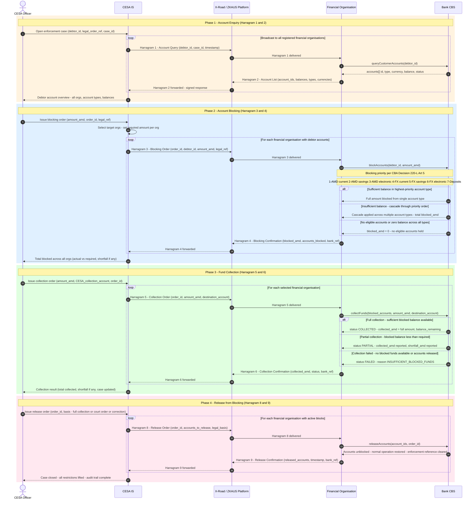

# ARC-001-DIAG-003-v1.0 — ZKAUS Enforcement Message Protocol: Harragram 1–9 Flow

> **Template Origin**: Official | **ArcKit Version**: 4.9.1 | **Command**: `/arckit:diagram`

## Document Control

| Field | Value |
|-------|-------|
| **Document ID** | ARC-001-DIAG-003-v1.0 |
| **Document Type** | Architecture Diagram |
| **Diagram Type** | Sequence Diagram |
| **Project** | CESA–Banks Enforcement Integration (Project 001) |
| **Classification** | OFFICIAL |
| **Status** | DRAFT |
| **Version** | 1.0 |
| **Created Date** | 2026-04-23 |
| **Last Modified** | 2026-04-23 |
| **Review Cycle** | On material change to CBA Decision 220-L or ZKAUS protocol |
| **Next Review Date** | 2026-07-23 |
| **Owner** | Project Team, Architecture Lead |
| **Reviewed By** | PENDING |
| **Approved By** | PENDING |
| **Distribution** | Project Team, Architecture Team, CESA Programme Office, Commercial Bank Representatives |

## Revision History

| Version | Date | Author | Changes | Approved By | Approval Date |
|---------|------|--------|---------|-------------|---------------|
| 1.0 | 2026-04-23 | ArcKit AI | Initial creation from `/arckit:diagram` command — derived from CBA Decision 220-L (30 Dec 2025) and CESA-BANKS-BP.pdf | PENDING | PENDING |

---

## 1. Purpose

This diagram documents the **ZKAUS (Electronic Enforcement Automated System) message protocol** — the nine Harragram message types that govern all enforcement interactions between Armenian enforcement bodies (CESA, HKAC) and Central Bank of Armenia-licensed financial organisations (commercial banks, NBFs).

The protocol is defined in **CBA Council Decision No. 220-L** (30 December 2025, effective 8 January 2026) `[CBA-C1]` and operationalised in the business process flows documented in **CESA-BANKS-BP.pdf** `[BP-C1]`. The diagram adds three elements not covered by DIAG-001 (PlantUML, high-level 4-phase flow) or DIAG-002 (Mermaid, error handling and retry):

1. **ZKAUS Harragram message type labels** (1–9) from the CBA regulatory framework
2. **Account blocking priority cascade** — the 7-tier account type ordering mandated by CBA Decision 220-L Art 5 `[CBA-C3]`
3. **Collection outcome decision logic** — full, partial, and failed collection branches, including shortfall reporting

---

## 2. Diagram

**View this diagram**: paste the Mermaid code into [mermaid.live](https://mermaid.live), or open in VS Code with the Mermaid Preview extension. Renders automatically in GitHub markdown.

---

## 3. Legend

| Symbol | Meaning |
|--------|---------|
| `->>` | Synchronous message (request / command) |
| `-->>` | Reply / asynchronous response |
| `loop` | Repeated per financial organisation (broadcast pattern) |
| `alt / else / end` | Mutually exclusive decision branches |
| `rect rgb(255,243,224)` | Phase 1: Account Enquiry |
| `rect rgb(224,240,255)` | Phase 2: Account Blocking |
| `rect rgb(224,255,224)` | Phase 3: Fund Collection |
| `rect rgb(255,232,240)` | Phase 4: Release from Blocking |
| Harragram N | ZKAUS protocol message type N as defined in CBA Decision 220-L |

---

## 4. ZKAUS Message Protocol Reference

| Harragram | Direction | Purpose | Sender | CBA Ref |
|-----------|-----------|---------|--------|---------|
| **1** | CESAIS → FinOrg (via ZKAUS) | Account information query — request all accounts held for debtor | CESA IS / ZKAUS | 220-L Art 12 `[CBA-C4]` |
| **2** | FinOrg → CESAIS (via ZKAUS) | Account list response — account IDs, types, currencies, balances | Financial Organisation | 220-L Art 12 `[CBA-C4]` |
| **3** | CESAIS → FinOrg (via ZKAUS) | Blocking order — apply hold to debtor accounts up to required AMD amount | CESA IS / ZKAUS | 220-L Art 5 `[CBA-C3]` |
| **4** | FinOrg → CESAIS (via ZKAUS) | Blocking confirmation — actual amount blocked, accounts affected, bank reference | Financial Organisation | 220-L Art 12 `[CBA-C4]` |
| **5** | CESAIS → FinOrg (via ZKAUS) | Collection order — transfer blocked funds to CESA collection account | CESA IS / ZKAUS | 220-L Arts 31–34 `[CBA-C5]` |
| **6** | FinOrg → CESAIS (via ZKAUS) | Collection confirmation — amount transferred, status, bank reference | Financial Organisation | 220-L Arts 31–34 `[CBA-C5]` |
| **7** | Both directions | Special case per Article 62 — HKAC substitution or enforcement transfer | ZKAUS / Financial Org | 220-L Art 62 (out of scope for this diagram) |
| **8** | CESAIS → FinOrg (via ZKAUS) | Release order — remove blocking from specified accounts | CESA IS / ZKAUS | 220-L Art 26 `[CBA-C6]` |
| **9** | FinOrg → CESAIS (via ZKAUS) | Release confirmation — accounts unblocked, timestamp, bank reference | Financial Organisation | 220-L Art 26 `[CBA-C6]` |

> **Note on Harragram 7**: Article 62 of the CBA Decision governs special enforcement transfers — typically when HKAC (Compulsory Enforcement Service) assumes enforcement from CESA, or when an enforcement order must be forwarded across jurisdictions. This message type is bidirectional and context-dependent; it is not included in the primary flow above. A separate diagram (DIAG-004) should document the HKAC substitution path.

---

## 5. Account Blocking Priority Order

Per CBA Decision 220-L, Article 5 `[CBA-C3]`, financial organisations must apply blocks in the following priority order — exhausting each tier before cascading to the next:

| Priority | Account Type | Currency | Conversion |
|----------|-------------|----------|------------|
| 1 | Current accounts | AMD (Dram) | None |
| 2 | Savings accounts | AMD | None |
| 3 | Electronic money accounts | AMD | None |
| 4 | Current accounts | Foreign currency | Converted at CBA rate (prior business day) |
| 5 | Savings accounts | Foreign currency | Converted at CBA rate (prior business day) |
| 6 | Electronic money accounts | Foreign currency | Converted at CBA rate (prior business day) |
| 7 | Deposit accounts | AMD and FX | Per terms of deposit agreement |

**Cascade rule**: If the balance in tier N is insufficient to meet the required blocking amount, the residual is cascaded to tier N+1. Blocking continues until the required amount is reached or all account types are exhausted.

---

## 6. Component Inventory

| Lifeline | Type | Description | Legal Reference |
|----------|------|-------------|-----------------|
| **CESA Officer** | Actor | Enforcement officer who initiates enforcement actions and reviews outcomes | CESA-BANKS-BP.pdf `[BP-C1]` |
| **CESA IS** | Internal System | CESA Case Management System; orchestrates all ZKAUS message exchanges; maintains case audit trail | CESA-BANKS-BP.pdf `[BP-C1]` |
| **X-Road / ZKAUS Platform** | Infrastructure / Boundary | X-Road Security Servers (both sides) plus ZKAUS application layer; provides mutual TLS, message signing, audit logging, and routing | CBA 220-L Art 1 `[CBA-C1]`; CESA-BANKS-BP.pdf `[BP-C2]` |
| **Financial Organisation** | External System | Commercial banks and NBFs licensed by CBA; implements ZKAUS API; manages account holds | CBA 220-L Art 1 `[CBA-C1]` |
| **Bank CBS** | Internal (Bank) | Core Banking System; applies and releases account holds; executes fund transfers | CESA-BANKS-BP.pdf `[BP-C1]` |

---

## 7. Architecture Decisions

| Decision | Rationale | Reference |
|----------|-----------|-----------|
| Broadcast Harragram 1 to all registered financial organisations before blocking | CESA must know which organisations hold debtor accounts before issuing holds; avoids enforcement orders to organisations with no exposure | `[BP-C2]` |
| Blocking applied in mandatory 7-tier account type priority | CBA Decision mandates priority order to minimise debtor disruption while maximising enforcement effectiveness; AMD accounts exhausted before FX to avoid currency conversion risk | `[CBA-C3]` |
| Cascade rule for partial blocking | Single enforcement order covers all account types; bank cascades automatically to ensure maximum possible blocking without requiring multiple messages | `[CBA-C3]` |
| Harragram 4 reports actual blocked amount (not requested amount) | Allows CESA IS to calculate true total across all banks and determine if further action or additional bank targeting is needed | `[CBA-C4]` |
| ZKAUS acts as central routing and audit intermediary | Provides cryptographic non-repudiation for all Harragram messages; neither CESA nor banks can deny message exchange; legally enforceable audit trail | `[CBA-C1]` |
| Harragram 7 (Article 62 special case) excluded from primary flow | HKAC substitution and cross-jurisdiction transfers are exceptional cases requiring a separate operational procedure; including them in the primary flow would obscure the common path | `[CBA-C4]` |

---

## 8. Requirements Traceability

| Requirement | ID | Diagram Element | Coverage |
|------------|-----|-----------------|---------|
| Real-time enforcement execution | BR-001 | Harragram 1–4 synchronous flows | ✅ Covered |
| Fund collection and seizure | BR-002 | Harragram 5–6 collection phase | ✅ Covered |
| Lifting of restrictions | BR-003 | Harragram 8–9 release phase | ✅ Covered |
| Account discovery across all banks | BR-004 | Harragram 1–2 broadcast loop | ✅ Covered |
| Secure authenticated channel | INT-001 | X-Road / ZKAUS Platform (mTLS, signed messages) | ✅ Covered |
| Non-repudiation of enforcement instructions | INT-002 | ZKAUS audit log annotation on all Harragram types | ✅ Covered |
| Per-bank independent enforcement | INT-003 | `loop` construct — each org receives independent message set | ✅ Covered |
| Account blocking priority order | FR-014 | Priority cascade `Note over` and `alt/else` block in Phase 2 | ✅ Covered |
| Partial collection shortfall reporting | FR-019 | `alt/else` in Phase 3 — PARTIAL status branch | ✅ Covered |
| Audit trail of all enforcement actions | NFR-SEC-001 | ZKAUS Platform node — audit logging referenced in component inventory | ⚠️ Implied |

**Coverage Summary**: 10 requirements mapped | 9 Covered ✅ | 1 Implied ⚠️ | 0 Not covered ❌

---

## 9. Integration Points

| Integration | Harragram | Protocol | Data Exchanged |
|-------------|-----------|----------|---------------|
| CESA IS → ZKAUS Platform | 1, 3, 5, 8 | X-Road mTLS, signed | Enforcement requests (query, block, collect, release) |
| ZKAUS Platform → Financial Organisation | 1, 3, 5, 8 | X-Road mTLS, signed | Enforcement orders with legal references |
| Financial Organisation → ZKAUS Platform | 2, 4, 6, 9 | X-Road mTLS, signed | Confirmations with actual outcomes and bank references |
| ZKAUS Platform → CESA IS | 2, 4, 6, 9 | X-Road mTLS, signed | Aggregated responses for case record update |
| Financial Organisation ↔ CBS | Internal | Bank internal API | Account queries, hold instructions, fund transfers |
| HKAC → ZKAUS (special case) | 7 | X-Road mTLS | Enforcement substitution / transfer orders (Harragram 7, Article 62) |

---

## 10. Data Flow

| Data Element | Classification | Flow | Legal Basis | Retention |
|-------------|---------------|------|-------------|-----------|
| Debtor Tax ID / SSN | Personal Data (Sensitive) | CESA IS → ZKAUS → Financial Org | Legal enforcement obligation | Case duration + statutory period |
| Account IDs and types | Financial Personal Data | Financial Org → ZKAUS → CESA IS (Harragram 2) | Legal enforcement obligation | Case duration + statutory period |
| Account balances (AMD and FX) | Financial Personal Data | Financial Org → ZKAUS → CESA IS | Legal enforcement obligation | Case duration |
| Blocked amount (actual vs requested) | Financial Personal Data | Financial Org → ZKAUS → CESA IS (Harragram 4) | Legal enforcement obligation | Audit record |
| Legal order reference | Administrative Data | CESA IS → ZKAUS → Financial Org | Court or administrative order | Statutory period |
| Collection amount and destination account | Financial Data | CESA IS → ZKAUS → Financial Org (Harragram 5) | Legal enforcement obligation | Audit record |
| Bank reference numbers | Operational Data | Financial Org → ZKAUS → CESA IS (Harragram 4, 6, 9) | Legal enforcement obligation | Audit record |
| FX conversion rates (CBA daily rate) | Reference Data | CBS internal (used in account cascade) | CBA regulatory requirement | Per CBA rate publication schedule |

**Personal Data Note**: All Harragram messages containing debtor TIN/SSN or account data are transmitted exclusively via ZKAUS-authenticated channels. Data minimisation applies — Harragram 1 responses should return account existence and type without full balance disclosure where not required for enforcement calculation.

---

## 11. Security Architecture

| Concern | Control | Standard |
|---------|---------|----------|
| Message integrity | ZKAUS / X-Road digital signature on every Harragram; tamper-evident | X-Road Protocol v4; CBA 220-L Art 1 `[CBA-C1]` |
| Non-repudiation | Audit log maintained on both CESA SS and Financial Org SS; Harragram timestamps and bank_ref recorded | X-Road spec; ARC-000-PRIN-v1.0 Principle 5 |
| Transport security | Mutual TLS (X.509) on all ZKAUS channel messages | TLS 1.2+; X-Road mutual TLS |
| Enforcement authorisation | Only CESA officers authenticated to CESA IS may initiate Harragram 1, 3, 5, 8 sequences | CESA IS role-based access control |
| FX conversion integrity | CBA official daily rate used for FX-to-AMD conversion; rate source is CBA, not bank-supplied | CBA 220-L Art 5 `[CBA-C3]` |
| HKAC substitution (Harragram 7) | Special authorisation chain; HKAC order supersedes CESA hold; financial org must verify substitution authority before acting | CBA 220-L Art 62 |

---

## 12. Diagram Quality Gate

| # | Criterion | Target | Result | Status |
|---|-----------|--------|--------|--------|
| 1 | Edge crossings | 0 (sequence diagrams are inherently linear) | 0 | PASS |
| 2 | Visual hierarchy | 4 `rect` phase blocks with `Note over` labels structure the lifecycle | 4 phase blocks with labels | PASS |
| 3 | Grouping | `loop` groups multi-org broadcast; `alt/else` groups decision outcomes | Both constructs used appropriately | PASS |
| 4 | Flow direction | Top-to-bottom (inherent in sequence diagrams) | Consistent TB throughout | PASS |
| 5 | Relationship traceability | All arrows labeled with Harragram type and payload description | All 27 arrows labeled | PASS |
| 6 | Abstraction level | Single level — system-to-system protocol messages | Protocol level only; no code-level detail | PASS |
| 7 | Edge label readability | Labels concise; key/value pairs use space-separated rather than colon-separated syntax to avoid Mermaid parse conflicts | Max ~70 chars per label | PASS |
| 8 | Node placement | 5 lifelines; connected nodes are sequential (no long-range crossing arrows) | Sequential left-to-right placement | PASS |
| 9 | Element count | 5 lifelines vs 8 maximum for sequence diagrams | 5 / 8 | PASS |

All 9 criteria: **PASS**

---

## 13. Related Diagrams

| Diagram | ID | Focus | Relationship |
|---------|----|-------|-------------|
| Enforcement Data Flow (To-Be State) | ARC-001-DIAG-001-v1.0 | PlantUML 4-phase sequence (query, block, collect, release) at high level | Complementary — DIAG-001 is the business narrative; this diagram adds ZKAUS message type detail |
| Error Handling and Retry Flow | ARC-001-DIAG-002-v1.0 | Mermaid sequence — X-Road failure, retry, graceful degradation | Complementary — covers what happens when Harragram messages fail to deliver |
| HKAC Substitution Flow (proposed) | ARC-001-DIAG-004-v1.0 | Harragram 7 — Article 62 enforcement transfer | Planned — documents the exceptional case excluded from this diagram |

---

## 14. External References

### Document Register

| Doc ID | Filename | Type | Source |
|--------|----------|------|--------|
| BP-C | CESA-BANKS-BP.pdf | Business Process Diagrams | `projects/001-cesa-banks/external/` |
| CBA-220L | ՀՀ ԿENTRONAKAN BANKITI KHROVDI OROSHIMNE... .pdf | CBA Council Decision No. 220-L (30 Dec 2025) | `projects/001-cesa-banks/external/` |

### Citations

| Citation ID | Doc ID | Section | Extracted Finding |
|-------------|--------|---------|-------------------|
| `[BP-C1]` | BP-C | Page 1 (Image 1) — swimlane BP diagram | To-be automated process: blocking, collection, release — three-phase lifecycle with CESA IS and banks |
| `[BP-C2]` | BP-C | Page 2 (Image 2) — account discovery and NBF variant | Account enquiry broadcast to all registered financial orgs; NBF and credit facility variant shown separately |
| `[BP-C3]` | BP-C | Page 3 (Image 3) — technical account flow | Detailed CBS-level flow: account type routing, cascade blocking, collection status tracking, release confirmation |
| `[CBA-C1]` | CBA-220L | Article 1, General Provisions | Defines ZKAUS (Electronic Enforcement Automated System); scope covers blocking, collection, release for all CBA-licensed financial organisations |
| `[CBA-C2]` | CBA-220L | Article 2, Definitions | Defines: ZKAUS, enforcement body, financial organisation, Harragram message types, account categories |
| `[CBA-C3]` | CBA-220L | Article 5 (Section 3) | Account blocking priority order: AMD current, AMD savings, AMD electronic, FX current, FX savings, FX electronic, Deposits; cascade rule; FX conversion at prior-day CBA rate |
| `[CBA-C4]` | CBA-220L | Article 12, Harragram type definitions (A–I) | Nine ZKAUS message types defined: types 1–2 (query/response), 3–4 (blocking order/confirmation), 5–6 (collection order/confirmation), 7 (Article 62 special case), 8–9 (release order/confirmation) |
| `[CBA-C5]` | CBA-220L | Articles 31–34 (collection procedure) | Financial organisation must transfer funds in same account priority order as blocking; partial collection reported via Harragram 6; shortfall amount explicitly reported |
| `[CBA-C6]` | CBA-220L | Article 26 (release compliance) | Financial organisation must remove blocking upon receipt of Harragram 8; confirm via Harragram 9; enforcement reference cleared from CBS records |

---

**Generated by**: ArcKit `/arckit:diagram` command
**Generated on**: 2026-04-23
**ArcKit Version**: 4.9.1
**Project**: CESA–Banks Enforcement Integration (Project 001)
**AI Model**: Claude Sonnet 4.6
**Generation Context**: Derived from CBA Council Decision No. 220-L (30 Dec 2025, effective 8 Jan 2026) — ZKAUS 9-message protocol specification; and CESA-BANKS-BP.pdf (3 swimlane business process diagrams, Armenian language). Diagram is the third in the CESA-Banks series, adding ZKAUS Harragram message type labels and account priority cascade logic not present in DIAG-001 or DIAG-002.
