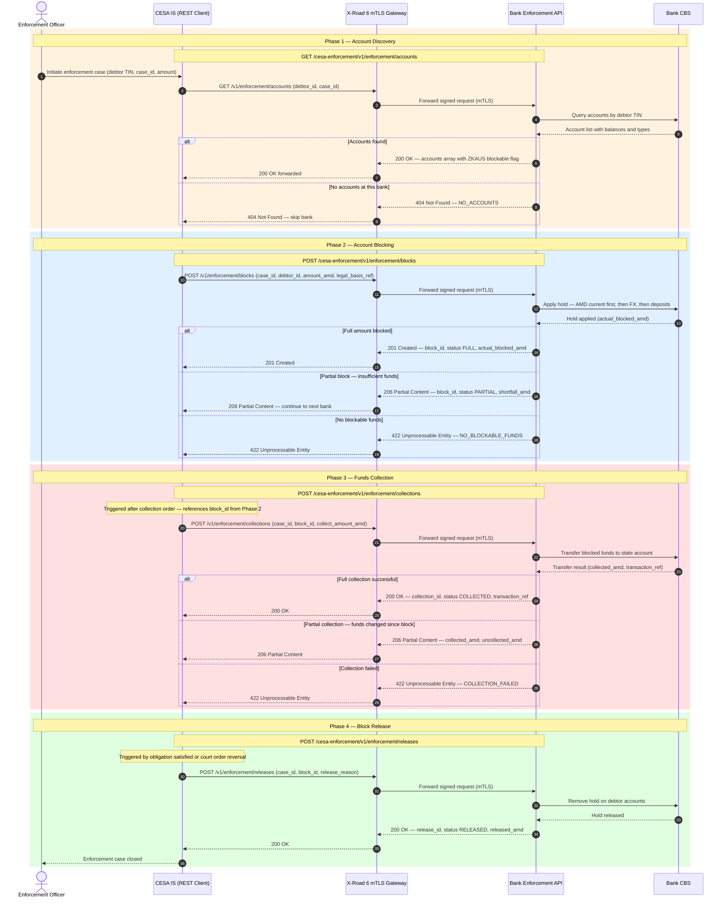

# ARC-001-DIAG-004-v1.0 — CESA–Bank Enforcement Integration: REST API Sequence Diagram and API Specification

## Document Control

| Field | Value |
|-------|-------|
| **Document ID** | ARC-001-DIAG-004-v1.0 |
| **Project** | 001-cesa-banks |
| **Project Name** | CESA Judicial Enforcement — Bank Integration |
| **Document Type** | Architecture Diagram |
| **Diagram Type** | Sequence Diagram (REST API perspective) |
| **Version** | 1.0 |
| **Status** | DRAFT |
| **Classification** | OFFICIAL |
| **Date** | 2026-04-23 |
| **Owner** | Architecture Team |
| **Review Cycle** | On material change to API contract or ZKAUS protocol |

### Revision History

| Version | Date | Author | Description |
|---------|------|--------|-------------|
| 1.0 | 2026-04-23 | ArcKit AI | Initial creation from `/arckit:diagram sequence` command, derived from CBA Decision No. 220-L (effective 8 January 2026) and CESA-BANKS-BP.pdf business process diagrams |

---

## 1. Purpose

This diagram models the CESA–Bank judicial enforcement integration as a **REST API interaction**: the CESA Information System acts as the REST **client**, and each bank exposes a **Bank Enforcement API** (REST server) reachable via the X-Road 6 secure data exchange layer.

It complements the prior diagrams in this series:
- **DIAG-001**: Business narrative (PlantUML, four-phase overview)
- **DIAG-002**: Error handling and X-Road failure modes
- **DIAG-003**: ZKAUS protocol with Harragram message types (A–I)
- **DIAG-004** *(this document)*: REST API perspective — HTTP methods, request/response schemas, status codes, and full endpoint specification

The REST API design presented here is a **reference specification** derived from the ZKAUS protocol obligations defined in CBA Decision No. 220-L. It represents the recommended API contract for implementation by participating banks.

---

## 2. Diagram



### Legend

| Symbol | Meaning |
|--------|---------|
| `->>` | HTTP request (via X-Road mTLS tunnel) |
| `-->>` | HTTP response |
| `alt / else` | Mutually exclusive HTTP response branches |
| `rect rgb(255,243,224)` | Phase 1: Account Discovery |
| `rect rgb(224,240,255)` | Phase 2: Account Blocking |
| `rect rgb(255,224,224)` | Phase 3: Funds Collection |
| `rect rgb(224,255,224)` | Phase 4: Block Release |

---

## 3. REST API Specification

### 3.1 Base URL and Transport

| Property | Value |
|----------|-------|
| **Base URL** | `{bank-xroad-subsystem}/cesa-enforcement/v1` |
| **Transport** | X-Road 6 over mutual TLS (mTLS) |
| **Content-Type** | `application/json` |
| **Encoding** | UTF-8 |
| **X-Road Service ID** | `ARM/GOV/{bank-member-code}/cesa-enforcement/v1` |

All requests are signed by X-Road and delivered to the bank's Security Server. Banks MUST NOT expose these endpoints directly on public internet — all traffic routes through X-Road.

---

### 3.2 Common Request Headers

| Header | Required | Description |
|--------|----------|-------------|
| `X-Road-Client` | REQUIRED | X-Road client identifier of CESA IS (e.g., `ARM/GOV/CESA/cesa-is`) |
| `X-Road-Service` | REQUIRED | Target service identifier on bank's X-Road subsystem |
| `X-Case-Id` | REQUIRED | Unique enforcement case reference (court-issued case number) |
| `X-Request-Id` | REQUIRED | UUID for request tracing; used for deduplication |
| `Idempotency-Key` | REQUIRED (mutating) | UUID; guarantees exactly-once semantics for POST endpoints |
| `Authorization` | — | Not required; authorization derived from X-Road client certificate |

---

### 3.3 Endpoint: Account Discovery

**`GET /enforcement/accounts`**

Retrieve all accounts held at this bank for the specified debtor, with blockability assessment per ZKAUS account priority rules `[CBA-C5]`.

#### Query Parameters

| Parameter | Type | Required | Description |
|-----------|------|----------|-------------|
| `debtor_id` | string | REQUIRED | Debtor's Armenian Tax Identification Number (TIN) or Social Security Number |
| `case_id` | string | REQUIRED | Enforcement case reference number |
| `include_zero_balance` | boolean | optional | Include zero-balance accounts in response (default: `false`) |

#### Response — 200 OK

```json
{
  "debtor_id": "1234567890",
  "bank_code": "ACBAAM22",
  "case_id": "CASE-2026-004521",
  "retrieved_at": "2026-04-23T09:15:00Z",
  "accounts": [
    {
      "account_id": "AM12ACBA0000000012345678",
      "account_type": "AMD_CURRENT",
      "currency": "AMD",
      "available_balance": 850000,
      "blockable": true,
      "block_priority": 1
    },
    {
      "account_id": "AM12ACBA0000000087654321",
      "account_type": "FX_CURRENT",
      "currency": "USD",
      "available_balance_amd_equivalent": 412000,
      "fx_rate": 400.5,
      "blockable": true,
      "block_priority": 4
    },
    {
      "account_id": "AM12ACBA0000000099999999",
      "account_type": "DEPOSIT",
      "currency": "AMD",
      "available_balance": 1500000,
      "blockable": true,
      "block_priority": 7
    }
  ]
}
```

#### Account Types and Block Priority `[CBA-C5]`

| `block_priority` | `account_type` | Description |
|-----------------|----------------|-------------|
| 1 | `AMD_CURRENT` | AMD current accounts |
| 2 | `AMD_SAVINGS` | AMD savings accounts |
| 3 | `AMD_ELECTRONIC` | AMD electronic (wallet) accounts |
| 4 | `FX_CURRENT` | Foreign currency current accounts (AMD equivalent) |
| 5 | `FX_SAVINGS` | Foreign currency savings accounts (AMD equivalent) |
| 6 | `FX_ELECTRONIC` | Foreign currency electronic accounts (AMD equivalent) |
| 7 | `DEPOSIT` | Term deposit accounts |

#### Response — 404 Not Found

```json
{
  "error": "NO_ACCOUNTS",
  "message": "No accounts found for debtor_id at this bank",
  "debtor_id": "1234567890",
  "bank_code": "ACBAAM22"
}
```

---

### 3.4 Endpoint: Account Blocking

**`POST /enforcement/blocks`**

Apply an enforcement hold on debtor accounts, consuming available balance in ZKAUS priority order until the requested amount is reached or all blockable funds are exhausted.

#### Request Body

```json
{
  "case_id": "CASE-2026-004521",
  "debtor_id": "1234567890",
  "amount_amd": 1200000,
  "legal_basis_ref": "Court Decision No. 2026-CV-1234, 22 April 2026",
  "enforcement_officer_id": "CESA-OFF-00742",
  "effective_date": "2026-04-23"
}
```

| Field | Type | Required | Description |
|-------|------|----------|-------------|
| `case_id` | string | REQUIRED | Enforcement case reference |
| `debtor_id` | string | REQUIRED | Debtor TIN |
| `amount_amd` | integer | REQUIRED | Requested block amount in AMD (drams) |
| `legal_basis_ref` | string | REQUIRED | Court decision or legal document reference |
| `enforcement_officer_id` | string | REQUIRED | CESA officer identifier for audit trail |
| `effective_date` | date (ISO 8601) | REQUIRED | Date from which the block is legally effective |

#### Response — 201 Created (Full Block)

```json
{
  "block_id": "BLK-2026-ACBA-000891",
  "case_id": "CASE-2026-004521",
  "status": "FULL",
  "requested_amount_amd": 1200000,
  "actual_blocked_amd": 1200000,
  "blocked_at": "2026-04-23T09:16:42Z",
  "accounts": [
    {
      "account_id": "AM12ACBA0000000012345678",
      "account_type": "AMD_CURRENT",
      "blocked_amount_amd": 850000
    },
    {
      "account_id": "AM12ACBA0000000087654321",
      "account_type": "FX_CURRENT",
      "blocked_amount_amd": 350000,
      "blocked_amount_original": 873.91,
      "original_currency": "USD",
      "fx_rate_applied": 400.5
    }
  ]
}
```

#### Response — 206 Partial Content (Partial Block)

```json
{
  "block_id": "BLK-2026-ACBA-000892",
  "case_id": "CASE-2026-004521",
  "status": "PARTIAL",
  "requested_amount_amd": 1200000,
  "actual_blocked_amd": 850000,
  "shortfall_amd": 350000,
  "blocked_at": "2026-04-23T09:16:44Z",
  "accounts": [
    {
      "account_id": "AM12ACBA0000000012345678",
      "account_type": "AMD_CURRENT",
      "blocked_amount_amd": 850000
    }
  ],
  "message": "All blockable funds exhausted; shortfall must be sought at other banks"
}
```

#### Response — 422 Unprocessable Entity (No Blockable Funds)

```json
{
  "error": "NO_BLOCKABLE_FUNDS",
  "case_id": "CASE-2026-004521",
  "debtor_id": "1234567890",
  "message": "All accounts have zero balance or are legally restricted from blocking"
}
```

---

### 3.5 Endpoint: Funds Collection

**`POST /enforcement/collections`**

Transfer previously blocked funds to the state enforcement account. MUST reference a valid `block_id` returned by the blocking endpoint.

#### Request Body

```json
{
  "case_id": "CASE-2026-004521",
  "block_id": "BLK-2026-ACBA-000891",
  "collect_amount_amd": 1200000,
  "destination_account": "AM12CBAR0000000011111111",
  "destination_bank_code": "CBARAMC0",
  "collection_order_ref": "CESA-COL-ORDER-2026-00456",
  "enforcement_officer_id": "CESA-OFF-00742"
}
```

| Field | Type | Required | Description |
|-------|------|----------|-------------|
| `case_id` | string | REQUIRED | Enforcement case reference |
| `block_id` | string | REQUIRED | Block reference from POST /blocks response |
| `collect_amount_amd` | integer | REQUIRED | Amount to collect (≤ actual_blocked_amd) |
| `destination_account` | string | REQUIRED | IBAN of state collection account |
| `destination_bank_code` | string | REQUIRED | BIC/SWIFT of destination bank |
| `collection_order_ref` | string | REQUIRED | Internal CESA collection order reference |
| `enforcement_officer_id` | string | REQUIRED | CESA officer identifier |

#### Response — 200 OK (Full Collection)

```json
{
  "collection_id": "COL-2026-ACBA-000301",
  "case_id": "CASE-2026-004521",
  "block_id": "BLK-2026-ACBA-000891",
  "status": "COLLECTED",
  "collected_amd": 1200000,
  "transaction_ref": "TXN-ACBA-20260423-00019284",
  "collected_at": "2026-04-23T10:05:33Z"
}
```

#### Response — 206 Partial Content (Partial Collection)

```json
{
  "collection_id": "COL-2026-ACBA-000302",
  "case_id": "CASE-2026-004521",
  "block_id": "BLK-2026-ACBA-000891",
  "status": "PARTIAL",
  "collected_amd": 800000,
  "uncollected_amd": 400000,
  "transaction_ref": "TXN-ACBA-20260423-00019285",
  "collected_at": "2026-04-23T10:05:35Z",
  "message": "Partial funds transferred; remaining block maintained on residual balance"
}
```

#### Response — 422 Unprocessable Entity (Collection Failed)

```json
{
  "error": "COLLECTION_FAILED",
  "case_id": "CASE-2026-004521",
  "block_id": "BLK-2026-ACBA-000891",
  "reason": "ACCOUNT_CLOSED",
  "message": "Target account was closed after block was applied; manual intervention required"
}
```

---

### 3.6 Endpoint: Block Release

**`POST /enforcement/releases`**

Remove an enforcement hold from debtor accounts. Triggered by obligation satisfaction, court order reversal, or CESA officer instruction.

#### Request Body

```json
{
  "case_id": "CASE-2026-004521",
  "block_id": "BLK-2026-ACBA-000891",
  "release_reason": "OBLIGATION_SATISFIED",
  "legal_basis_ref": "Court Decision No. 2026-CV-1234 — satisfaction confirmed 23 April 2026",
  "enforcement_officer_id": "CESA-OFF-00742"
}
```

| Field | Type | Required | `release_reason` values |
|-------|------|----------|------------------------|
| `case_id` | string | REQUIRED | — |
| `block_id` | string | REQUIRED | — |
| `release_reason` | enum | REQUIRED | `OBLIGATION_SATISFIED`, `COURT_ORDER_REVERSED`, `OVERPAYMENT_CORRECTION`, `CASE_WITHDRAWN` |
| `legal_basis_ref` | string | REQUIRED | — |
| `enforcement_officer_id` | string | REQUIRED | — |

#### Response — 200 OK

```json
{
  "release_id": "REL-2026-ACBA-000145",
  "case_id": "CASE-2026-004521",
  "block_id": "BLK-2026-ACBA-000891",
  "status": "RELEASED",
  "released_amd": 1200000,
  "released_at": "2026-04-23T14:22:10Z"
}
```

---

### 3.7 Error Response Envelope

All error responses use a consistent envelope:

```json
{
  "error": "ERROR_CODE",
  "message": "Human-readable description in Armenian or English",
  "case_id": "CASE-2026-004521",
  "request_id": "550e8400-e29b-41d4-a716-446655440000",
  "timestamp": "2026-04-23T09:16:44Z",
  "details": {}
}
```

---

### 3.8 HTTP Status Code Reference

| Code | Meaning | Endpoints |
|------|---------|-----------|
| `200 OK` | Success (collection, release) | GET /accounts, POST /collections, POST /releases |
| `201 Created` | Block successfully created (full) | POST /blocks |
| `206 Partial Content` | Partial block or partial collection | POST /blocks, POST /collections |
| `400 Bad Request` | Missing or malformed request parameters | All |
| `401 Unauthorized` | X-Road certificate not recognised | All |
| `404 Not Found` | Debtor has no accounts; block_id not found | GET /accounts, POST /collections, POST /releases |
| `409 Conflict` | Block already exists for this case_id (idempotency) | POST /blocks |
| `422 Unprocessable Entity` | Business rule violation (no blockable funds, collection failed) | POST /blocks, POST /collections |
| `503 Service Unavailable` | Bank CBS unavailable; retry after `Retry-After` header | All |

---

## 4. Component Inventory

| Lifeline | Type | Description |
|----------|------|-------------|
| **Enforcement Officer** | Actor | CESA officer issuing enforcement actions via CESA IS |
| **CESA IS (REST Client)** | Internal System | CESA Information System acting as REST API client; manages case lifecycle |
| **X-Road 6 (mTLS Gateway)** | Infrastructure | CBA-operated X-Road 6 interoperability layer; provides mTLS, message signing, audit log |
| **Bank Enforcement API (REST Server)** | External System | REST API hosted by each bank; implements the ZKAUS contract defined in CBA Decision 220-L |
| **Bank CBS** | Internal (Bank) | Bank Core Banking System; applies and releases enforcement holds |

---

## 5. Architecture Decisions

| Decision | Rationale |
|----------|-----------|
| REST over SOAP for bank API | REST with JSON aligns with modern bank API practices; lower integration cost; X-Road provides transport-level security so application-level SOAP envelope is unnecessary |
| Idempotency-Key on all mutating endpoints | Enforcement actions must be exactly-once; network failures on X-Road must not result in duplicate blocks or collections |
| 206 Partial Content for partial block/collection | Avoids 200 masking shortfall; 4xx would incorrectly signal failure when partial success is a valid enforcement outcome |
| `block_id` as prerequisite for collection | Prevents collection without prior confirmed block; maintains legal audit chain (block → collect) |
| `release_reason` enum not free text | Ensures audit trail is machine-parseable; supports automated reporting to CBA under Decision 220-L `[CBA-C5]` |
| FX balance reported as AMD equivalent | All enforcement arithmetic operates in AMD; bank converts FX at current rate at time of block per ZKAUS obligation `[CBA-C5]` |

---

## 6. Requirements Traceability

| Requirement | Diagram Element | Source |
|-------------|-----------------|--------|
| INT-001: X-Road 6 integration | X-Road 6 (mTLS Gateway) lifeline; all requests routed via X-Road | ARC-001-REQ-v1.0 |
| FR-001: Account discovery before blocking | Phase 1 — GET /v1/enforcement/accounts | ARC-001-REQ-v1.0 |
| FR-002: Account blocking with priority order | Phase 2 — POST /v1/enforcement/blocks; priority cascade in CBS note | ARC-001-REQ-v1.0 `[CBA-C5]` |
| FR-003: Partial blocking support | 206 Partial Content response branch | ARC-001-REQ-v1.0 |
| FR-004: Funds collection | Phase 3 — POST /v1/enforcement/collections | ARC-001-REQ-v1.0 |
| FR-005: Block release | Phase 4 — POST /v1/enforcement/releases | ARC-001-REQ-v1.0 |
| NFR-SEC-001: Mutual TLS authentication | X-Road mTLS; `X-Road-Client` header identifies CESA IS | ARC-001-REQ-v1.0 |
| NFR-AUD-001: Audit trail on all operations | `X-Case-Id`, `X-Request-Id`, `enforcement_officer_id` on every request | ARC-001-REQ-v1.0 |
| NFR-REL-001: Idempotent operations | `Idempotency-Key` header; 409 Conflict on duplicate | ARC-001-REQ-v1.0 |

---

## 7. Integration Points

| Integration | Protocol | Direction | Data Exchanged |
|-------------|----------|-----------|---------------|
| CESA IS → Bank Enforcement API | REST/JSON over X-Road 6 mTLS | Unidirectional (CESA initiates all requests) | Account queries, block/collect/release instructions |
| Bank Enforcement API → Bank CBS | Internal bank API | Bidirectional | Hold instructions, balance queries, transfer orders |
| X-Road 6 → CBA Audit Log | X-Road built-in | Automatic | All signed messages logged at CBA level |

---

## 8. Data Flow

| Data Element | Classification | Flow | Legal Basis |
|-------------|---------------|------|-------------|
| Debtor TIN | Personal Data (Sensitive) | CESA IS → Bank | RA Data Protection Law; legal basis = court enforcement order |
| Account balances | Financial Personal Data | Bank → CESA IS (GET response) | CBA Decision 220-L Art 12 `[CBA-C4]` |
| Blocked amount (AMD) | Financial Personal Data | Bidirectional | CBA Decision 220-L Art 5 `[CBA-C5]` |
| FX rate applied at block | Financial Data | Bank → CESA IS (block response) | CBA Decision 220-L Art 5 `[CBA-C5]` |
| Transaction reference | Administrative Data | Bank → CESA IS (collection response) | Court enforcement record |
| Legal basis reference | Legal/Administrative | CESA IS → Bank | Court decision number |

---

## 9. Security Architecture

| Concern | Control |
|---------|---------|
| Transport security | X-Road 6 mTLS; all messages signed and encrypted in transit |
| Client authentication | X-Road client certificate; banks cannot receive requests from unauthenticated parties |
| Authorization | `enforcement_officer_id` logged; CESA IS must verify officer has active warrant before issuing API call |
| Idempotency / replay protection | `Idempotency-Key` + `X-Request-Id` prevent replayed enforcement actions |
| Personal data minimisation | Account discovery returns only data needed for blocking decision; full account history not exposed |
| Audit trail | Every request carries `X-Case-Id` and `X-Request-Id`; X-Road logs all messages at CBA; bank CBS logs hold events |

---

## 10. Quality Gate

| Criterion | Status | Detail |
|-----------|--------|--------|
| Diagram type specified | PASS | Sequence diagram |
| Mermaid syntax valid | PASS | Verified against sequenceDiagram.md reference |
| Legend included | PASS | Section 2 Legend table |
| Element count within threshold | PASS | 5 lifelines (threshold: 8) |
| Edge crossings < 5 | PASS | Sequential flow; 0 crossing edges |
| Consistent flow direction | PASS | Top-to-bottom throughout |
| Single abstraction level | PASS | REST API request/response level; no CBS internals |
| Quality gate table included | PASS | This table |
| Requirements traceable | PASS | Section 6 traces to ARC-001-REQ-v1.0 |

---

## 11. External References

| Citation | Source | Finding |
|----------|--------|---------|
| `[CBA-C4]` | CBA Decision No. 220-L (effective 8 January 2026), Art 12 | Defines 9 Harragram message types (A–I) for ZKAUS protocol; API endpoints in this diagram map to Harragram 3–4 (block), 5–6 (collect), 7 special, 8–9 (release) |
| `[CBA-C5]` | CBA Decision No. 220-L (effective 8 January 2026), Art 5 | Account blocking priority: AMD current (1) → AMD savings (2) → AMD electronic (3) → FX current (4) → FX savings (5) → FX electronic (6) → Deposits (7) |

**Source files**:
- `projects/001-cesa-banks/external/CESA-BANKS-BP.pdf` — CESA–Bank business process swimlane diagrams
- CBA Decision No. 220-L (30 December 2025, effective 8 January 2026) — shared as image attachments

---

**Generated by**: ArcKit `/arckit:diagram` command
**Generated on**: 2026-04-23
**ArcKit Version**: 4.9.1
**Project**: CESA Judicial Enforcement — Bank Integration (Project 001)
**AI Model**: Claude Sonnet 4.6
