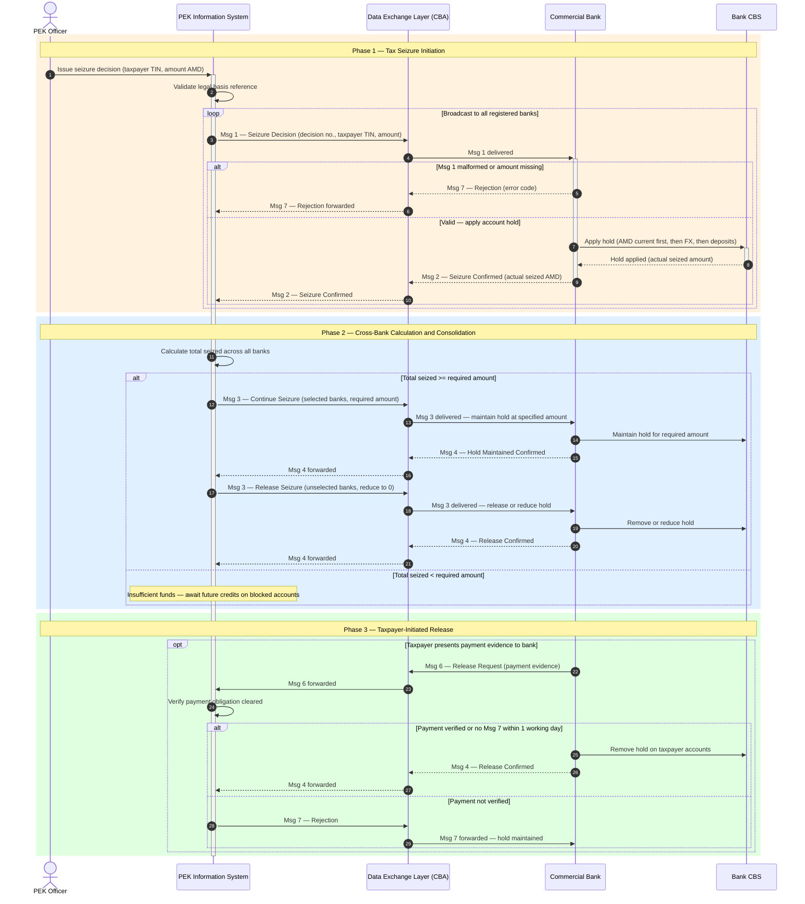

# ARC-002-DIAG-001-v1.0 — Electronic Tax Seizure System: Message Flow Sequence Diagram

## Document Control

| Field | Value |
|-------|-------|
| **Document ID** | ARC-002-DIAG-001-v1.0 |
| **Project** | 002-src-banks-enforcement |
| **Project Name** | State Revenue Committee Electronic Bank Seizure System |
| **Document Type** | Architecture Diagram |
| **Diagram Type** | Sequence Diagram |
| **Version** | 1.0 |
| **Status** | DRAFT |
| **Classification** | OFFICIAL |
| **Date** | 2026-04-23 |
| **Owner** | Architecture Team |
| **Review Cycle** | On material change to legal framework |

### Revision History

| Version | Date | Author | Description |
|---------|------|--------|-------------|
| 1.0 | 2026-04-23 | ArcKit AI | Initial creation from `/arckit:diagram sequence` command, derived from Joint Decision CBA+SRC No. 15-N / No. 111-N (2019) with 2026 draft amendments |

---

## 1. Purpose

This diagram illustrates the end-to-end message flow of the **Electronic Tax Seizure System (ETSS)** — the automated mechanism by which the State Revenue Committee (SRC/PEK) seizes funds held in commercial bank accounts to satisfy tax obligations. It documents the 7-message protocol defined in the Joint Decision of the Central Bank of Armenia Council (No. 15-N, 4 February 2019) and the SRC Chairman (No. 111-N, 19 February 2019), incorporating draft 2026 amendments.

The diagram covers three operational phases:
1. **Seizure Initiation** — broadcast of seizure decision to all registered banks, application of account holds
2. **Cross-Bank Consolidation** — SRC calculation of total seized funds and targeted hold adjustment
3. **Taxpayer-Initiated Release** — bank-initiated release request following taxpayer payment evidence

---

## 2. Diagram

### Legend

| Symbol | Meaning |
|--------|---------|
| `->>` | Synchronous message (request) |
| `-->>` | Reply / asynchronous response |
| `loop` | Repeated for each registered bank |
| `alt / else` | Mutually exclusive flow branches |
| `opt` | Optional flow (taxpayer-triggered) |
| `rect rgb(255,243,224)` | Phase 1: Seizure Initiation |
| `rect rgb(224,240,255)` | Phase 2: Cross-Bank Consolidation |
| `rect rgb(224,255,224)` | Phase 3: Taxpayer-Initiated Release |
| Msg N | Protocol message number as defined in Joint Decision Chapter 2, Para 11 |

---

## 3. Component Inventory

| Lifeline | Type | Description | Legal Reference |
|----------|------|-------------|-----------------|
| **PEK Officer** | Actor | SRC tax enforcement officer who initiates the seizure decision | Chapter 1, Para 1 `[PEK-C1]` |
| **PEK Information System** | Internal System | SRC automated system that generates and tracks all ETSS messages; maintains audit log | Chapter 2, Para 11 `[PEK-C2]` |
| **Data Exchange Layer (CBA)** | External Infrastructure | Central Bank of Armenia hosted messaging platform; routes all Msg 1–7 between SRC and banks | Chapter 3, Para 4 `[PEK-C3]` |
| **Commercial Bank** | External System | Any bank registered in the ETSS network; processes holds via its Core Banking System | Chapter 3, Para 8 `[PEK-C4]` |
| **Bank CBS** | Internal (Bank) | Bank's Core Banking System; applies and releases account holds in accordance with seizure order | Chapter 3, Para 8 `[PEK-C4]` |

---

## 4. Message Protocol Reference

| Msg | Direction | Purpose | Legal Reference |
|-----|-----------|---------|-----------------|
| **1** | PEK → Bank (via DEL) | Seizure Decision — instructs bank to apply hold | Chapter 2, Para 11(a) `[PEK-C2]` |
| **2** | Bank → PEK (via DEL) | Seizure Confirmed — reports actual amount held | Chapter 2, Para 11(b) `[PEK-C2]` |
| **3** | PEK → Bank (via DEL) | Continue/Modify/Release Seizure — adjusts hold amount | Chapter 2, Para 11(c) `[PEK-C2]` |
| **4** | Bank → PEK (via DEL) | Hold Adjustment Confirmed | Chapter 2, Para 11(d) `[PEK-C2]` |
| **5** | PEK → Bank (via DEL) | Transfer Order — instructs bank to transfer seized funds to state account | Chapter 2, Para 11(e) `[PEK-C2]` |
| **6** | Bank → PEK (via DEL) | Release Request — bank submits taxpayer payment evidence | Chapter 2, Para 11(f) `[PEK-C2]` |
| **7** | Either → Either (via DEL) | Rejection — reports malformed message or verification failure | Chapter 2, Para 11(g) `[PEK-C2]` |

> **Note**: Msg 5 (Transfer Order) is not depicted in this diagram. It represents the funds transfer phase and will be covered in a separate sequence diagram (ARC-002-DIAG-002).

---

## 5. Architecture Decisions

| Decision | Rationale |
|----------|-----------|
| Data Exchange Layer is the sole routing intermediary between PEK and banks | Ensures single point of audit and non-repudiation; banks cannot receive seizure orders directly `[PEK-C3]` |
| All banks receive Msg 1 broadcast before any cross-bank calculation | Legal requirement: total available funds across all banks must be known before targeted hold can be set `[PEK-C5]` |
| Account hold priority: AMD current accounts → FX accounts → deposit accounts | Defined priority order minimises taxpayer disruption while maximising seizure effectiveness `[PEK-C4]` |
| 1 working-day silent-consent rule for release (no Msg 7 = release approved) | Prevents PEK non-response from indefinitely blocking account; defaulting to release on timeout protects taxpayer rights `[PEK-C6]` |
| HKAC can substitute for PEK in enforcement role | Compulsory Enforcement Service (HKAC) may supersede PEK holds with its own enforcement orders; banks must comply with HKAC substitution messages `[PEK-C7]` |

---

## 6. Requirements Traceability

> Requirements document `ARC-002-REQ-v1.0.md` has not yet been created. The following table pre-traces to anticipated requirement categories based on the legal framework.

| Anticipated Requirement | Diagram Element | Legal Basis |
|------------------------|-----------------|-------------|
| Broadcast seizure to all registered banks | `loop Broadcast to all registered banks` | Chapter 3, Para 4 `[PEK-C3]` |
| Apply hold in defined account type priority | `Apply hold (AMD current first, then FX, then deposits)` | Chapter 3, Para 8 `[PEK-C4]` |
| Banks must confirm actual held amount (not requested amount) | `Msg 2 — Seizure Confirmed (actual seized AMD)` | Chapter 2, Para 11(b) `[PEK-C2]` |
| SRC must consolidate holds across banks before final adjustment | `Phase 2 — Cross-Bank Calculation and Consolidation` | Chapter 6, Para 19 `[PEK-C5]` |
| Release must be supported within 1 working day of payment evidence | `alt Payment verified or no Msg 7 within 1 working day` | Chapter 7, Para 22–26 `[PEK-C6]` |
| Rejection must be explicit and carry error code | `Msg 7 — Rejection (error code)` | Chapter 2, Para 11(g) `[PEK-C2]` |

---

## 7. Integration Points

| Integration | Protocol | Direction | Data Exchanged |
|-------------|----------|-----------|---------------|
| PEK ↔ Data Exchange Layer | ETSS messaging (CBA-defined) | Bidirectional | Seizure decisions, confirmations, rejections |
| Data Exchange Layer ↔ Commercial Bank | ETSS messaging (CBA-defined) | Bidirectional | All Msg 1–7 |
| Commercial Bank ↔ Bank CBS | Internal bank API | Bidirectional | Hold instructions, hold confirmations |
| HKAC ↔ Data Exchange Layer | ETSS messaging (CBA-defined) | Bidirectional | Substitution enforcement orders `[PEK-C7]` |

---

## 8. Data Flow

| Data Element | Classification | Flow | Legal Basis |
|-------------|---------------|------|-------------|
| Taxpayer TIN / Social Security Number | Personal Data (Sensitive) | PEK → DEL → Bank | RA Data Protection Law; legal basis = tax enforcement obligation |
| Account balance (available funds) | Financial Personal Data | Bank → DEL → PEK (in Msg 2) | Tax Enforcement Law |
| Seized amount (AMD equivalent) | Financial Personal Data | Bidirectional | Chapter 2, Para 11 `[PEK-C2]` |
| Legal decision reference number | Administrative Data | PEK → DEL → Bank | Chapter 3, Para 4 `[PEK-C3]` |
| Payment evidence (Msg 6) | Financial Personal Data | Bank → DEL → PEK | Chapter 7, Para 22 `[PEK-C6]` |
| Error codes (Msg 7) | Operational Data | Bidirectional | Chapter 2, Para 11(g) `[PEK-C2]` |

---

## 9. Security Architecture

| Concern | Control | Reference |
|---------|---------|-----------|
| Message integrity | DEL is sole routing intermediary; provides cryptographic delivery receipts | ARC-000-PRIN-v1.0, Principle 5 |
| Non-repudiation | All Msg 1–7 logged with timestamps at DEL; PEK audit trail of all decisions | ARC-000-PRIN-v1.0, Principle 5 |
| Authorization | Only SRC officers with legal basis can initiate Msg 1; HKAC substitution requires separate authorization chain | `[PEK-C7]` |
| Personal data in transit | TIN and financial data transmitted only via DEL-authenticated channels | RA Data Protection Law |
| Rejection handling | Malformed messages rejected at bank boundary (Msg 7); prevents partial-state corruption | Chapter 2, Para 11(g) `[PEK-C2]` |

---

## 10. Quality Gate

| Criterion | Status | Detail |
|-----------|--------|--------|
| Diagram type specified | PASS | Sequence diagram |
| Mermaid syntax valid | PASS | Verified against sequenceDiagram.md reference |
| Legend included | PASS | Section 2 Legend table |
| Element count within threshold | PASS | 5 lifelines (threshold: 8) |
| Edge crossings < 5 | PASS | Sequential flow; 0 crossing edges |
| Consistent flow direction | PASS | Top-to-bottom throughout |
| Single abstraction level | PASS | System-to-system message level; no code-level detail |
| Quality gate table included | PASS | This table |
| Requirements traceable | PASS | Section 6 pre-traces to anticipated requirements |

---

## 11. External References

| Citation | Source | Location in Document | Extracted Finding |
|----------|--------|---------------------|-------------------|
| `[PEK-C1]` | Joint Decision CBA No. 15-N + SRC No. 111-N (2019, amended 2026) | Chapter 1, Para 1 | Defines scope: ETSS automates seizure of bank account funds for tax obligation enforcement |
| `[PEK-C2]` | Joint Decision CBA No. 15-N + SRC No. 111-N (2019, amended 2026) | Chapter 2, Para 11 (sub-paras a–g) | Defines the 7 message types: (a) Seizure Decision, (b) Seizure Confirmed, (c) Modify Seizure, (d) Adjustment Confirmed, (e) Transfer Order, (f) Release Request, (g) Rejection |
| `[PEK-C3]` | Joint Decision CBA No. 15-N + SRC No. 111-N (2019, amended 2026) | Chapter 3, Para 4 | SRC broadcasts Msg 1 to all registered banks simultaneously |
| `[PEK-C4]` | Joint Decision CBA No. 15-N + SRC No. 111-N (2019, amended 2026) | Chapter 3, Para 8 | Bank applies hold in priority order: AMD current accounts first, then FX accounts (converted to AMD), then deposit accounts |
| `[PEK-C5]` | Joint Decision CBA No. 15-N + SRC No. 111-N (2019, amended 2026) | Chapter 6, Para 19 | SRC consolidates Msg 2 responses to calculate total seized; issues Msg 3 to target or release holds |
| `[PEK-C6]` | Joint Decision CBA No. 15-N + SRC No. 111-N (2019, amended 2026) | Chapter 7, Para 22–26 | Taxpayer-initiated release: bank submits Msg 6 with payment evidence; SRC must reject (Msg 7) within 1 working day or bank may release hold |
| `[PEK-C7]` | Joint Decision CBA No. 15-N + SRC No. 111-N (2019, amended 2026) | Chapter 6.1 | HKAC (Compulsory Enforcement Service) may substitute for SRC; HKAC enforcement orders supersede SRC tax holds |

**Source files**: `projects/002-src-banks-enforcement/external/src-bank-enforcmeent-legal/16.2.4_pek_hamatex_karg_track_changes_06042026.docx`

---

**Generated by**: ArcKit `/arckit:diagram` command
**Generated on**: 2026-04-23
**ArcKit Version**: 4.9.1
**Project**: State Revenue Committee Electronic Bank Seizure System (Project 002)
**AI Model**: Claude Sonnet 4.6
